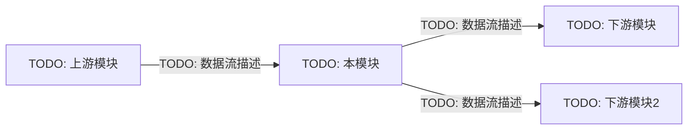
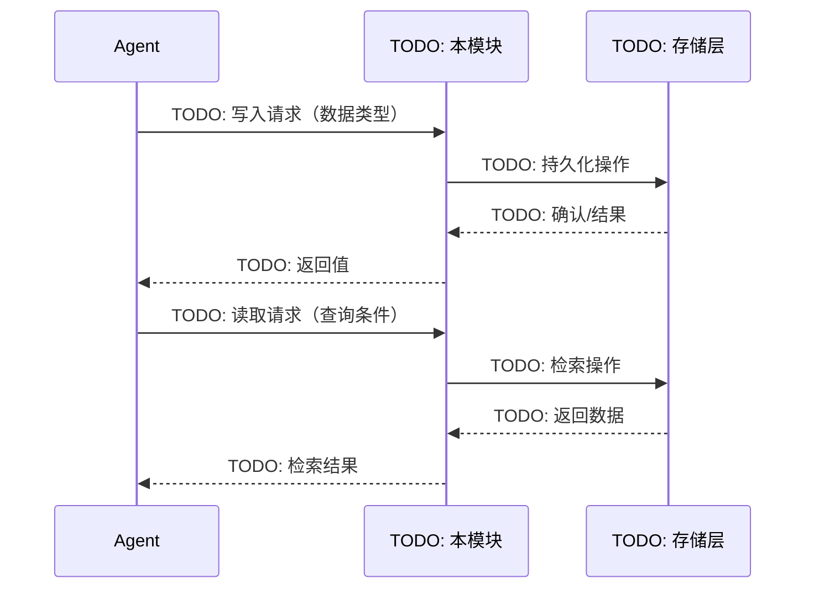

<!-- ============================================================
  MODULE_DOC 标准模板 — Agent OS 知识库文档站
  使用方式：复制本文件到对应模块目录，替换所有占位文字。
  每个章节的 HTML 注释说明了该章节的内容规范和字数建议。
  删除所有 HTML 注释后即为正式文档。
  ============================================================ -->

# 模块名称（Module Name）

<!--
  【本页摘要】
  一句话总结本模块的核心职责，面向工程师，直接点明解决什么问题。
  示例："工作记忆为 Agent 提供当前任务的短期上下文缓冲，类似 CPU L1 缓存。"
-->

> 一句话钩子：说明本模块解决什么问题、为谁服务。

---

## 1. 理论基础

<!--
  【内容规范】引用 CoALA（2023）和/或 AIOS（2024）论文中对本子系统的原文定义。
  - 篇幅：≤3 段，每段 ≤5 行
  - 必须引用论文来源，格式示例：
      > "Working memory temporarily holds and manipulates information relevant to the current task."
      > — CoALA (Sumers et al., 2023), §3.1
  - 不绑定特定厂商（不提 OpenAI / AWS 等品牌）
  - 阐明本模块在 AIOS 内核层六大子系统（调度/上下文管理/内存管理/存储管理/工具管理/访问控制）中的对应位置
-->

### CoALA / AIOS 定义

> TODO: 引用 CoALA 或 AIOS 原文对本子系统的定义段落。

本子系统在 AIOS 内核层对应 **TODO: 子系统名称** 模块（参见 AIOS §TODO: 章节编号）。

### 理论背景

TODO: 用 2-3 段文字阐述本模块的理论来源、在认知科学或计算机系统中的类比，以及其在 Agent OS 中的重要性。

---

## 2. 核心机制

<!--
  【内容规范】用三列表格列举 3-6 个核心机制。
  - 列格式：机制名称 | 说明 | 工程类比
  - 工程类比应贴近后端开发经验（如 Redis TTL、ThreadLocal、B-Tree 索引、消息队列等）
  - 每行说明不超过 20 字
-->

| 机制名称 | 说明 | 工程类比 |
|---------|------|---------|
| TODO: 机制1 | TODO: 简短说明 | TODO: 如 Redis TTL |
| TODO: 机制2 | TODO: 简短说明 | TODO: 如 ThreadLocal |
| TODO: 机制3 | TODO: 简短说明 | TODO: 如 LRU Cache |

---

## 3. 在 Agent OS 中的位置（架构图）

<!--
  【内容规范】展示本模块在整体 Agent OS 中的位置和与其他模块的依赖关系。
  - 优先使用 Mermaid 图（flowchart LR 或 TB）
  - 若需要交互式节点图，可使用 ArchitectureGraph 组件（见下方注释示例）
  - 图示内容：本模块节点 + 直接依赖的上下游模块 + 数据流方向箭头
  - 图示下方附 1-2 句文字说明
-->



<!--
  如需交互式架构图，替换上方 mermaid 块为：

  import ArchitectureGraph from '@site/src/components/ArchitectureGraph';

  <ArchitectureGraph
    nodes={[
      { id: "this-module", label: "TODO: 本模块", description: "TODO: 描述", position: { x: 300, y: 200 }, status: "completed" },
      { id: "upstream",    label: "TODO: 上游",   description: "TODO: 描述", position: { x: 100, y: 200 }, status: "completed" },
    ]}
    edges={[
      { id: "e1", source: "upstream", target: "this-module", label: "TODO: 数据流" },
    ]}
    height={400}
  />
-->

TODO: 用 1-2 句话描述本模块在整体架构中的层次位置和核心依赖关系。

---

## 4. 工作原理（时序图）

<!--
  【内容规范】用 Mermaid 时序图展示本模块的核心读写路径或处理流程。
  - 使用 sequenceDiagram 或 flowchart（视需求选择）
  - 展示：参与者（Agent / 本模块 / 存储层 / 外部服务）→ 消息流 → 返回值
  - 图示下方附 ≤3 行文字说明关键步骤
  - 每个步骤标注对应的 LLM 调用或工具调用（若有）
-->



TODO: 说明上述时序图中 1-3 个关键设计决策（如：为何选择此读写顺序、数据一致性如何保证等）。

---

## 5. 实现要点（代码示例）

<!--
  【内容规范】引用 hello-agents 仓库中的真实代码片段。
  - 代码块必须标注语言（python）
  - 第一行注释：# Source: hello-agents/code/chapterXX/文件名.py
  - 每段代码 ≤40 行，聚焦核心逻辑
  - 每个关键行附行级注释（中文）
  - 若有多个代码片段，用小标题分隔（### 片段名称）
-->

### TODO: 核心类/函数名称

```python
# Source: hello-agents/code/chapterXX/TODO_文件名.py
# TODO: 粘贴不超过 40 行的核心代码片段
# 关键行附中文行内注释

class TODOClass:
    """TODO: 类的一句话说明"""

    def __init__(self):
        # TODO: 初始化逻辑
        pass

    def core_method(self, input_data):
        # TODO: 核心处理逻辑
        pass
```

TODO: 代码说明：用 1-3 句话解释上述代码片段实现的核心逻辑和设计取舍。

---

## 6. 企业落地场景：IoT 设备诊断（某企业）

<!--
  【内容规范】以 某储能企业设备智能诊断 Agent 为业务场景，描述本模块的具体应用。
  - 必须具体到设备类型（如 DEV-042 设备管理系统、温控模块）和业务操作（如告警触发、诊断报告生成）
  - 描述：场景背景 → 本模块的具体作用 → 实现效果（量化指标优先）
  - 可配合 Mermaid 流程图说明数据流
  - 篇幅：2-4 段或等效的图+文组合
-->

### 场景背景

TODO: 描述 某储能企业设备的业务背景（设备规模、诊断需求、痛点）。
示例：某企业在全国部署了 500+ 套IoT 系统，每套系统包含 DMS、温度管理、变流系统 等子模块，每天产生约 10 万条传感器告警。

### 本模块在诊断 Agent 中的角色

TODO: 具体描述本模块如何支撑故障诊断流程。
- 数据输入：什么数据写入本模块？（如：DEV-042 实时温度、电压告警事件）
- 核心操作：本模块做了什么处理？（如：缓存当前诊断上下文、检索历史相似故障）
- 数据输出：返回什么给 Agent？（如：最近 10 条相似故障案例 + 处理方案）

### 实现效果

TODO: 列举可量化的效果指标（如：上下文召回延迟 <50ms、历史案例命中率 85%）。

---

## 7. AWS AgentCore 对应

<!--
  【内容规范】将本地/开源实现映射到 AWS 托管服务，使用四列 Markdown 表格。
  - 列格式：本地/开源实现 | AWS 组件 | 关键配置项 | 注意事项
  - AWS 组件名称使用规范写法（如 "Amazon Bedrock AgentCore"，不缩写）并附官方文档链接
  - 关键配置项：列出 2-3 个实际需要设置的参数名（如 ttl、maxmemory-policy）
  - 注意事项：生产使用中需要特别关注的坑点（如成本、延迟、限制）
-->

| 本地 / 开源实现 | AWS 组件 | 关键配置项 | 注意事项 |
|--------------|---------|-----------|---------|
| TODO: 本地实现 | [TODO: AWS 服务名](TODO: AWS 文档链接) | `TODO: 配置项1`, `TODO: 配置项2` | TODO: 注意事项 |
| TODO: 本地实现2 | [TODO: AWS 服务名2](TODO: AWS 文档链接2) | `TODO: 配置项` | TODO: 注意事项 |

TODO: 补充 1-2 段文字说明选型决策（为何选择上述 AWS 服务而非其他替代方案）。

---

## 8. 相关模块

<!--
  【内容规范】使用 Docusaurus :::info Admonition 列出相关模块的内部链接。
  - 必须包含 ≥2 个相关模块的链接
  - 使用相对路径格式（../module-dir/page.md），触发 Docusaurus broken link 检测
  - 每个链接附一句话说明关联关系（数据流方向、依赖关系、互补关系）
-->

:::info 相关模块

- **[TODO: 相关模块1](../TODO-module-dir/index.md)**：TODO: 说明与本模块的关联（如：本模块的检索结果写入该模块）
- **[TODO: 相关模块2](../TODO-module-dir/index.md)**：TODO: 说明与本模块的关联（如：该模块的上下文注入依赖本模块的输出）

:::

---

## 9. 参考

<!--
  【内容规范】列出权威参考资料链接。
  - 论文格式：作者（年份）. 标题. 来源. [arXiv/DOI 链接]
  - AWS 文档格式：服务名称 — 文档页面标题. [AWS 文档链接]
  - 至少包含：CoALA 或 AIOS 论文 + 本模块对应的 AWS 文档链接（若有）
  - hello-agents 源代码链接（引用的章节）
-->

- Sumers et al. (2023). *Cognitive Architectures for Language Agents (CoALA)*. arXiv:2309.02427. [https://arxiv.org/abs/2309.02427](https://arxiv.org/abs/2309.02427)
- Mei et al. (2024). *AIOS: LLM Agent Operating System*. arXiv:2403.16971. [https://arxiv.org/abs/2403.16971](https://arxiv.org/abs/2403.16971)
- TODO: [AWS 相关文档标题](TODO: https://docs.aws.amazon.com/...) — 本模块对应 AWS 服务的官方文档
- TODO: [hello-agents Chapter XX — 本模块源代码](TODO: https://github.com/...) — 本文档代码示例来源
