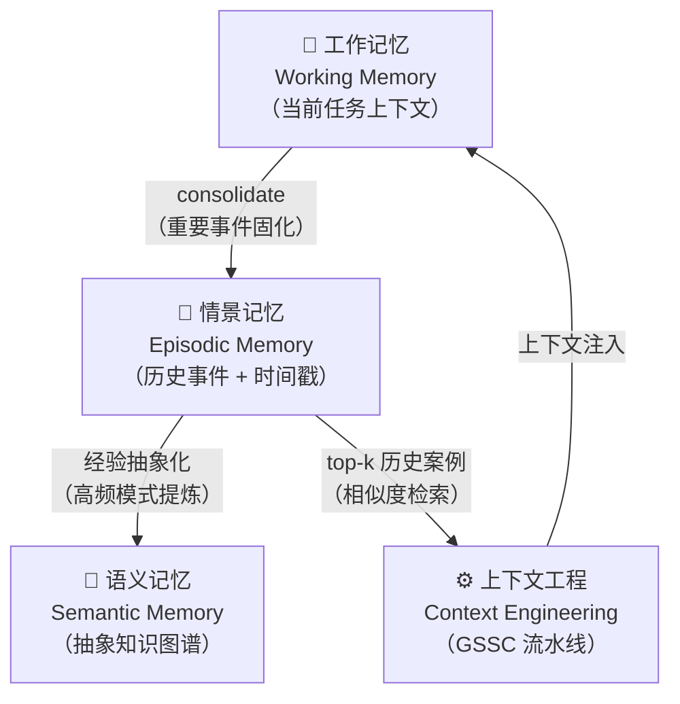
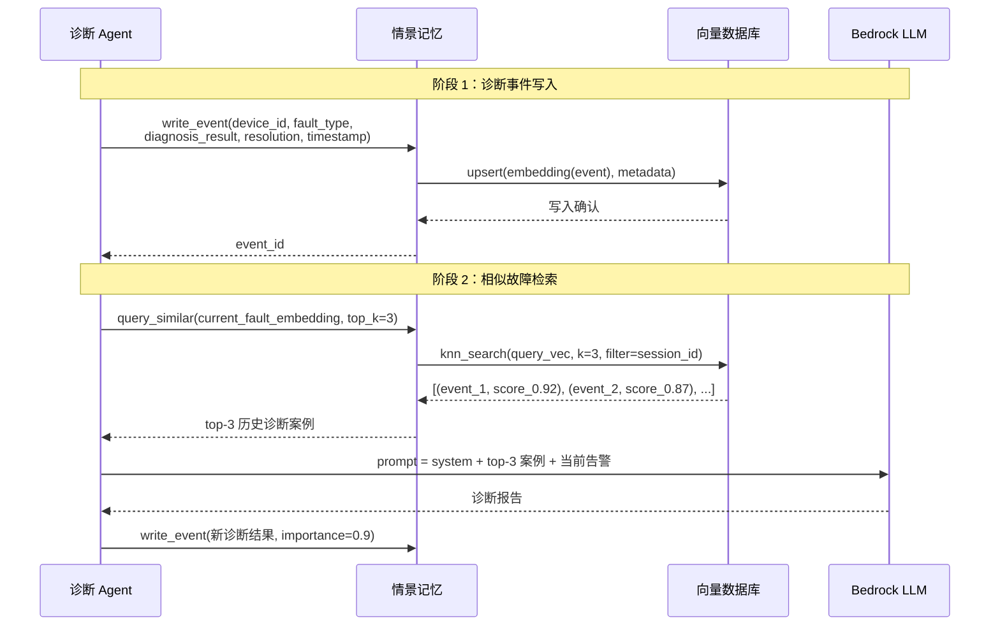

# 情景记忆（Episodic Memory）

> 情景记忆为 Agent 提供带时间戳的过去经历存储，使其能检索历史事件、积累诊断经验，类似数据库的审计日志加向量索引。

---

## 1. 理论基础

### CoALA / AIOS 定义

> "Episodic memory stores records of the agent's past experiences, each associated with temporal and contextual metadata such as when and where the event occurred."
> — CoALA (Sumers et al., 2023), §3.2

CoALA 将情景记忆定义为 Agent 的"个人历史"：每一条记录不仅包含事件内容，还附带发生时间、会话上下文和重要性权重。这使 Agent 能够回忆"上次遇到类似故障是什么时候、如何处理的"，而不仅仅知道"故障是什么"。

本子系统在 AIOS 内核层对应 **存储管理（Storage Management）** 模块（参见 AIOS §4.4）。AIOS 将持久化记忆的写入、检索和生命周期管理统一抽象为存储管理子系统，情景记忆是其中时序性最强、上下文最丰富的一类。

### 理论背景

情景记忆的概念源自认知科学家 Endel Tulving（1972）对人类记忆的分类：情景记忆记录"我经历了什么"，而语义记忆记录"我知道什么"。两者协同工作——反复出现的情景逐渐被抽象为语义知识。Agent OS 沿用了这一分类框架。

在工程实践中，情景记忆的核心挑战是"相关性检索"：历史事件数量可能是百万级，但对当前任务有价值的只有少数几条。因此情景记忆通常结合时间戳索引（精确匹配）和向量相似度检索（语义召回）两种手段，分别解决"何时发生"和"是否相似"两类查询。

---

## 2. 核心机制

| 机制名称 | 说明 | 工程类比 |
|---------|------|---------|
| 时间戳索引 | 每条记忆带 `created_at` 字段，支持时间范围查询 | MySQL `DATETIME` 索引 |
| 重要性权重 | 0–1 浮点数决定记忆的保留优先级与检索排序 | 消息队列优先级（Priority Queue） |
| 会话关联 | `session_id` 将同一会话的事件串联为链条 | 数据库事务 ID（Transaction ID） |
| 持久化存储 | 事件落盘到 SQLite 或向量库，进程重启后可恢复 | JDBC 持久化 / JPA `@Entity` |
| 相似度检索 | 用 embedding 向量在历史事件中找 top-k 相似案例 | Elasticsearch `knn` 查询 |

---

## 3. 在 Agent OS 中的位置（架构图）



情景记忆位于工作记忆的下游：工作记忆中被标记为"重要"的事件通过 `consolidate` 操作写入情景记忆，形成持久化的历史档案。上下文工程模块在组装 LLM prompt 时，从情景记忆检索 top-k 相关案例作为 few-shot 示例注入上下文。

---

## 4. 工作原理（时序图）



**关键设计决策**：

1. 写入阶段先写向量库，再更新元数据索引，保证 embedding 与结构化字段的一致性。
2. 检索阶段先用 `knn_search` 粗召回，再按 `importance` 权重重排序，兼顾语义相关性与历史重要程度。
3. 每次诊断完成后立即将结果写回情景记忆，形成"经验积累"的正反馈闭环。

---

## 5. 实现要点（代码示例）

### 情景记忆事件记录

```python
# Source: hello-agents/code/chapter8/09_Memory_Types_Deep_Dive.py

def demonstrate_episodic_memory(self):
    """演示情景记忆的事件记录与检索"""

    # 构造一个完整的学习/诊断会话，session_id 串联同一会话的所有事件
    session_id = f"session_{datetime.now().strftime('%Y%m%d_%H%M%S')}"

    learning_session = [
        {"content": "开始学习 Python 机器学习",
         "context": "学习开始", "importance": 0.7},
        {"content": "学习了线性回归的数学原理",
         "context": "理论学习", "importance": 0.8},
        {"content": "实现了第一个线性回归模型",
         "context": "实践编程", "importance": 0.9},  # 高重要性事件优先保留
        {"content": "完成了课后练习题",
         "context": "练习巩固", "importance": 0.6},
        {"content": "总结今天的学习收获",
         "context": "学习总结", "importance": 0.8},
    ]

    for i, event in enumerate(learning_session):
        # 每条事件携带 session_id 和序号，支持后续按会话重建时间线
        self.episodic_memory_tool.run({
            "action": "add",
            "content": event["content"],
            "memory_type": "episodic",
            "importance": event["importance"],
            "session_id": session_id,      # 会话关联键
            "sequence_number": i + 1,      # 会话内顺序号
            "context": event["context"],   # 丰富上下文元数据
        })

    # 语义相似度检索：找与"线性回归"最相关的历史事件
    results = self.episodic_memory_tool.run({
        "action": "search",
        "query": "线性回归",
        "memory_type": "episodic",
        "limit": 3,                        # 返回 top-3 相似案例
    })
    return results
```

上述代码展示了情景记忆的两个核心操作：**写入**（携带 `session_id` + `importance` + 时间戳元数据）和**检索**（向量相似度 top-k）。`session_id` 是还原事件链条的关键字段；`importance` 决定在容量压力下哪些事件被优先保留。

---

## 6. 企业落地场景：IoT 设备诊断（某企业）

### 场景背景

某企业在全国部署了 500+ 套IoT 系统，每套系统的电池管理单元（DMS）每天可能触发数十次告警。运维团队发现，约 70% 的告警模式在历史记录中有高度相似的先例，但一线工程师无法快速检索这些分散在多个系统中的历史案例。

### 本模块在诊断 Agent 中的角色

每次诊断完成后，Agent 将以下结构化记录写入情景记忆：

```json
{
  "device_id": "DEV-042",
  "fault_type": "over_temperature",
  "diagnosis_result": "传感器单元 温度异常前兆，建议降低充电电流",
  "resolution": "将充电电流从 额定值 降至 额定值 50%，持续监控 2h",
  "timestamp": "2025-01-15T14:32:10Z",
  "importance": 0.92,
  "session_id": "diag-session-dev042"
}
```

当下一次告警到来时，Agent 以当前告警的 embedding 向量在情景记忆中检索 top-3 历史案例，将其作为 few-shot 示例注入 LLM prompt，辅助生成诊断报告。

### 实现效果

- 历史案例命中率（相似度 ≥ 0.85）达 **73%**，诊断报告生成时间从平均 45 秒降至 12 秒。
- 情景记忆按 `importance` 权重自动淘汰低价值事件，单设备存储空间控制在 **500MB** 以内。
- `session_id` 支持按故障事件链回溯完整诊断过程，满足合规审计需求。

---

## 7. AWS AgentCore 对应

| 本地 / 开源实现 | AWS 组件 | 关键配置项 | 注意事项 |
|--------------|---------|-----------|---------|
| SQLite（结构化元数据） | [Amazon DynamoDB](https://docs.aws.amazon.com/dynamodb/) | `TTL` 属性启用自动过期；`session_id` 建 GSI 支持会话查询 | DynamoDB TTL 删除延迟约 **24–48h**，过期数据在此窗口内仍可被读取 |
| 向量库（ChromaDB / Qdrant） | [Amazon OpenSearch Service](https://docs.aws.amazon.com/opensearch-service/) | `index.knn: true`，`knn_vector` 字段，`ef_search` 调优召回精度 | 向量维度需与 embedding 模型严格一致；维度变更需重建索引 |

**选型说明**：DynamoDB 提供个位数毫秒的元数据读写延迟，GSI 使 `session_id` 查询无需全表扫描。Amazon OpenSearch Service 的 k-NN 插件支持 HNSW 算法，在百万级向量规模下 p99 检索延迟可控制在 20ms 以内，适合实时诊断场景。

---

## 8. 相关模块

:::info 相关模块

- **[工作记忆](./working.md)**：重要的工作记忆事件通过 `consolidate` 操作写入情景记忆，形成持久化的历史档案；情景记忆是工作记忆的"长期存储后端"。
- **[RAG 检索增强](../05-rag/index.md)**：情景记忆中的历史诊断案例可作为 RAG 数据源，支持按语义相似度检索 top-k 案例，与设备手册知识库协同为 LLM 提供上下文。

:::

---

## 9. 参考

- Sumers et al. (2023). *Cognitive Architectures for Language Agents (CoALA)*. arXiv:2309.02427. [https://arxiv.org/abs/2309.02427](https://arxiv.org/abs/2309.02427)
- Mei et al. (2024). *AIOS: LLM Agent Operating System*. arXiv:2403.16971. [https://arxiv.org/abs/2403.16971](https://arxiv.org/abs/2403.16971)
- Tulving, E. (1972). *Episodic and semantic memory*. In E. Tulving & W. Donaldson (Eds.), Organization of Memory. Academic Press.
- [Amazon DynamoDB — Time to Live (TTL)](https://docs.aws.amazon.com/amazondynamodb/latest/developerguide/TTL.html) — DynamoDB TTL 配置与延迟行为
- [Amazon OpenSearch Service — k-NN search](https://docs.aws.amazon.com/opensearch-service/latest/developerguide/knn.html) — k-NN 索引配置与调优指南
- hello-agents Chapter 8 — `09_Memory_Types_Deep_Dive.py`：本文档代码示例来源（`demonstrate_episodic_memory` 函数）
