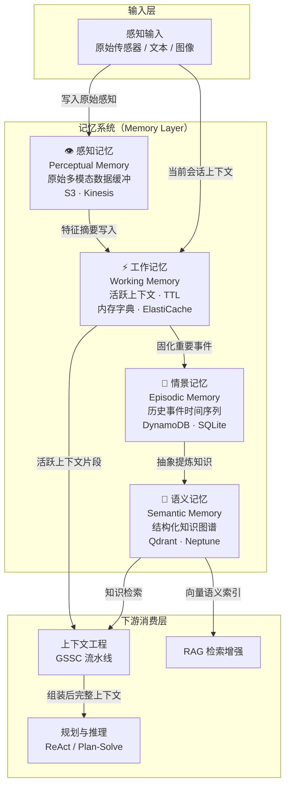
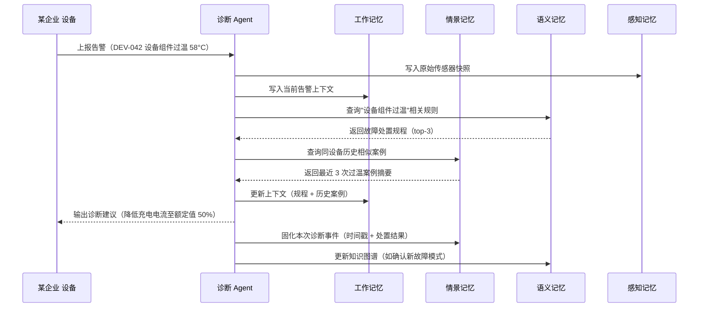

# 记忆系统（Memory）

> Agent 的"大脑存储层"——决定 Agent 记住什么、遗忘什么、如何检索。对应 AWS AgentCore Memory 组件。

---

## 理论基础：CoALA 四类记忆框架

**CoALA**（Cognitive Architectures for Language Agents，Sumers et al., 2023）是目前最系统的 Language Agent 认知架构论文。其第 3.1 节将 Agent 记忆划分为四种类型，直接映射人类认知科学的研究成果：

> "We categorize memory into four types based on their storage and retrieval mechanisms: working memory, episodic memory, semantic memory, and procedural memory."
> — CoALA §3.1

**AIOS**（Mei et al., 2024，arXiv:2403.16971）在工程侧将其映射为操作系统"内存管理子系统"（Memory Management），负责在多个 Agent 会话之间调度和持久化上下文。

Agent OS 采用 CoALA 四分法作为标准，不引入厂商定义。感知记忆（Perceptual Memory）在 IoT 场景中特别重要，作为传感器原始数据的第一级缓冲单独列出。

---

## 架构图：四种记忆类型在 Agent OS 中的层级与数据流

数据流：感知输入 → 感知记忆（原始缓冲）→ 工作记忆（活跃处理）→ 情景记忆（事件持久化）→ 语义记忆（知识抽象）→ 上下文工程组装 → 规划层消费。

---

## 四种记忆子类型总览

| 记忆类型 | CoALA 定义 | 存储介质 | IoT 场景应用 | 文档链接 |
|---------|-----------|---------|------------|---------|
| 工作记忆 | 当前推理步骤的活跃上下文，容量有限，生命周期为单次会话 | 内存字典 · Redis TTL | IoT 设备实时告警上下文，当前诊断步骤的中间变量 | [working.md](./working.md) |
| 情景记忆 | 带时间戳的历史事件序列，保留完整上下文和因果链 | SQLite · DynamoDB | 历史诊断案例、告警处置记录、设备维护日志 | [episodic.md](./episodic.md) |
| 语义记忆 | 从情景中抽象出的结构化事实和关系网络 | Qdrant · Amazon Neptune | 设备知识图谱、故障规则库、部件规格参数 | [semantic.md](./semantic.md) |
| 感知记忆 | 多模态原始输入的短期缓冲，供特征提取和摘要处理 | Amazon S3 · Kinesis | 传感器原始波形、DMS 电压曲线、红外热成像帧 | [perceptual.md](./perceptual.md) |

---

## 记忆交互流：诊断会话时序

---

## AWS AgentCore 记忆组件映射

| 本地 / 开源实现 | AWS 组件 | 关键配置项 | 注意事项 |
|--------------|---------|-----------|---------|
| 内存字典 + TTL（工作记忆） | [Amazon ElastiCache for Redis](https://docs.aws.amazon.com/elasticache/) | `ttl`, `maxmemory-policy: allkeys-lru` | Redis Serverless 按需计费；TTL 单位为秒，注意精度 |
| SQLite 本地文件（情景记忆） | [Amazon DynamoDB](https://docs.aws.amazon.com/dynamodb/) | `ttl` 属性, `BillingMode: PAY_PER_REQUEST` | 大量历史记录建议加 GSI；DynamoDB TTL 有 48h 延迟 |
| Qdrant 向量数据库（语义记忆） | [Amazon OpenSearch Serverless](https://docs.aws.amazon.com/opensearch-service/) | `vectorField`, `dimension: 1536`, `engine: faiss` | k-NN 查询按 OCU 计费；冷启动延迟约 30s |
| 本地文件系统（感知记忆） | [Amazon S3](https://docs.aws.amazon.com/s3/) + [Amazon Kinesis](https://docs.aws.amazon.com/kinesis/) | `StorageClass: STANDARD_IA`, `ShardCount` | 结合 S3 Intelligent-Tiering 降低冷数据成本 |

:::info 相关模块

- **[RAG 检索增强](../05-rag/index.md)**：RAG 工具的向量检索结果最终写入语义记忆；知识库构建依赖语义记忆的持久化索引。
- **[上下文工程](../06-context-engineering/index.md)**：GSSC 流水线的 Gather 阶段从工作记忆和情景记忆中提取上下文片段，组装为规划层的输入。

:::

---

## 延伸阅读

- Sumers, T. R., Yao, S., Narasimhan, K., & Griffiths, T. L. (2023). *Cognitive Architectures for Language Agents (CoALA)*. arXiv:2309.02427. [https://arxiv.org/abs/2309.02427](https://arxiv.org/abs/2309.02427)
- Mei, K., et al. (2024). *AIOS: LLM Agent Operating System*. arXiv:2403.16971. [https://arxiv.org/abs/2403.16971](https://arxiv.org/abs/2403.16971)
- [Amazon Bedrock AgentCore Memory](https://docs.aws.amazon.com/bedrock/latest/userguide/agents-memory.html) — AWS 官方 Agent 记忆组件文档
- hello-agents Chapter 8 配套代码：`hello-agents/code/chapter8/09_Memory_Types_Deep_Dive.py`
