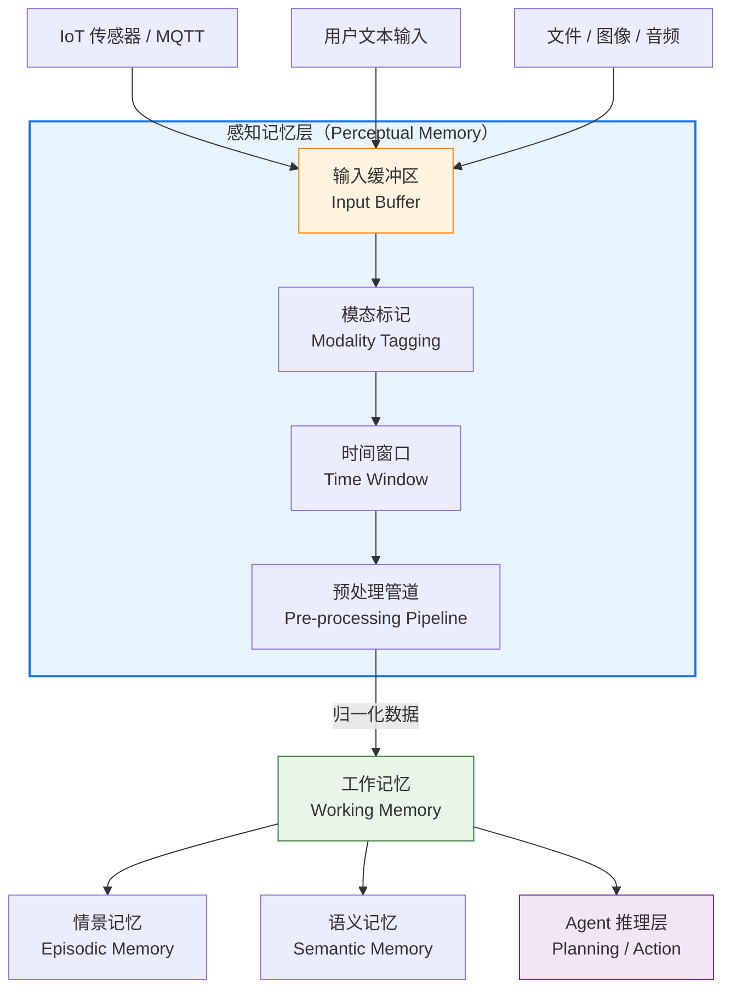
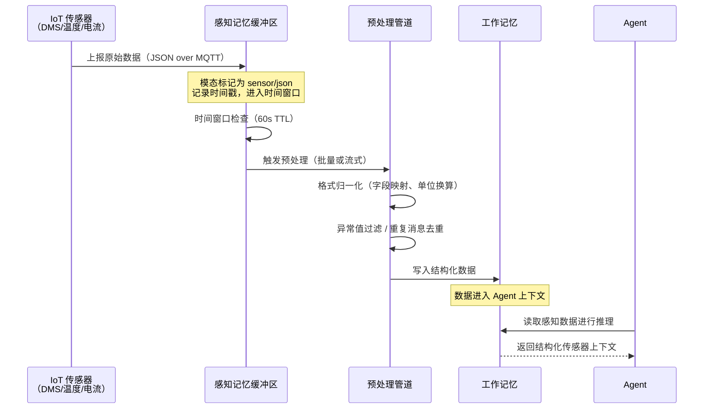

# 感知记忆（Perceptual Memory）

> 原始感知数据的入口缓冲区——Agent 认知系统的"感官输入层"。

---

## 1. 理论基础

**CoALA 定义**

CoALA（Cognitive Architectures for Language Agents，2023）将感知记忆（Perceptual Memory）定位为认知系统的最前端：它暂存来自外部世界的**原始感知输入**，在数据被处理为更高级表示之前保留其原始形态。感知记忆是"输入缓冲区"，对应人类认知中的感觉记忆（Sensory Memory）——信息在这里停留的时间极短，但对后续处理至关重要。

> "Perceptual memory holds the raw sensory inputs before they are processed into higher-level representations — the *input buffer* of the cognitive system."
> — CoALA, 2023

**AIOS 映射**

AIOS（arXiv:2403.16971，2024/2025）在其内核层架构中，将感知记忆对应到 **Access Control / Input Processing 层**：所有外部输入（文本、图像、音频、传感器流）在进入 Agent 上下文之前，均须经过该层的接收、验证与初步格式化。AIOS 将此层设计为独立模块，确保 Agent 核心逻辑不直接面对未经处理的原始数据。

**工程意义**

感知记忆的核心价值在于**解耦**：外部世界的数据格式千变万化（MQTT 消息、HTTP 响应、文件流、视频帧），感知记忆层在数据进入 Working Memory 之前完成模态标记、格式归一化和降噪，为上层认知处理提供干净、一致的输入。

---

## 2. 核心机制

| 机制名称 | 说明 | 工程类比 |
|---------|------|---------|
| 输入缓冲区 | 暂存未处理的原始感知数据，按到达顺序排队 | 消息队列 Buffer（Kafka/SQS） |
| 模态标记 | 自动标注数据类型（text / image / audio / sensor），为后续路由提供元数据 | HTTP `Content-Type` Header |
| 时间窗口 | 短暂保留最近 N 秒的原始输入，超时自动丢弃以控制内存占用 | Sliding Window / Ring Buffer |
| 预处理管道 | 格式归一化（JSON 标准化、编码统一）、降噪（过滤异常值、重复消息去重） | ETL Pipeline / Stream Processor |

---

## 3. 在 Agent OS 中的位置

感知记忆是整个 Agent OS 数据流的**入口节点**，所有外部输入必须先经过感知记忆缓冲，再流向工作记忆。



---

## 4. 工作原理

以下时序图展示从 IoT 传感器数据进入到 Agent 可用的完整流程：



---

## 5. 实现要点

以下代码片段来自 `hello-agents/code/chapter8/09_Memory_Types_Deep_Dive.py`，展示感知记忆的文本感知存储实现：

```python
# Source: hello-agents/code/chapter8/09_Memory_Types_Deep_Dive.py
# 感知记忆（Perceptual Memory）— 文本感知记忆存储示例
# demonstrate_perceptual_memory() 方法节选

def demonstrate_perceptual_memory(self):
    """演示感知记忆的特点"""
    print("\n👁️ 感知记忆 (Perceptual Memory) 深度解析")
    print("-" * 60)

    print("🔍 感知记忆特点:")
    print("• 🎨 多模态数据支持")
    print("• 🔄 跨模态相似性搜索")
    print("• 📊 感知数据的语义理解")
    print("• 🎯 内容生成和检索")

    # 演示文本感知记忆
    print(f"\n1. 文本感知记忆:")

    text_perceptions = [
        {
            "content": "这是一段优美的诗歌：春江潮水连海平，海上明月共潮生",
            "modality": "text",        # 模态标记：文本
            "genre": "poetry",
            "emotion": "peaceful",
            "language": "chinese",
            "aesthetic_value": 0.9
        },
        {
            "content": "技术文档：API接口返回JSON格式数据，包含状态码和响应体",
            "modality": "text",        # 模态标记：文本
            "genre": "technical",
            "complexity": "medium",
            "language": "chinese",
            "practical_value": 0.8
        }
    ]

    for perception in text_perceptions:
        result = self.perceptual_memory_tool.run({
            "action": "add",
            "content": perception["content"],
            "memory_type": "perceptual",    # 写入感知记忆
            "importance": 0.7,
            **{k: v for k, v in perception.items() if k != "content"}
        })
        print(f"  文本感知: {perception['genre']} - {result}")
```

**核心要点解读：**

- `modality` 字段对应**模态标记**机制，区分 `text` / `image` / `audio` / `sensor`
- `memory_type: "perceptual"` 确保数据写入感知记忆层而非其他记忆类型
- 附加元数据（genre、emotion、language）支持跨模态检索和语义理解
- `importance` 影响时间窗口内的保留优先级

---

## 6. 企业落地场景：IoT 设备诊断（某企业）

**场景背景**

某储能企业设备（如壁挂IoT 系统）通过 DMS（设备管理系统）持续上报实时传感器数据，这些原始数据在进入 Agent 诊断推理之前，需要经过感知记忆层的缓冲与预处理。

| 维度 | 详情 |
|-----|------|
| **数据来源** | DMS 传感器模块（每台设备每秒 1-5 条消息） |
| **数据格式** | JSON over MQTT，包含设备 ID、时间戳、测量值 |
| **数据字段** | `voltage`（电压 V）、`current`（电流 A）、`temperature`（温度 ℃）、`soc`（设备状态 %） |
| **时间窗口** | 保留最近 **60 秒**原始数据；超时消息自动丢弃，不写入工作记忆 |
| **触发条件** | 温度 > 45℃、SOC < 10% 或 SOC > 95%、电压偏差 > 5% 时优先处理 |

**原始 MQTT 消息示例：**

```json
{
  "device_id": "FWH-DEV-042",
  "timestamp": "2025-01-28T10:23:45Z",
  "modality": "sensor",
  "payload": {
    "voltage": 52.3,
    "current": -12.5,
    "temperature": 38.7,
    "soc": 67.2
  }
}
```

**感知记忆处理流程：**

1. **缓冲**：MQTT 消息到达后写入感知记忆缓冲区，附加模态标记 `sensor`
2. **时间窗口**：仅保留 60 秒内的消息，形成滑动窗口时序数据
3. **归一化**：字段映射（`soc` → `state_of_charge`）、单位统一（电流正负号约定）、异常值过滤（电压 < 0 的无效读数）
4. **写入工作记忆**：将归一化后的结构化数据写入工作记忆，供 Agent 读取并触发诊断推理

---

## 7. AWS AgentCore 对应

| 本地/开源实现 | AWS 组件 | 关键配置项 | 注意事项 |
|-------------|---------|-----------|---------|
| MQTT 消息缓冲 | [AWS IoT Core](https://docs.aws.amazon.com/iot/) + [Amazon Kinesis Data Streams](https://docs.aws.amazon.com/streams/latest/dev/) | `retentionPeriod`（保留期，1-365天）、`shardCount`（分片数） | Kinesis 按分片计费，单分片 1 MB/s 写入；估算设备数量合理设置分片，避免过度分配 |
| 原始文件暂存（图像/音频/大型日志） | [Amazon S3](https://docs.aws.amazon.com/s3/) | `lifecycle rules`（生命周期策略）、`intelligent tiering`（智能分层） | 配合 S3 事件通知触发 Lambda 预处理函数，实现归一化管道；为临时缓冲数据设置短生命周期（7-30天）降低存储成本 |
| 预处理管道 | [AWS Lambda](https://docs.aws.amazon.com/lambda/) + [Amazon Kinesis Data Firehose](https://docs.aws.amazon.com/firehose/) | `batchSize`、`parallelizationFactor`、数据转换 Lambda ARN | Firehose 内置数据转换支持，适合格式归一化；Lambda 触发器适合复杂预处理逻辑 |
| 时间窗口 / 滑动聚合 | [Amazon Kinesis Data Analytics](https://docs.aws.amazon.com/kinesisanalytics/) | 滑动窗口大小（秒）、聚合函数 | 适合实时窗口聚合（如 60 秒内平均温度）；复杂场景可考虑 Apache Flink on Kinesis Analytics |

---

## 8. 相关模块

:::info 相关模块

- **[工作记忆](./working.md)**：感知记忆预处理后的结构化数据写入工作记忆，进入 Agent 的活跃上下文，驱动诊断推理
- **[感知与输入处理](../02-perception/index.md)**：感知记忆是感知模块的底层存储层，感知模块的多模态解析结果均先缓冲于此
- **[记忆系统总览](./index.md)**：了解四种记忆类型在 Agent OS 中的完整层级关系与数据流向

:::

---

## 9. 延伸阅读

- **CoALA 论文**：Zhu et al., "Cognitive Architectures for Language Agents," arXiv:2309.02427 (2023) — 感知记忆理论来源
- **AIOS 论文**：Mei et al., "AIOS: LLM Agent Operating System," arXiv:2403.16971 (2024/2025) — Access Control / Input Processing 层设计
- **AWS IoT Core 文档**：[https://docs.aws.amazon.com/iot/](https://docs.aws.amazon.com/iot/) — MQTT 消息路由与规则引擎
- **Amazon Kinesis Data Streams 文档**：[https://docs.aws.amazon.com/streams/latest/dev/](https://docs.aws.amazon.com/streams/latest/dev/) — 实时数据流缓冲与保留策略
- **Amazon S3 生命周期策略**：[https://docs.aws.amazon.com/AmazonS3/latest/userguide/object-lifecycle-mgmt.html](https://docs.aws.amazon.com/AmazonS3/latest/userguide/object-lifecycle-mgmt.html) — 原始文件暂存与自动清理
