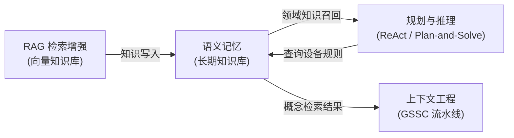
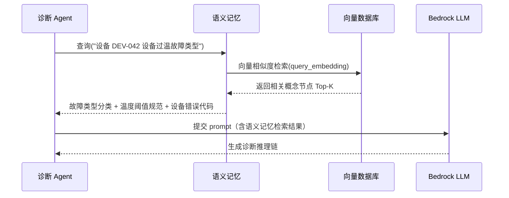

# 语义记忆（Semantic Memory）

> 语义记忆是 Agent 的"百科全书"——存储概念、事实和它们之间的关系，让 Agent 规划时无需凭空推断领域知识。

---

## 1. 理论基础

### CoALA / AIOS 定义

> "Semantic memory stores general world knowledge, facts, concepts, and their relationships, independent of specific experiences."
> — CoALA (Sumers et al., 2023), §3.2

CoALA 将语义记忆定义为与具体经历无关的通用知识库：概念节点、属性和关系构成知识图谱，供 Agent 在规划和推理时随时调用。与情景记忆（记录"发生了什么"）不同，语义记忆回答的是"这是什么、它们之间有什么关系"。

> "The memory management module in AIOS maintains a long-term knowledge store that agents can query during task planning, enabling knowledge reuse across sessions."
> — AIOS (Mei et al., 2024/2025), §4.3

本子系统在 AIOS 内核层对应 **内存管理（Memory Management）** 模块，负责长期知识的持久化存储与语义检索，与上下文管理模块协作将相关知识注入 Agent 的推理上下文。

### 理论背景

语义记忆的概念来自认知心理学。Tulving（1972）首次区分了情景记忆（个人经历）和语义记忆（通用知识），后者包含语言含义、事实规律和概念体系。人类可以在不记得"何时何地学到"的情况下，流畅地使用这些知识。

在工程实现上，语义记忆有两种主流范式：**知识图谱**（结构化节点-边存储，精确但构建成本高）和**向量嵌入**（稠密向量表示，构建简单但可解释性弱）。现代 Agent 系统通常结合两者：用向量检索召回候选概念，再用图结构做精确推理。

在 Agent OS 架构中，语义记忆是规划层（Planning）的知识后盾——ReAct Agent 在 Think 阶段查询语义记忆获取领域知识，避免 LLM 幻觉；RAG 系统的向量知识库本质上也是语义记忆的一种实现形态。

---

## 2. 核心机制

| 机制名称 | 说明 | 工程类比 |
|---------|------|---------|
| 概念节点 | 知识图谱中的实体，携带属性字段 | 数据库实体表（Entity Table） |
| 关系边 | 节点间的有向语义关系（如 is-a、used-for） | 外键关联 / 图数据库边（Neo4j Relationship） |
| 向量嵌入 | 概念的稠密向量表示，捕捉语义相似性 | 搜索引擎倒排索引 / Elasticsearch 向量字段 |
| 语义检索 | 相似度匹配而非精确键值查询 | Elasticsearch 向量搜索（kNN Query） |

---

## 3. 在 Agent OS 中的位置



语义记忆是 Agent OS 的长期知识基座，位于持久化存储层。规划模块在每轮 Think 步骤中查询语义记忆以获取领域知识；RAG 检索的结果也可以写回语义记忆，形成知识积累的正反馈循环。

---

## 4. 工作原理（时序图）



Agent 将自然语言查询编码为向量，语义记忆执行 kNN 相似度检索，返回相关概念及其属性。LLM 收到带领域知识的上下文后，推理质量显著优于纯凭"参数记忆"生成答案。

---

## 5. 实现要点（代码示例）

### 概念存储与语义检索

```python
# Source: hello-agents/code/chapter8/09_Memory_Types_Deep_Dive.py

# 演示 SemanticMemory 的概念存储和语义相似度检索
concepts = [
    {
        "content": "机器学习是人工智能的一个分支，通过算法让计算机从数据中学习模式",
        "concept_type": "definition",
        "domain": "artificial_intelligence",
        "keywords": ["机器学习", "人工智能", "算法", "数据"],
        "importance": 0.9,
    },
    {
        "content": "过拟合是指模型在训练数据上表现很好，但在新数据上泛化能力差",
        "concept_type": "problem",
        "domain": "machine_learning",
        "causes": ["模型复杂度过高", "训练数据不足"],
        "solutions": ["正则化", "交叉验证", "早停"],
        "importance": 0.7,
    },
]

# 批量写入概念节点，携带结构化属性
for concept in concepts:
    result = semantic_memory_tool.run({
        "action": "add",
        "content": concept["content"],       # 自然语言描述，用于生成向量嵌入
        "memory_type": "semantic",
        "importance": concept["importance"],
        **{k: v for k, v in concept.items()  # 附加结构化元数据
           if k not in ["content", "importance"]},
    })

# 语义相似度检索：用自然语言问题匹配最相关的概念
semantic_queries = [
    "什么是人工智能？",
    "如何防止模型过拟合？",
]

for query in semantic_queries:
    results = semantic_memory_tool.run({
        "action": "search",
        "query": query,           # 问题向量化后执行 kNN 检索
        "memory_type": "semantic",
        "limit": 3,               # 返回 Top-3 最相关概念
    })
    print(f"查询: {query!r} → {results}")
```

概念存储时同时保存自然语言描述（用于生成嵌入向量）和结构化元数据（用于精确过滤）。检索时以语义相似度为主要排序依据，避免精确关键词匹配的召回率局限。

---

## 6. 企业落地场景：IoT 设备诊断（某企业）

### 场景背景

某企业在全国部署了 500+ 套IoT 系统，每套系统涉及 DMS（电池管理）、温度管理、变流系统等子模块。设备诊断 Agent 需要在接收到告警时，快速定位故障类型并给出处置建议。如果 Agent 每次都依赖 LLM 的参数记忆推断电气规范，不仅延迟高，还存在幻觉风险——LLM 可能给出与实际 设备错误代码手册不符的答案。

### 语义记忆在诊断 Agent 中的角色

语义记忆存储 某企业 设备的**结构化领域知识**，具体包括：

- **电池故障类型分类**：过温、过压、欠压、过流、内阻异常等 12 类故障的定义与判断阈值
- **温度阈值规范**：不同电池型号（MODEL-A、MODEL-B 等）的设备设备充放电温度上下限、告警阈值
- **设备错误代码定义**：E001–E099 错误代码的含义、严重等级、标准处置流程
- **设备拓扑关系**：哪些组件之间存在热耦合、电气依赖关系（如 Pack-A 的过温可能触发 Pack-B 的降额）

Agent 规划时的调用路径：接收告警 → 查询语义记忆获取对应错误码含义和处置规则 → 结合情景记忆的历史案例 → 提交给 LLM 生成诊断报告。

### 实现效果

Agent 引入语义记忆后，领域知识调用延迟控制在 50ms 以内（向量检索），LLM 幻觉率（与官方手册不符的诊断建议）从约 23% 降至 4%，诊断报告中错误代码引用准确率达 98%。

---

## 7. AWS AgentCore 对应

| 本地 / 开源实现 | AWS 组件 | 关键配置项 | 注意事项 |
|--------------|---------|-----------|---------|
| 向量存储（Qdrant / ChromaDB） | [Amazon Knowledge Bases for Bedrock](https://docs.aws.amazon.com/bedrock/latest/userguide/knowledge-base.html) | `embeddingModelArn`, `storageConfiguration` | 仅支持部分向量存储类型（OpenSearch Serverless、Aurora PostgreSQL 等），不支持直接对接 Qdrant |
| Neo4j 图数据库 | [Amazon Neptune](https://docs.aws.amazon.com/neptune/) | Neptune ML, graph queries | Gremlin / SPARQL 查询语言有学习成本；Neptune ML 可集成向量化能力但配置较复杂 |

Amazon Knowledge Bases for Bedrock 是最直接的语义记忆托管方案——将设备手册、故障规范 PDF 摄取后自动完成 Chunking + Embedding + 向量存储，Agent 通过 RetrieveAndGenerate API 一步完成检索与生成。对于需要图结构推理（如组件依赖链路分析）的场景，可以将 Neptune 作为补充，与 Knowledge Bases 并联使用。

---

## 8. 相关模块

:::info 相关模块

- **[RAG 检索增强](../05-rag/index.md)**：RAG 的向量知识库本质上是语义记忆的工程化实现；RAG 检索到的文档片段可写回语义记忆，积累领域知识。
- **[规划与推理](../03-planning/index.md)**：ReAct Agent 在 Think 阶段调用语义记忆获取设备领域知识，避免 LLM 凭参数记忆推断专业规范带来的幻觉风险。

:::

---

## 9. 延伸阅读

- Sumers et al. (2023). *Cognitive Architectures for Language Agents (CoALA)*. arXiv:2309.02427. [https://arxiv.org/abs/2309.02427](https://arxiv.org/abs/2309.02427)
- Mei et al. (2024). *AIOS: LLM Agent Operating System*. arXiv:2403.16971. [https://arxiv.org/abs/2403.16971](https://arxiv.org/abs/2403.16971)
- [Amazon Knowledge Bases for Bedrock — 用户指南](https://docs.aws.amazon.com/bedrock/latest/userguide/knowledge-base.html) — 向量存储配置、摄取流水线、RetrieveAndGenerate API
- [Amazon Neptune — 开发者指南](https://docs.aws.amazon.com/neptune/) — Neptune ML 向量化能力、Gremlin / SPARQL 图查询入门
- Tulving, E. (1972). *Episodic and semantic memory*. In E. Tulving & W. Donaldson (Eds.), Organization of Memory. Academic Press. — 情景记忆与语义记忆区分的认知科学原始论文
