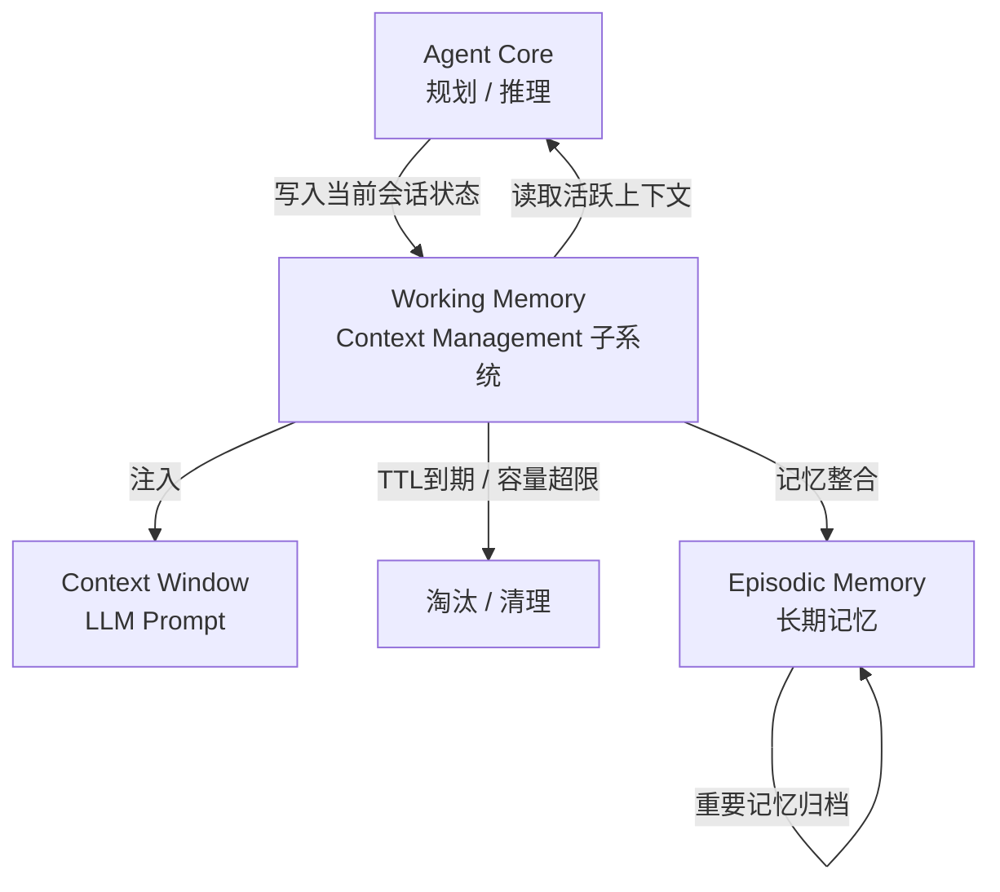
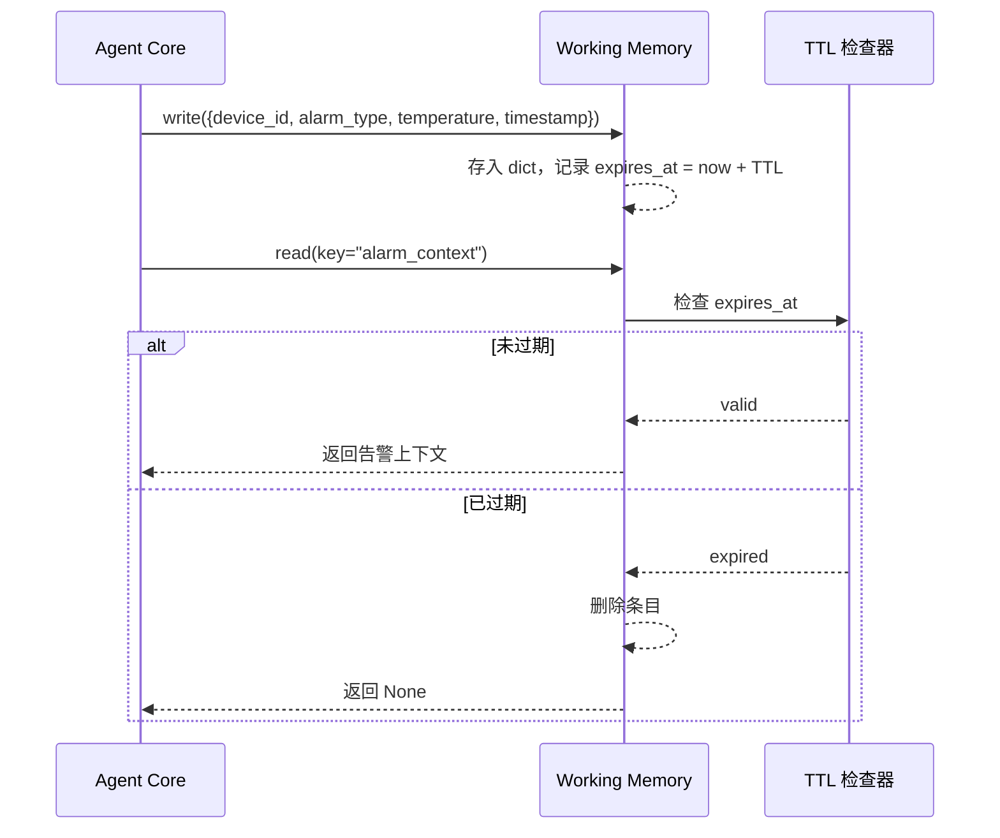

# 工作记忆（Working Memory）

> 短暂存在、高速访问——工作记忆是 Agent 执行当前任务的「临时便签本」。

---

## 1. 理论基础

CoALA 论文（arXiv:2309.02427）将工作记忆定义为：**存储当前任务所需的短期、任务相关上下文**，类似人类认知中的"工作台"——只容纳正在使用的信息，容量有限，任务结束后自动清空。

AIOS（arXiv:2403.16971）将其映射到内核层的 **Context Management 子系统**：该子系统负责在 Agent 执行周期内维护活跃上下文，向 LLM 注入当前会话状态，并在会话结束或容量达到上限时执行淘汰策略。

工作记忆的核心约束是**时效性**和**容量上限**，这两条约束共同确保系统不因累积大量过期状态而消耗内存或污染上下文窗口。

---

## 2. 核心机制

| 机制名称 | 说明 | 工程类比 |
|----------|------|----------|
| TTL 过期 | 每条记忆携带到期时间戳，过期后自动失效 | Redis TTL / `EXPIRE` 命令 |
| 容量限制 | 默认最多存储 50 条记忆，超限触发淘汰 | JVM Heap 最大堆大小 |
| 重要性排序 | 每条记忆有 0~1 权重，淘汰时优先清除低权重记忆 | LRU Cache 加权变体 |
| 时间衰减 | 检索评分乘以时间衰减因子，新记忆排名更高 | Hacker News 热度公式 |
| 自动清理 | 后台定期扫描并删除 TTL 到期条目，维持系统性能 | Redis `activeExpireCycle` |

---

## 3. 在 Agent OS 中的位置



工作记忆位于 Agent Core 与 Context Window 之间，是**实时状态的唯一真相来源**。Agent 每个推理步骤读写工作记忆；上下文工程流水线（GSSC）从中拉取内容组装 Prompt。

---

## 4. 工作原理



写入时，记忆条目附带 `expires_at` 时间戳和 `importance` 权重；读取时先做 TTL 检查，过期则清除并返回空值，保证 Agent 不会获取到陈旧状态。

---

## 5. 实现要点

以下摘自 `hello-agents/code/chapter8/03_WorkingMemory_Implementation.py`，展示容量管理与 TTL 的核心逻辑：

```python
# Source: hello-agents/code/chapter8/03_WorkingMemory_Implementation.py

class WorkingMemoryDemo:
    """工作记忆演示类：有限容量 + TTL + 重要性排序"""

    def __init__(self):
        self.memory_tool = MemoryTool(
            user_id="working_memory_demo",
            memory_types=["working"]  # 只启用工作记忆
        )

    def demonstrate_capacity_management(self):
        """演示容量管理和 TTL 机制"""
        # 工作记忆核心约束：
        # • 容量上限：默认 50 条
        # • TTL：默认 60 分钟后自动过期
        # • 优先级：重要性权重低的记忆优先被淘汰
        for i in range(10):
            importance = 0.3 + (i * 0.07)  # 递增重要性 0.30 → 0.93
            self.memory_tool.run({
                "action": "add",
                "content": f"工作记忆测试项目 {i+1}",
                "memory_type": "working",
                "importance": importance,   # 权重决定淘汰顺序
            })

        # 触发基于重要性的清理（低于阈值 0.3 的条目被移除）
        self.memory_tool.run({
            "action": "forget",
            "strategy": "importance_based",
            "threshold": 0.3,
        })

    def demonstrate_mixed_retrieval_strategy(self):
        """混合检索策略：TF-IDF 语义 + 关键词 + 时间衰减 + 重要性权重"""
        result = self.memory_tool.run({
            "action": "search",
            "query": "设备过温告警",
            "memory_type": "working",
            "limit": 5,   # 返回最相关的 5 条
        })
        return result
```

关键设计决策：将 Mock 实现与真实实现共置于同一文件，通过 `MOCK_MODE` 环境变量切换，确保无 API Key 时演示逻辑仍能完整执行。

---

## 6. 企业落地场景：IoT 设备诊断（某企业）

**场景**：DEV-042 设备过温告警触发，诊断 Agent 需要在整个会话期间缓存当前告警上下文，以便多轮推理步骤之间共享状态。

**工作记忆的作用**：

- 写入 `{device_id: "DEV-042", alarm_type: "over_temperature", temperature: 68.5, timestamp: "2025-01-28T10:23:00Z"}` 到工作记忆
- 后续推理步骤（查询设备手册、调用诊断工具、生成报告）均从工作记忆读取同一份上下文，无需重复传参

**约束配置**：

- `TTL = 30 min`：诊断会话结束后上下文自动清理，避免跨会话状态污染
- `capacity = 50`：单设备诊断会话通常不超过 20 条状态条目，容量上限防止内存溢出
- `importance_threshold = 0.3`：低权重的中间推理状态（如临时计算结果）优先被淘汰，高权重的告警核心字段始终保留

---

## 7. AWS AgentCore 对应

| 本地/开源实现 | AWS 组件 | 关键配置项 | 注意事项 |
|--------------|----------|------------|----------|
| `dict` + TTL 逻辑 | [Amazon ElastiCache for Redis](https://docs.aws.amazon.com/elasticache/) | `ttl`（秒）、`maxmemory-policy` | 选择 `allkeys-lru` 或 `volatile-lru` eviction policy 以模拟重要性淘汰 |
| `MemoryTool(working)` | Amazon Bedrock AgentCore Memory（session context） | `sessionId`、`ttlInSeconds` | 每个 session 拥有独立命名空间，跨 session 不共享状态 |

---

## 8. 相关模块

:::info 相关模块

- **[上下文工程](../06-context-engineering/index.md)**：工作记忆内容通过 GSSC 流水线（Gather → Select → Structure → Compress）组装进上下文窗口，是 Prompt 实时状态的主要来源
- **[情景记忆](./episodic.md)**：诊断会话结束时，重要的工作记忆条目通过记忆整合（Memory Consolidation）写入情景记忆持久化，供未来相似故障检索复用

:::

---

## 9. 延伸阅读

- Zhu et al. **CoALA: Cognitive Architectures for Language Agents** (2023) — [arXiv:2309.02427](https://arxiv.org/abs/2309.02427)
- Mei et al. **AIOS: LLM Agent Operating System** (2024) — [arXiv:2403.16971](https://arxiv.org/abs/2403.16971)
- AWS 官方文档：[Amazon ElastiCache for Redis 开发者指南](https://docs.aws.amazon.com/elasticache/latest/dg/WhatIs.html)
- AWS 官方文档：[Amazon Bedrock AgentCore Memory](https://docs.aws.amazon.com/bedrock/latest/userguide/agents-memory.html)
