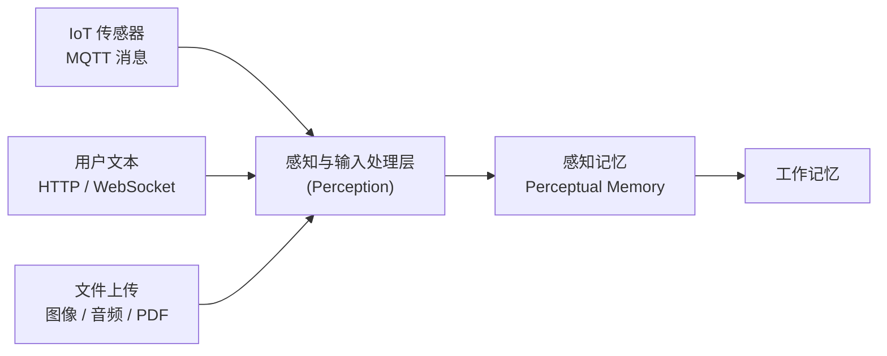

# 感知与输入处理（Perception）

> 感知层是 Agent OS 的"五感"——将外部世界的多模态输入（文本、图像、音频、传感器数据）转化为 Agent 可理解的标准格式。

:::caution 文档状态

本文档当前为 **草稿（Draft）** 状态。感知模块的学习内容将在完成 hello-agents 相关章节后更新。当前文档提供基础框架描述和 AWS 组件占位映射。

:::

---

## 在 Agent OS 中的位置

感知层是整个 Agent OS 数据流的最前端，所有外部输入在进入记忆系统之前都必须经过感知处理：

---

## AWS AgentCore 对应（占位）

以下 AWS 组件与感知处理相关，具体配置项待内容完善后补充：

| 感知类型 | AWS 组件 | 说明 | 状态 |
|---------|---------|------|------|
| 文本输入 | Amazon Bedrock（原生支持）| LLM 直接处理文本输入 | 已在其他模块覆盖 |
| 图像识别 | [Amazon Rekognition](https://docs.aws.amazon.com/rekognition/) | 图像分类、对象检测、文字识别（OCR）| 待补充 |
| 语音转文字 | [Amazon Transcribe](https://docs.aws.amazon.com/transcribe/) | 实时/批量语音转文字 | 待补充 |
| 文档解析 | [Amazon Textract](https://docs.aws.amazon.com/textract/) | PDF/图像中的表格和文字提取 | 待补充 |
| IoT 数据流 | [AWS IoT Core](https://docs.aws.amazon.com/iot/) + [Kinesis](https://docs.aws.amazon.com/kinesis/) | 传感器数据实时接入 | 已在感知记忆章节覆盖 |

---

:::info 相关模块

- **[感知记忆（Perceptual Memory）](../01-memory/perceptual.md)**：感知处理后的原始数据写入感知记忆缓冲区。
- **[工具执行层](../04-action-tools/index.md)**：感知输入可以作为工具调用的触发条件（如图像识别结果触发诊断工具调用）。

:::

---

## 延伸阅读

- CoALA arXiv:2309.02427 — Perception and Action Space
- [Amazon Rekognition 文档](https://docs.aws.amazon.com/rekognition/)
- [Amazon Transcribe 文档](https://docs.aws.amazon.com/transcribe/)
- [Amazon Textract 文档](https://docs.aws.amazon.com/textract/)
