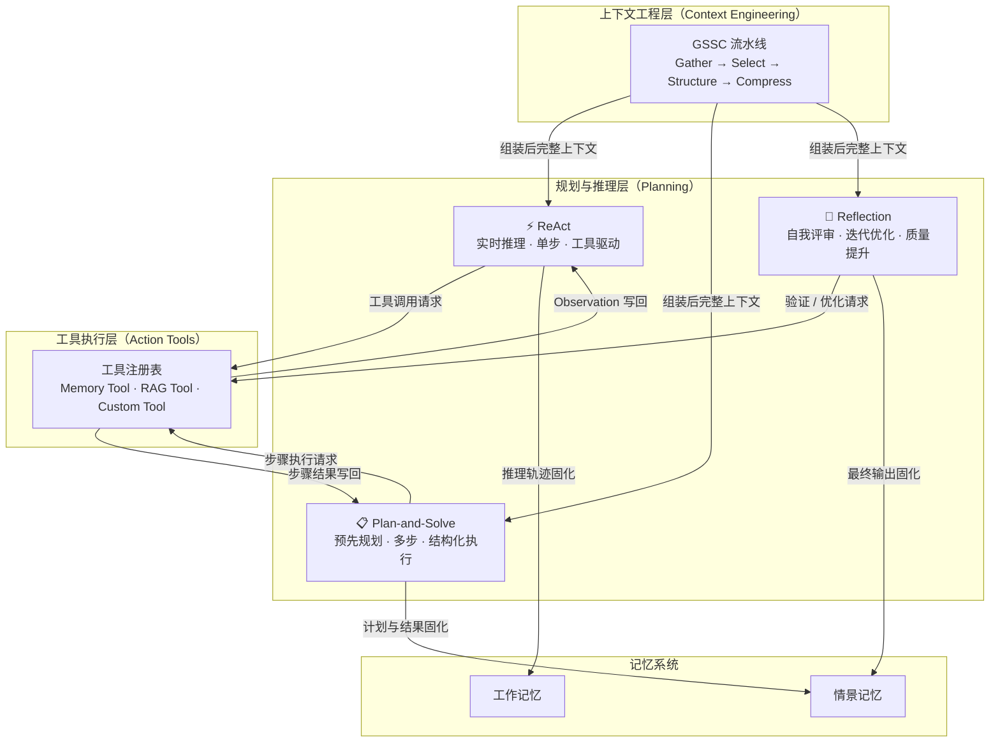

# 规划与推理（Planning）

> Agent 的"决策引擎"——决定 Agent 如何把目标分解为行动序列，是连接上下文输入与工具执行的核心推理层。

---

## 理论基础：CoALA 行动空间与规划范式

**CoALA**（Cognitive Architectures for Language Agents，Sumers et al., 2023）将 Agent 的行动空间（Action Space）划分为四类：存储操作、流程控制、工具调用、**推理规划**。其中推理规划子系统负责把用户意图映射为可执行的多步骤决策链。

CoALA 将规划行为归纳为三个核心维度：

- **单步反应型（Reactive）**：每步根据当前观察实时决策，无需维护显式计划。对应 ReAct 范式。
- **预先规划型（Deliberative）**：先生成完整计划再逐步执行，适合复杂多步任务。对应 Plan-and-Solve 范式。
- **自我校正型（Reflective）**：执行后评估输出质量，迭代优化直至满足标准。对应 Reflection 范式。

**AIOS**（Mei et al., 2024，arXiv:2403.16971）在内核层专门设置**调度子系统（Scheduler Subsystem）**，负责管理并发 Agent 的规划任务队列、分配 LLM 推理资源，并维护跨步骤的中间状态。在多设备并发诊断场景中，调度子系统确保多个规划任务不会因资源竞争而互相阻塞。

---

## 三种规划范式对比

| 范式 | 适用场景 | 优势 | 局限性 |
|------|---------|------|--------|
| **ReAct**（实时单步推理） | 需要实时工具调用、信息随时间动态变化的任务，如告警响应、在线搜索 | 响应快、无需预知任务边界、观察结果直接反馈推理 | 长任务中容易失去全局方向；易陷入局部循环 |
| **Plan-and-Solve**（复杂多步任务） | 目标明确、步骤可提前分解、中间结果有依赖关系的任务，如多阶段诊断、报告生成 | 逻辑结构清晰、各步骤可独立验证、易于并行执行子计划 | 规划阶段依赖 LLM 一次性生成完整计划，抗噪性弱；执行过程中计划难以动态调整 |
| **Reflection**（质量提升与自我验证） | 输出质量要求高、需要迭代精化的任务，如代码生成、诊断报告撰写、方案优化 | 通过多轮评审显著提升输出质量；评审与执行可使用不同视角的 prompt | 迭代次数增加 LLM 调用成本；收敛条件难以形式化定义 |

---

## 架构图：规划层在 Agent OS 中的位置

数据流：上下文工程组装完整上下文 → 规划层选择范式推理 → 工具执行层调用外部资源 → 观察结果写回推理循环 → 最终结果固化至记忆系统。

---

## AWS AgentCore 映射

Amazon Bedrock AgentCore 对三种规划范式提供了原生支持，无需自行管理推理循环的基础设施。

| 规划范式 | 本地 / 开源实现 | Amazon Bedrock AgentCore 实现 | 关键配置项 | 注意事项 |
|---------|--------------|------------------------------|-----------|---------|
| **ReAct** | `ReActAgent` 手动循环（chapter4/ReAct.py） | [Amazon Bedrock Agents](https://docs.aws.amazon.com/bedrock/latest/userguide/agents.html) 内置 ReAct 循环 | `orchestrationType: DEFAULT`，`maxSteps: 10` | 默认最大推理步数 10，复杂任务可调至 20；每次工具调用计一次 Bedrock API 请求 |
| **Plan-and-Solve** | `PlanAndSolveAgent`（chapter4/Plan_and_solve.py） | [Amazon Bedrock Agents with Step-by-Step Orchestration](https://docs.aws.amazon.com/bedrock/latest/userguide/agents-orchestration.html) + [Amazon Bedrock Flows](https://docs.aws.amazon.com/bedrock/latest/userguide/flows.html) | `orchestrationType: CUSTOM_ORCHESTRATION`，Flow 节点定义步骤依赖 | Bedrock Flows 支持条件分支和并行步骤；适合将 Planner 和 Executor 解耦为独立节点 |
| **Reflection** | `ReflectionAgent`（chapter4/Reflection.py） | [Amazon Bedrock Agents](https://docs.aws.amazon.com/bedrock/latest/userguide/agents.html) + 自定义 Evaluator Lambda Action Group | Evaluator Lambda 返回 `needsRefinement: true/false` + 反馈文本 | 每轮反思增加一次完整 Agent 调用，成本随迭代线性增长；建议设置最大迭代上限 |

---

## IoT 场景：某储能企业设备故障诊断

某储能企业设备诊断 Agent 在不同故障类型下选择不同的规划范式，以平衡响应速度与诊断精度。

| 规划范式 | 某企业 诊断应用 | 触发条件 | 预期输出 |
|---------|-------------------|---------|---------|
| **ReAct → 实时告警响应** | DMS 单体设备组件过压/过温告警，Agent 实时查询传感器数据、搜索处置规程、逐步执行响应动作 | 告警级别 ≥ Level-2，响应时限 ≤ 30s | 实时处置建议（如降低充电电流、触发散热）+ 告警确认记录 |
| **Plan-and-Solve → 复杂多步诊断** | 设备整体健康度评估：需依次完成电压检测 → 温度趋势分析 → 历史案例检索 → 综合评分 → 报告生成，各步骤有数据依赖 | 定期巡检任务或 Level-1 低优先级告警 | 结构化健康评估报告（JSON + 自然语言摘要） |
| **Reflection → 诊断结果验证** | 关键诊断结论生成后，由独立评审 Agent 对诊断逻辑进行审查，确认推理链无误、建议符合设备手册规范 | 诊断结论影响维修决策（如建议更换传感器模块）时触发 | 经过验证的最终诊断报告 + 评审意见记录 |

---

## 子文档导航

| 文档 | 内容 | 状态 |
|-----|------|------|
| [ReAct 范式](./react.md) | Think → Act → Observe 循环实现；ReAct 时序图；chapter4/ReAct.py 核心代码；实时告警响应场景 | draft |
| [Plan-and-Solve 范式](./plan-and-solve.md) | Planner + Executor 分离架构；Plan-and-Solve 流程图；chapter4/Plan_and_solve.py 核心代码；多步诊断场景 | draft |
| [Reflection 范式](./reflection.md) | Execute → Reflect → Refine 迭代循环；Reflection 时序图；chapter4/Reflection.py 核心代码；诊断结果验证场景 | draft |

---

:::info 相关模块

- **[工具执行层](../04-action-tools/index.md)**：规划层通过工具执行层调用外部资源（设备状态查询、历史告警检索、报告生成）；ReAct 的每一个 Act 步骤都对应一次工具执行层的调用。
- **[上下文工程](../06-context-engineering/index.md)**：GSSC 流水线在将上下文注入规划层之前，负责从记忆系统中收集、筛选、结构化和压缩上下文片段，直接影响规划质量。

:::

---

## 延伸阅读

- Yao, S., Zhao, J., Yu, D., et al. (2022). *ReAct: Synergizing Reasoning and Acting in Language Models*. arXiv:2210.03629. [https://arxiv.org/abs/2210.03629](https://arxiv.org/abs/2210.03629)
- Wang, L., Xu, W., Lan, Y., et al. (2023). *Plan-and-Solve Prompting: Improving Zero-Shot Chain-of-Thought Reasoning by Large Language Models*. arXiv:2305.04091. [https://arxiv.org/abs/2305.04091](https://arxiv.org/abs/2305.04091)
- Shinn, N., Cassano, F., Labash, B., et al. (2023). *Reflexion: Language Agents with Verbal Reinforcement Learning*. arXiv:2303.11366. [https://arxiv.org/abs/2303.11366](https://arxiv.org/abs/2303.11366)
- Sumers, T. R., Yao, S., Narasimhan, K., & Griffiths, T. L. (2023). *Cognitive Architectures for Language Agents (CoALA)*. arXiv:2309.02427. [https://arxiv.org/abs/2309.02427](https://arxiv.org/abs/2309.02427)
- Mei, K., et al. (2024). *AIOS: LLM Agent Operating System*. arXiv:2403.16971. [https://arxiv.org/abs/2403.16971](https://arxiv.org/abs/2403.16971)
- [Amazon Bedrock Agents 官方文档](https://docs.aws.amazon.com/bedrock/latest/userguide/agents.html) — Amazon Bedrock AgentCore 内置规划与推理
- [Amazon Bedrock Flows 官方文档](https://docs.aws.amazon.com/bedrock/latest/userguide/flows.html) — Amazon Bedrock AgentCore 多步工作流编排
- hello-agents Chapter 4 配套代码：`hello-agents/code/chapter4/ReAct.py`、`hello-agents/code/chapter4/Plan_and_solve.py`、`hello-agents/code/chapter4/Reflection.py`
