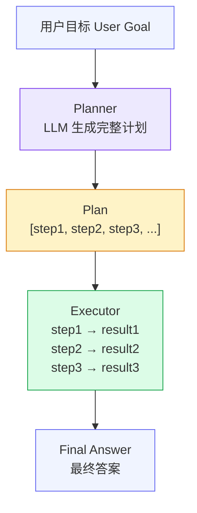
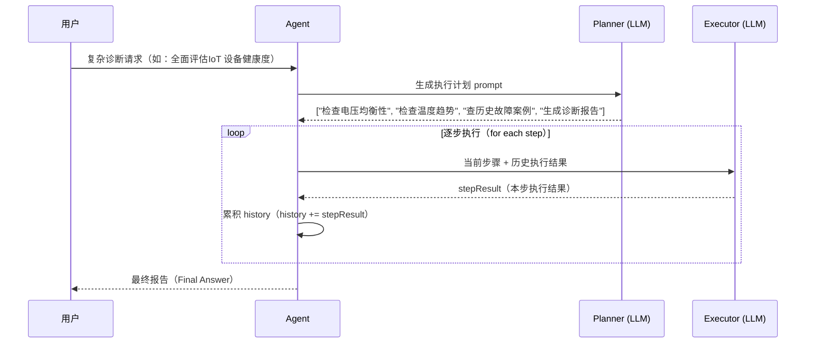

# Plan-and-Solve 范式

## 1. 理论基础

**Wang et al. (2023)** 在论文 *Plan-and-Solve Prompting: Improving Zero-Shot Chain-of-Thought Reasoning by Large Language Models*（arXiv:2305.04091）中提出了 Plan-and-Solve 范式。其核心洞察是：在执行任何步骤之前，先让 LLM 完整地生成执行计划，可以显著减少零样本链式推理中的计算错误和步骤遗漏。

**CoALA（Cognitive Architectures for Language Agents）** 将这种模式归类为 **deliberative planning（审慎规划）**：Agent 不是在感知-行动循环中即时决策，而是先显式生成一份完整计划，再逐步执行。这与人类专家在动手操作前先写工作清单的认知习惯高度吻合。

**AIOS（LLM-Based AI Agent Operating System，arXiv:2403.16971）** 在内核层的调度子系统中直接对应了这一模式：**multi-step task scheduling**（多步任务调度）将复杂目标分解为有序子任务序列，内核负责维护执行状态，保证每步结果能作为下步输入传递。

---

## 2. 核心机制

| 机制名称 | 说明 | 工程类比 |
|---------|------|---------|
| Planner | LLM 一次性生成完整执行计划（步骤列表），后续执行阶段不再修改计划 | 项目甘特图 |
| Executor | 按步骤顺序执行，每步结果作为下步输入累积到历史上下文 | 流水线作业（Pipeline） |
| 步骤依赖 | 后续步骤可在 prompt 中显式引用前步结果，形成数据流依赖 | 有向无环图（DAG） |
| 计划 JSON | 结构化的步骤列表（Python list 或 JSON array），LLM 解析后顺序执行 | 工作流定义文件 |

---

## 3. 在 Agent OS 中的位置



Planner 和 Executor 共享同一个 LLM 后端，但使用不同的 system prompt：Planner 注重**分解能力**，Executor 注重**执行能力**。计划生成后即固定，不在执行过程中动态修改（区别于 ReAct 的即时决策）。

---

## 4. 工作原理（时序图）



每个 Executor 调用都接收完整的 `question + plan + history + current_step` 上下文，保证执行连贯性。随着步骤推进，history 逐步增长，Token 消耗也随步骤数线性增加，需要结合上下文工程模块进行 Token 预算控制。

---

## 5. 实现要点

以下代码片段来自 `hello-agents/code/chapter4/Plan_and_solve.py`，展示了 Planner、Executor 和 PlanAndSolveAgent 的核心实现：

```python
# Source: hello-agents/code/chapter4/Plan_and_solve.py
# 规划器：一次性生成完整执行步骤列表
class Planner:
    def __init__(self, llm_client):
        self.llm_client = llm_client

    def plan(self, question: str) -> list[str]:
        prompt = PLANNER_PROMPT_TEMPLATE.format(question=question)
        messages = [{"role": "user", "content": prompt}]
        response_text = self.llm_client.think(messages=messages) or ""
        try:
            # 从 LLM 输出的 ```python ... ``` 代码块中解析步骤列表
            plan_str = response_text.split("```python")[1].split("```")[0].strip()
            plan = ast.literal_eval(plan_str)
            return plan if isinstance(plan, list) else []
        except (ValueError, SyntaxError, IndexError):
            return []

# 执行器：按步骤顺序执行，每步结果累积为历史上下文
class Executor:
    def __init__(self, llm_client):
        self.llm_client = llm_client

    def execute(self, question: str, plan: list[str]) -> str:
        history = ""
        for i, step in enumerate(plan, 1):
            prompt = EXECUTOR_PROMPT_TEMPLATE.format(
                question=question, plan=plan,
                history=history if history else "无",
                current_step=step
            )
            response_text = self.llm_client.think(
                messages=[{"role": "user", "content": prompt}]
            ) or ""
            history += f"步骤 {i}: {step}\n结果: {response_text}\n\n"
        return response_text  # 最后一步结果作为最终答案

# Agent 整合：先规划，再执行
class PlanAndSolveAgent:
    def run(self, question: str):
        plan = self.planner.plan(question)     # 阶段一：生成计划
        if not plan:
            return                              # 计划为空则终止
        self.executor.execute(question, plan)  # 阶段二：顺序执行
```

---

## 6. 企业落地场景（某企业）

**场景：IoT 设备全面健康度评估（定期巡检任务）**

某储能企业系统需要对每个IoT 机柜（Battery Pack）进行周期性全面健康度巡检，这是一个目标明确、步骤固定的复杂多步任务，非常适合 Plan-and-Solve 范式。

**Planner 生成的计划示例：**

```python
[
    "查询所有 Pack 的电压均衡性（各 Cell 压差 ≤ 20mV）",
    "分析过去 30 天温度趋势（最高温、最低温、温差标准差）",
    "检索相似故障历史案例（向量相似度 top-5）",
    "评估 SOH（设备健康度）",
    "生成结构化健康报告（JSON + 人类可读摘要）"
]
```

**优势分析：**

- **独立验证**：每步结果可单独记录和校验，巡检流程可追溯
- **结构化输出**：最终报告由各步骤结果拼装而来，格式规整、信息完整
- **可重复执行**：计划固定，相同输入产生结构一致的报告，便于纵向对比
- **可审计性**：history 字段完整保留每步中间结果，满足 某企业 的设备维护合规要求

---

## 7. AWS AgentCore 对应

| 本地/开源实现 | AWS 组件 | 关键配置项 | 注意事项 |
|-------------|---------|-----------|---------|
| `PlanAndSolveAgent` | [Amazon Bedrock Flows](https://docs.aws.amazon.com/bedrock/latest/userguide/flows.html) | Flow 节点 + 条件分支 | 步骤间数据传递通过 Flow 变量实现，对应 `history` 字段 |
| Planner 提示词 | [Amazon Bedrock Prompt Management](https://docs.aws.amazon.com/bedrock/latest/userguide/prompt-management.html) | `promptArn` | Prompt Management 支持版本化管理，便于在线优化 Planner 策略 |
| 顺序执行（Executor 循环） | Amazon Bedrock Flows 串行节点 | `nodeConnections` | 并行步骤可使用 `ParallelNode`，无依赖的步骤并发执行以降低延迟 |

---

## 8. 相关模块

:::info 相关模块

- **[ReAct 范式](./react.md)**：ReAct 适合实时单步任务（感知-行动即时循环），Plan-and-Solve 适合目标明确的复杂多步任务（先规划后执行），两者互补，可按任务复杂度选择或组合使用。
- **[上下文工程](../06-context-engineering/index.md)**：每步执行前 GSSC 流水线组装该步骤所需的上下文；随着步骤累积，history 字段持续增长，Token 预算压力随步骤数线性上升，需要结合压缩策略控制成本。

:::

---

## 9. 延伸阅读

- **Plan-and-Solve 原始论文**：Wang et al. (2023), *Plan-and-Solve Prompting*, arXiv:[2305.04091](https://arxiv.org/abs/2305.04091)
- **CoALA**：Sumers et al. (2023), *Cognitive Architectures for Language Agents*, arXiv:2309.02427 — 第 4 节 deliberative planning
- **AIOS**：Mei et al. (2024), *AIOS: LLM Agent Operating System*, arXiv:[2403.16971](https://arxiv.org/abs/2403.16971) — 调度子系统设计
- **Amazon Bedrock Flows 文档**：[https://docs.aws.amazon.com/bedrock/latest/userguide/flows.html](https://docs.aws.amazon.com/bedrock/latest/userguide/flows.html)
- **配套代码参考**：`hello-agents/code/chapter4/Plan_and_solve.py`
