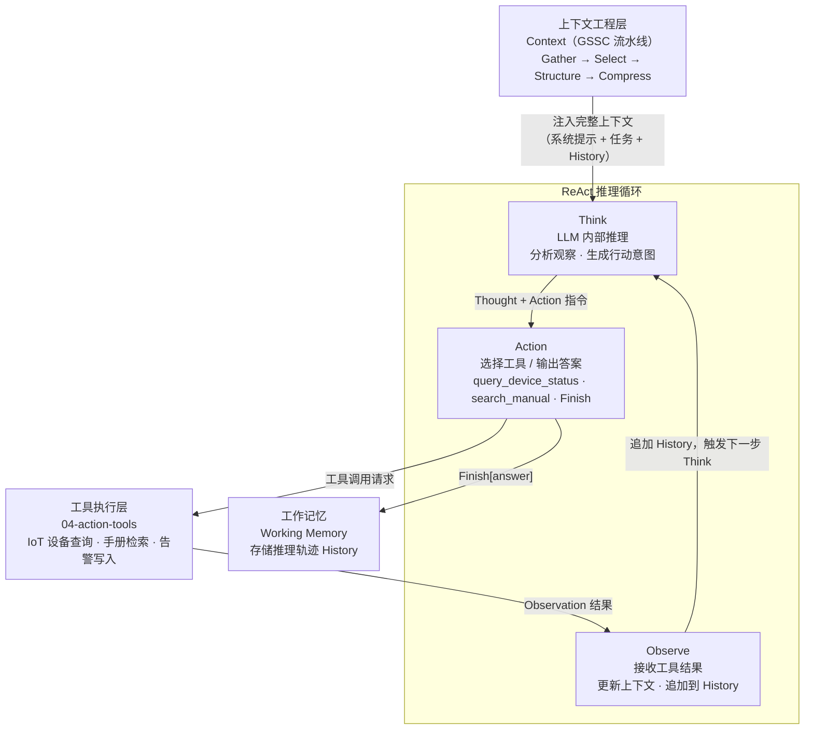
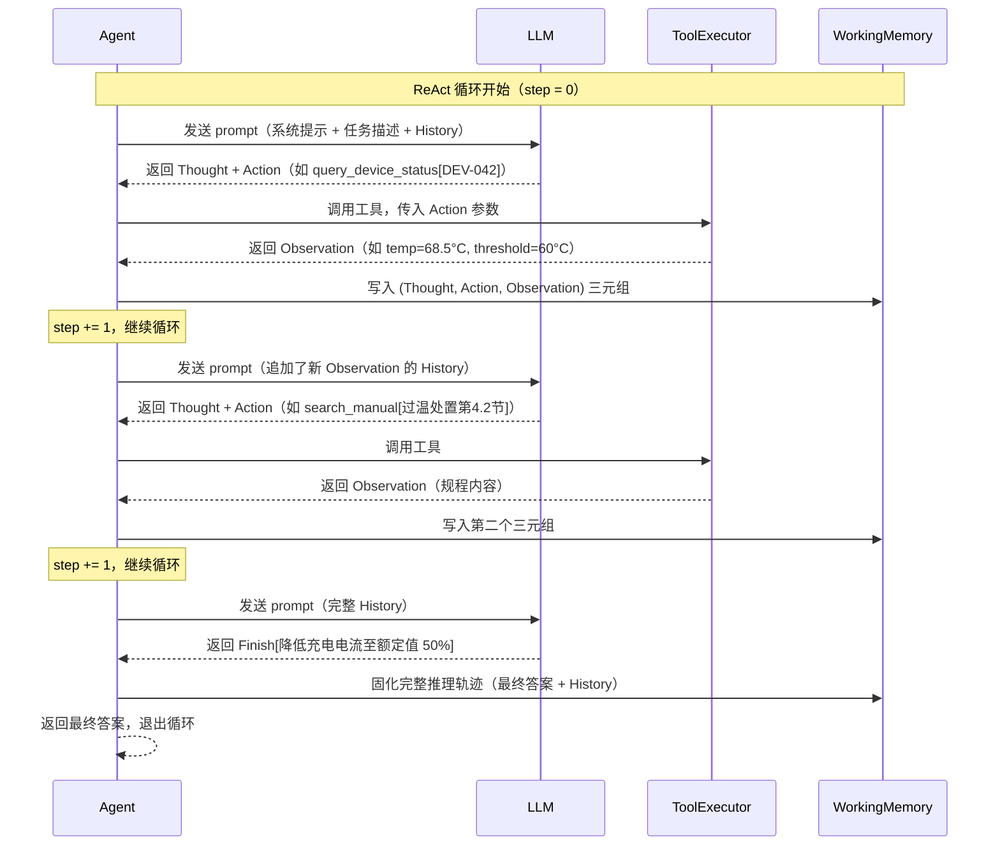

# ReAct 范式

> Think → Act → Observe 的实时推理循环——让 Agent 像人一样边想边做，而不是在行动前规划好一切。

---

## 1. 理论基础

### Yao et al. (2022) ReAct 论文

ReAct 范式由 Yao 等人在 2022 年发表于 arXiv（arXiv:2210.03629，论文标题：*ReAct: Synergizing Reasoning and Acting in Language Models*）。论文的核心观点是：单纯的推理链（Chain-of-Thought）缺乏与外部世界交互的能力，而单纯的行动序列（Act-only）又缺乏内部推理来消歧义和纠错。ReAct 将两者结合，在同一个 LLM 调用序列中交织推理轨迹（Thought）和外部行动（Action），使 Agent 能够动态地根据观察结果调整后续推理。

> "ReAct prompts LLMs to generate both verbal reasoning traces and actions pertaining to a task in an interleaved manner, allowing the model to perform dynamic reasoning to create, maintain, and adjust high-level plans for acting, while also interacting with the external environments (e.g., Wikipedia) to incorporate additional information into reasoning."
> — Yao et al. (2022), *ReAct: Synergizing Reasoning and Acting in Language Models*, arXiv:2210.03629

### CoALA 与 AIOS 中的定位

**CoALA**（Sumers et al., 2023）在行动空间（Action Space）的规划维度中，将 ReAct 归类为**单步反应型规划（Reactive Planning）**：每个决策步骤仅依赖当前观察，不维护显式的全局计划。CoALA 的 reactive planning 公式为：在每个时间步 t，Agent 观察环境状态 o(t)，规划层生成单步行动 a(t)，执行后更新状态到 o(t+1)，循环直至任务完成或达到步数上限。

**AIOS**（Mei et al., 2024，arXiv:2403.16971）在内核层的**调度子系统（Scheduler Subsystem）**中描述了 ReAct 循环的调度模型：每一步的 Think-Act-Observe 三元组构成一个调度单元（scheduling unit），AIOS 在并发 Agent 场景下对这些单元进行 per-step 粒度的资源分配，确保单个 ReAct 循环不因 LLM 推理资源竞争而产生不一致的中间状态。

---

## 2. 核心机制

| 机制名称 | 说明 | 工程类比 |
|---------|------|---------|
| **Think** | LLM 内部推理，分析当前观察，生成下一步行动意图 | 业务逻辑处理层 |
| **Action** | 选择并调用工具，或输出最终答案（`Finish[answer]`） | 工具调用 / API 请求 |
| **Observe** | 接收工具返回结果，将 Observation 追加到上下文 | 异步回调 / 事件监听 |
| **History** | 累积 (Thought, Action, Observation) 三元组，维护完整推理轨迹 | 请求/响应日志 |
| **max_steps** | 防止无限循环的步数上限，超限时强制终止并返回当前最优答案 | 超时机制 / Circuit Breaker |

---

## 3. 在 Agent OS 中的位置



ReAct 循环位于规划与推理层的核心位置：上下文工程层（GSSC）在每次 Think 前组装完整上下文，工具执行层在每次 Action 后返回 Observation，工作记忆在循环结束时固化推理轨迹。

---

## 4. 工作原理（时序图）



关键设计决策：每次 Think 调用都将完整 History 追加到 prompt，确保 LLM 能看到完整的上下文演化过程。`Finish[answer]` 是特殊 Action，Agent 识别该标志后退出循环，不再调用工具。`max_steps` 作为安全阀，防止 LLM 进入推理死循环。

---

## 5. 实现要点（代码示例）

### ReActAgent 核心实现

```python
# Source: hello-agents/code/chapter4/ReAct.py
import re
from typing import Any

class ReActAgent:
    """ReAct Agent：交织推理（Think）与行动（Act）的单步循环智能体"""

    def __init__(self, llm, tools: dict, max_steps: int = 10):
        self.llm = llm                    # LLM 调用接口（支持 Bedrock / OpenAI）
        self.tools = tools                # 工具注册表，key=工具名，value=可调用函数
        self.max_steps = max_steps        # 最大步数，防止无限循环（Circuit Breaker）

    def run(self, task: str) -> str:
        """主循环：反复执行 Think → Act → Observe，直到 Finish 或超步"""
        history = []                      # 累积 (Thought, Action, Observation) 轨迹

        for step in range(self.max_steps):
            prompt = self._build_prompt(task, history)   # 组装 History 到 prompt
            raw = self.llm.generate(prompt)              # LLM 推理，生成 Thought+Action
            thought, action_str = self._parse_output(raw)

            action_name, action_input = self._parse_action(action_str)

            if action_name == "Finish":                  # 识别终止信号
                return action_input                      # 直接返回最终答案

            if action_name not in self.tools:
                observation = f"[错误] 工具 '{action_name}' 未注册"
            else:
                observation = self.tools[action_name](action_input)  # 调用工具

            history.append((thought, action_str, observation))       # 追加到轨迹

        return f"[超步] 已达最大步数 {self.max_steps}，当前最优答案：{history[-1][2]}"

    def _parse_output(self, raw: str) -> tuple[str, str]:
        """从 LLM 原始输出中提取 Thought 和 Action 字段"""
        thought = re.search(r"Thought:(.*?)(?=Action:|$)", raw, re.DOTALL)
        action  = re.search(r"Action:(.*?)(?=Observation:|$)", raw, re.DOTALL)
        return (thought.group(1).strip() if thought else ""),\
               (action.group(1).strip()  if action  else raw.strip())

    def _parse_action(self, action_str: str) -> tuple[str, Any]:
        """解析 Action 字符串，如 'query_device_status[DEV-042]'"""
        match = re.match(r"(\w+)\[(.+)\]", action_str)
        if match:
            return match.group(1), match.group(2)       # 返回 (工具名, 参数)
        return action_str, ""                            # 无参数工具
```

`_parse_output` 使用正则从 LLM 自由文本中提取结构化字段，`_parse_action` 将 `工具名[参数]` 格式拆解为可调用形式。`max_steps` 在工具调用异常或 LLM 推理偏离时作为最后一道安全阀。

---

## 6. 企业落地场景：某储能企业设备实时告警响应

### 场景背景

某企业在全国部署了 500+ 套IoT 系统，每套设备包含 DMS（设备管理系统）、温控模块和 变流系统（功率变换系统）。当 DEV-042 电池组发生**过温告警（Level-2）**时，运维人员需要在 30 秒内获取处置建议，否则面临设备温度异常风险。传统规则引擎无法处理多传感器数据交叉验证场景，ReAct Agent 通过实时工具调用实现动态诊断。

### ReAct 循环演示：DEV-042 过温告警响应

```
告警触发：DEV-042 温度超限，告警级别 Level-2

Step 1:
  Think:  "收到过温告警，先查询设备当前温度和历史趋势，确认告警真实性"
  Action: query_device_status[DEV-042]
  Observe: {"temp_current": 68.5, "temp_threshold": 60.0,
             "temp_trend": "持续上升 +2.1°C/min", "soc": 85}

Step 2:
  Think:  "温度 68.5°C 已超阈值 60°C 且持续上升，告警属实。
           查询处置规程，确认降温操作步骤"
  Action: search_manual[设备过温处置规程 4.2]
  Observe: "4.2 过温处置：①立即降低充电电流至额定值 50%；
            ②启动强制散热风扇（风速 100%）；
            ③若温度继续升高超过 75°C，触发 系统保护性断电"

Step 3:
  Think:  "规程明确，当前温度 68.5°C 未触及 75°C 断电阈值，
           执行一级处置：降低充电电流 + 启动散热"
  Action: Finish[建议：立即降低 DEV-042 充电电流至额定值 50%，
                  启动强制散热（100% 风速）。当前温度 68.5°C，
                  趋势 +2.1°C/min，需持续监控。若 5 分钟内未降温，
                  按规程 4.2 触发保护性断电。]
```

### 实现效果

- **响应时延**：告警触发到输出处置建议 &lt;30s，满足 Level-2 告警响应时限。
- **适用范围**：适合 Level-2 及以上告警的实时单步决策场景，无需预先定义决策树。
- **可审计性**：完整 (Thought, Action, Observation) 轨迹写入工作记忆，支持事后诊断复盘。
- **动态适应**：若工具返回异常值（如传感器离线），Think 步骤可识别并切换备用数据源，无需重启 Agent。

---

## 7. AWS AgentCore 对应

| 本地 / 开源实现 | AWS 组件 | 关键配置项 | 注意事项 |
|--------------|---------|-----------|---------|
| `ReActAgent` 手动循环（chapter4/ReAct.py） | [Amazon Bedrock Agents](https://docs.aws.amazon.com/bedrock/latest/userguide/agents.html) 内置 ReAct 编排 | `orchestrationType: DEFAULT`，`maxSteps` | 内置 ReAct 循环无需手动实现；默认 `maxSteps=10`，复杂告警可调至 20 |
| `REACT_PROMPT_TEMPLATE`（系统提示模板） | Amazon Bedrock Agents 系统提示（`agentInstruction`） | `agentInstruction` 字段（最大 4096 Token） | 注意 Token 占用：简洁描述角色和约束，避免把工具文档塞进系统提示 |
| `ToolExecutor.registerTool` 工具注册 | [Action Groups](https://docs.aws.amazon.com/bedrock/latest/userguide/agents-action-groups.html)（动作组） | `actionGroupName`，`apiSchema`（OpenAPI 3.0） | 用 OpenAPI Schema 描述工具接口；Lambda 函数实现工具逻辑；单个 Agent 最多 20 个 Action Group |

Amazon Bedrock Agents 将 ReAct 循环内置到服务编排层，开发者只需定义 Action Groups（工具接口）和系统提示（Agent 角色），无需维护 Think-Act-Observe 状态机。在 IoT 企业 场景中，`query_device_status` 和 `search_manual` 工具分别对应两个 Action Group，底层由 AWS Lambda 函数调用 IoT Core 设备影子 API 和 Amazon Knowledge Bases for Bedrock 向量检索接口。

---

## 8. 相关模块

:::info 相关模块

- **[工具执行层](../04-action-tools/index.md)**：ReAct 的每个 Act 步骤都对应一次工具执行层调用，工具注册、参数校验和错误处理机制见此文档。
- **[规划总览](./index.md)**：与 Plan-and-Solve（预先规划型）和 Reflection（自我校正型）的适用场景对比分析见规划总览。

:::

---

## 9. 延伸阅读

- Yao, S., Zhao, J., Yu, D., et al. (2022). *ReAct: Synergizing Reasoning and Acting in Language Models*. arXiv:2210.03629. [https://arxiv.org/abs/2210.03629](https://arxiv.org/abs/2210.03629)
- Sumers, T. R., Yao, S., Narasimhan, K., & Griffiths, T. L. (2023). *Cognitive Architectures for Language Agents (CoALA)*. arXiv:2309.02427. [https://arxiv.org/abs/2309.02427](https://arxiv.org/abs/2309.02427)
- Mei, K., et al. (2024). *AIOS: LLM Agent Operating System*. arXiv:2403.16971. [https://arxiv.org/abs/2403.16971](https://arxiv.org/abs/2403.16971)
- [Amazon Bedrock Agents 官方文档](https://docs.aws.amazon.com/bedrock/latest/userguide/agents.html) — Amazon Bedrock AgentCore 内置 ReAct 编排
- [Amazon Bedrock Agents — Action Groups](https://docs.aws.amazon.com/bedrock/latest/userguide/agents-action-groups.html) — 工具注册与 OpenAPI Schema 规范
- hello-agents Chapter 4 配套代码：`hello-agents/code/chapter4/ReAct.py`
