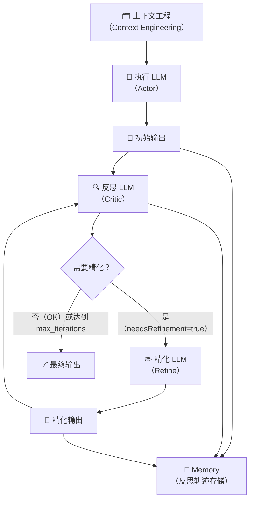
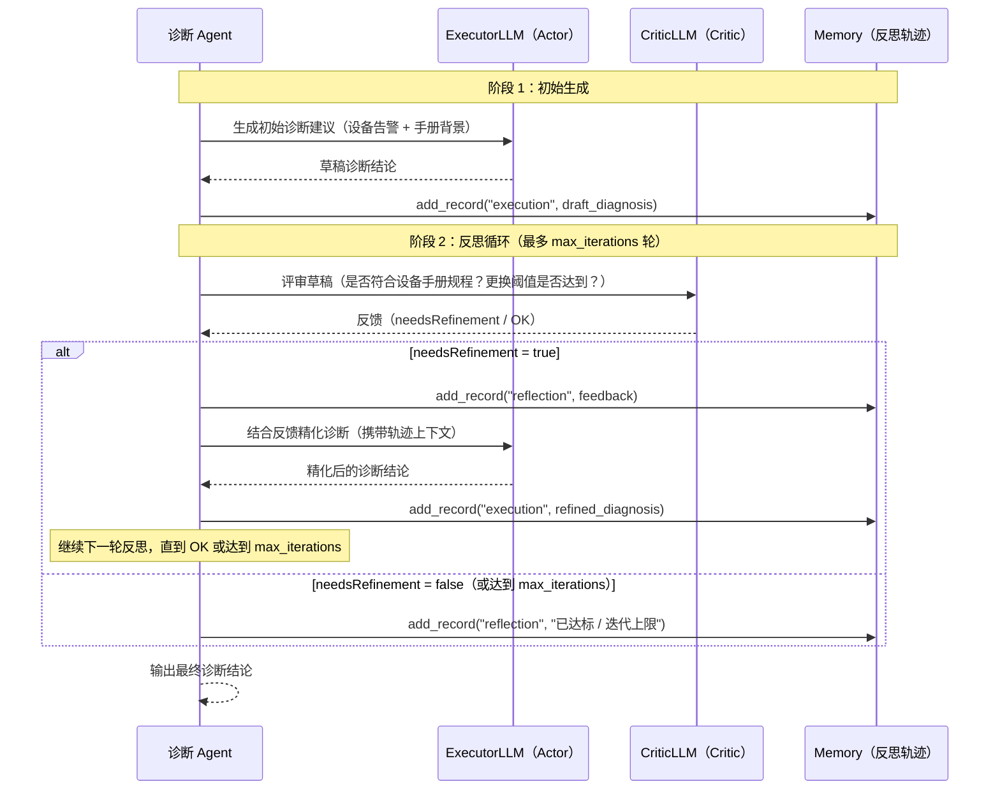

# Reflection 范式

> Reflection 范式通过独立 Critic 模型对 Agent 输出进行迭代评审与精化，让 Agent 在生成答案后能自我纠错，类似软件工程中的 Code Review + 修订流程。

---

## 1. 理论基础

### Reflexion 论文

Reflection 范式的学术基础来自 Shinn et al. (2023) 的论文 **Reflexion: Language Agents with Verbal Reinforcement Learning**（arXiv:2303.11366）。Reflexion 的核心观点是：LLM Agent 不需要梯度更新就能从执行失败中学习——只需将执行结果和语言反思存入记忆，下一轮迭代时 Agent 自然会规避相同错误。

论文将 Reflexion 分为三个组成部分：

1. **Actor**（执行者）：生成初始行动序列或文本输出
2. **Evaluator**（评估者）：对 Actor 输出打分或提出改进意见
3. **Self-Reflection**（自我反思）：将 Evaluator 的反馈转化为语言形式的自我总结，存入情景记忆供下一轮使用

### CoALA / AIOS 框架定位

CoALA（Sumers et al., 2023）在规划模块中将 Reflection 归类为 **reflective / introspective planning**（反思性规划）：Agent 在行动执行后对输出质量进行事后评估，并以评估结果指导后续行动选择。这与"先规划后执行"的 Plan-and-Solve 不同——Reflection 是在执行产出物存在之后才启动质量改进循环。

AIOS（Mei et al., 2024/2025，arXiv:2403.16971）在内核层的 **evaluation and quality assurance layer**（评估与质量保障层）中明确了对输出进行后处理校验的机制，Reflection 正是该层的典型实现模式：通过独立评估器（Critic）对 LLM 输出做客观评分，避免 Actor 自我评估时的确认偏误。

---

## 2. 核心机制

| 机制名称 | 说明 | 工程类比 |
|---------|------|---------|
| Generate | 初始 LLM 生成（如诊断建议、代码草稿） | 初稿撰写 |
| Reflect | 独立 Critic 模型评审输出质量，指出具体不足 | 代码 Review |
| Refine | 基于评审意见优化输出，生成改进版本 | 修订版本 |
| Memory | 存储历次执行结果和反思轨迹，为下轮迭代提供上下文 | 版本历史（Git） |
| max_iterations | 最大迭代轮数，防止无限循环消耗资源 | 重试次数上限 |

**关键设计决策**：Critic 必须与 Actor 相互独立——使用同一模型既当 Actor 又当 Critic 会导致确认偏误（模型倾向于认可自己的输出）。实践中通常使用能力更强的模型作为 Critic，或使用不同的系统提示词使其扮演不同角色。

---

## 3. 在 Agent OS 中的位置



Reflection 范式在规划层嵌套了一个内部质量保障循环：主 Agent 得到初始输出后，并不直接返回，而是先送入 Critic 评审。只有通过评审或达到最大迭代次数后，才将结果输出到下游（如工具执行层或用户界面）。Memory 模块横贯整个循环，记录每轮的执行结果和反思轨迹。

---

## 4. 工作原理（时序图）



**循环终止条件**有两个：

1. Critic 评审结果为"无需改进"（`needsRefinement = false`）
2. 迭代轮数达到 `max_iterations` 上限

两个条件中任意一个满足即退出循环，返回当时记忆中最新的执行结果作为最终输出。

---

## 5. 实现要点（代码示例）

```python
# Source: hello-agents/code/chapter4/Reflection.py
# 以下展示核心结构：Memory 类 + ReflectionAgent.run() + 关键提示词模板

class Memory:
    """存储历次执行结果和反思轨迹（情景记忆的轻量实现）。"""
    def __init__(self):
        self.records = []                          # 所有执行/反思记录的列表

    def add_record(self, record_type: str, content: str):
        self.records.append({"type": record_type, "content": content})

    def get_last_execution(self) -> str:
        """返回最近一次 'execution' 类型的记录（最新生成结果）。"""
        for record in reversed(self.records):
            if record["type"] == "execution":
                return record["content"]
        return None

# 反思提示词：要求 Critic 聚焦于可量化的改进点
REFLECT_PROMPT_TEMPLATE = """
你是严格的评审专家。审查以下输出并评估其质量。
任务: {task}
待审查输出: {output}
如果存在需要改进的问题，请清晰指出。若已达标，回答"无需改进"。
"""

# 精化提示词：携带历史轨迹 + 具体反馈
REFINE_PROMPT_TEMPLATE = """
根据评审员反馈优化你的输出。
任务: {task}
上一轮输出: {last_attempt}
评审员反馈: {feedback}
请生成改进后的输出。
"""

class ReflectionAgent:
    def __init__(self, llm_client, max_iterations: int = 3):
        self.llm_client = llm_client
        self.memory = Memory()                     # 每个 Agent 实例独立的记忆存储
        self.max_iterations = max_iterations       # 迭代上限，防止无限循环

    def run(self, task: str) -> str:
        # 1. 初始生成（Generate）
        initial_output = self._generate(task)
        self.memory.add_record("execution", initial_output)

        # 2. 迭代循环（Reflect → Refine）
        for i in range(self.max_iterations):
            last_output = self.memory.get_last_execution()
            feedback = self._reflect(task, last_output)  # Critic 评审
            self.memory.add_record("reflection", feedback)

            if "无需改进" in feedback:               # 提前退出条件
                break

            refined = self._refine(task, last_output, feedback)  # 精化
            self.memory.add_record("execution", refined)

        return self.memory.get_last_execution()    # 返回最终结果
```

核心设计要点：`Memory` 类按记录类型区分执行结果（`execution`）和反思轨迹（`reflection`），`get_last_execution()` 通过反向遍历确保总是返回最新版本。`run()` 方法将 Generate → Reflect → Refine 三步封装为一个有界循环，`max_iterations` 作为硬性上限保证终止性。

---

## 6. 企业落地场景（某企业）

### 场景：关键诊断结论的质量验证（维修决策级别）

某储能企业的 IoT系统中，**维修决策级别**（level-3 以上故障）的诊断结论直接决定是否派遣工程师更换硬件，错误决策带来的成本极高（单次不必要更换成本约 ¥8,000–¥15,000）。因此在此类场景中引入 Reflection 范式，对诊断结论进行自动化质量验证。

### 三步执行过程

**Generate（初始生成）**

诊断 Agent 根据 DEV-042 的传感器数据（SOH 78%、温度异常风险评分 0.75）生成初始建议：

> "建议更换 DEV-042 传感器模块 #7–#9"

**Reflect（Critic 验证）**

Critic Agent 对照设备手册和安全规程进行核查，重点验证两项条件：

- 更换阈值是否达到（手册规定：SOH < 80% **且** 温度异常风险评分 > 0.7）？
- 安全规程是否符合（是否明确要求认证工程师现场操作）？

Critic 反馈：

> "更换阈值已达到（SOH=78% < 80%，温度异常评分=0.75 > 0.7）。但初始建议缺少触发条件量化说明和安全规程要求，需补充。"

**Refine（精化输出）**

诊断 Agent 依据反馈生成精化版本：

> "当 SOH < 80% **且** 温度异常风险评分 > 0.7 时触发更换。建议更换 DEV-042 传感器模块 #7–#9，需由认证工程师现场执行，并在更换前断开系统高压回路。"

### 触发条件

| 故障级别 | 说明 | 是否启用 Reflection |
|---------|------|-------------------|
| Level 1–2 | 监控告警，无需立即行动 | 否（直接输出） |
| Level 3+ | 影响维修决策，可能触发工程师派遣或硬件更换 | **是**（启用 max_iterations=2） |

---

## 7. AWS AgentCore 对应

| 本地 / 开源实现 | AWS 组件 | 关键配置项 | 注意事项 |
|--------------|---------|-----------|---------|
| ReflectionAgent 双 LLM 模式（Actor + Critic） | [Amazon Bedrock Agents](https://docs.aws.amazon.com/bedrock/latest/userguide/agents.html) + 自定义 Evaluator Lambda Action Group | Lambda ARN 作为 Action Group 动作；Evaluator Lambda 返回 `{needsRefinement: bool, feedback: string}` | Evaluator Lambda 建议与 Agent 部署在同一 AWS Region，减少跨区延迟；Lambda 超时建议设置为 30s |
| Memory 轨迹存储 | [Amazon Bedrock AgentCore Memory](https://docs.aws.amazon.com/bedrock/latest/userguide/agent-memory.html) + Amazon DynamoDB | `sessionId`（串联同一诊断会话的所有轨迹）；`ttlInSeconds`（建议 86400 即 24h） | 反思轨迹本质是情景记忆的一种形式，DynamoDB TTL 自动清理过期轨迹，避免存储膨胀 |
| max_iterations | Amazon Bedrock Agents `maxSteps` 配置 | `maxSteps: 6`（对应 2 轮反思：每轮消耗约 3 次 Bedrock API 调用——Generate + Reflect + Refine） | 每轮迭代消耗 2–3 次 Bedrock 模型调用，`max_iterations=2` 时总调用数约 5–7 次；结合成本治理模块设置预算上限 |

**架构说明**：在 Amazon Bedrock Agents 中，Actor 角色由主 Agent 承担，Critic 通过 Lambda Action Group 实现。Evaluator Lambda 接收当前输出并返回结构化评估结果 `{needsRefinement: bool, feedback: string}`，Agent 根据 `needsRefinement` 决定是否继续迭代。

---

## 8. 相关模块

:::info 相关模块

- **[情景记忆](../01-memory/episodic.md)**：Reflection 的 Memory 模块存储历次执行结果和反思记录，与情景记忆机制高度一致——每轮迭代产生的执行轨迹和 Critic 反馈可直接持久化到情景记忆，供跨会话的经验积累使用。
- **[成本治理](../07-cost-governance/index.md)**：每次 Reflection 迭代增加 2–3 次 LLM 调用，在 `max_iterations=3` 时总调用数可达 7–10 次。需在质量提升与推理成本之间设置合理的 `max_iterations` 上限，并结合 Token 预算中间件监控单次诊断的总成本。

:::

---

## 9. 延伸阅读

- Shinn et al. (2023). *Reflexion: Language Agents with Verbal Reinforcement Learning*. arXiv:2303.11366. [https://arxiv.org/abs/2303.11366](https://arxiv.org/abs/2303.11366)
- Sumers et al. (2023). *Cognitive Architectures for Language Agents (CoALA)*. arXiv:2309.02427. [https://arxiv.org/abs/2309.02427](https://arxiv.org/abs/2309.02427)
- Mei et al. (2024). *AIOS: LLM Agent Operating System*. arXiv:2403.16971. [https://arxiv.org/abs/2403.16971](https://arxiv.org/abs/2403.16971)
- [Amazon Bedrock Agents — Developer Guide](https://docs.aws.amazon.com/bedrock/latest/userguide/agents.html) — Agent 配置、Action Groups 和 maxSteps 参数说明
- [Amazon Bedrock AgentCore Memory](https://docs.aws.amazon.com/bedrock/latest/userguide/agent-memory.html) — 会话记忆持久化与 TTL 配置
- hello-agents Chapter 4 — `Reflection.py`：本文档代码示例来源（`ReflectionAgent` 类 + `Memory` 类 + 提示词模板）
