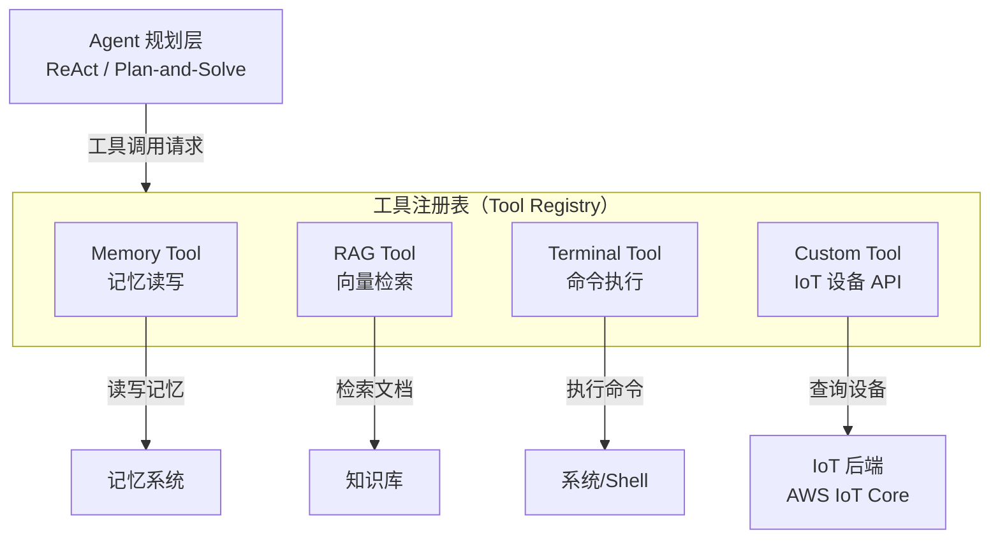

# 工具执行层（Action & Tools）

> "Everything is a Tool" —— hello-agents 的核心设计哲学：记忆读写、RAG 检索、外部 API 调用，统一抽象为可组合的工具接口。

---

## 理论基础

CoALA（Sumers et al., 2023）将 Agent 的行动空间分为四类：存储操作（读写记忆）、流程控制（条件分支）、**外部工具调用**（API/函数）、推理规划。工具调用层是连接 Agent 内部推理与外部世界的关键接口。

AIOS（2024）的**工具管理子系统（Tool Management Subsystem）**负责工具注册、权限管理和调用路由，确保多个并发 Agent 安全共享工具资源。

---

## "Everything is a Tool" 架构图

---

## IoT 场景：某企业 诊断 Agent 工具集

| 工具名 | 功能 | 对应 AWS Action Group |
|--------|------|----------------------|
| `device_status` | 查询设备实时传感器状态（温度/电压/SOC） | Lambda + IoT Core GetThingShadow |
| `alarm_history` | 检索设备历史告警记录（DynamoDB）| Lambda + DynamoDB GSI 查询 |
| `search_manual` | 检索设备手册知识库（RAG）| Amazon Knowledge Bases Retrieve API |
| `generate_report` | 调用 LLM 生成结构化诊断报告 | Amazon Bedrock InvokeModel |

---

## 子文档导航

| 文档 | 内容 |
|-----|------|
| [tool-design.md](./tool-design.md) | 工具设计原则、接口规范、错误处理模式 |
| [tool-executor.md](./tool-executor.md) | 工具执行机制、注册、路由、并发控制 |

---

## AWS AgentCore 对应

| 本地实现 | AWS 组件 | 关键配置项 | 注意事项 |
|---------|---------|-----------|---------|
| ToolRegistry | [Amazon Bedrock AgentCore Action Groups](https://docs.aws.amazon.com/bedrock/latest/userguide/agents-action-groups.html) | `actionGroupName`, `apiSchema` (OpenAPI 3.0) | 每个 Agent 最多 20 个 Action Group |
| 工具函数 | [AWS Lambda](https://docs.aws.amazon.com/lambda/) | `functionArn`, `timeout` | Lambda 调用超时默认 3s，诊断工具建议 15–30s |

:::info 相关模块

- **[规划与推理](../03-planning/index.md)**：ReAct Agent 的每个 Act 步骤都对应一次工具执行层调用。
- **[RAG 检索增强](../05-rag/index.md)**：RAG Tool 是工具执行层中的重要成员，知识库检索通过工具接口暴露给 Agent。

:::

---

## 延伸阅读

- Sumers et al. (2023). *CoALA*. arXiv:2309.02427.
- [Amazon Bedrock Agents — Action Groups](https://docs.aws.amazon.com/bedrock/latest/userguide/agents-action-groups.html)
- 配套代码：`code/tools/iot_tools.py`
