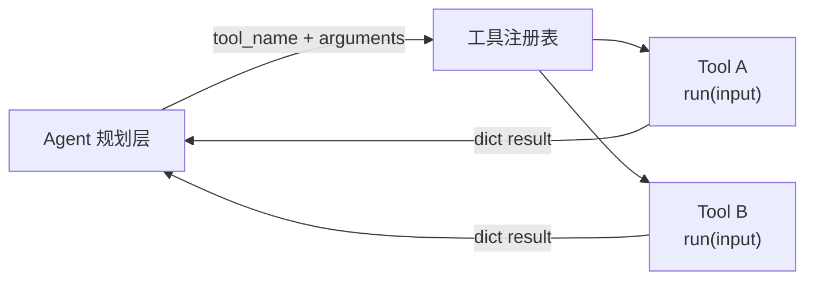
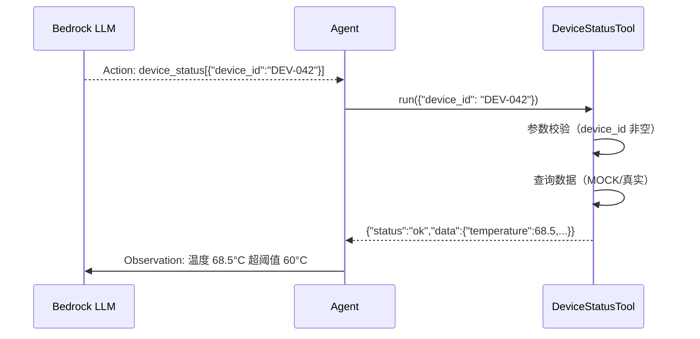

# 工具设计原则

> 好工具：接口稳定、职责单一、错误信息有用、可在无依赖环境下测试。

---

## 1. 理论基础

工具设计遵循**单一职责原则（SRP）**和**契约式设计（Design by Contract）**：每个工具负责一件明确的事，接口用 JSON Schema 声明前置条件（输入约束）和后置条件（输出结构）。LLM 依赖工具的 description 和 inputSchema 来决定何时调用以及传入什么参数，因此接口文档即是程序行为的一部分。

---

## 2. 核心机制

| 原则 | 说明 | 工程类比 |
|------|------|---------|
| 统一接口 | `run(input: dict) -> dict`，所有工具同一调用方式 | Java 接口/抽象基类 |
| JSON Schema 描述 | 输入参数用 JSON Schema 精确定义，LLM 可据此生成参数 | OpenAPI Spec |
| 幂等性 | 查询类工具应幂等（相同输入相同输出，无副作用）| HTTP GET |
| 结构化错误 | 错误时返回 `{"error": "..."}` 而非抛异常，让 Agent 可继续推理 | RFC 7807 Problem Details |
| MOCK 模式 | 通过 `MOCK_MODE` 环境变量切换 Mock/真实实现 | 测试替身（Test Double）|

---

## 3. 在 Agent OS 中的位置



---

## 4. 工作原理



---

## 5. 实现要点

```python
# Source: hello-agents/code/chapter7/（工具设计模式）
# 本地演示：code/tools/iot_tools.py

from abc import ABC, abstractmethod

class BaseTool(ABC):
    """统一工具接口——所有工具必须实现 run() 方法"""
    name: str          # 工具唯一标识，LLM 用此名称调用
    description: str   # 工具功能描述，LLM 依此决定是否调用

    @abstractmethod
    def run(self, input_data: dict) -> dict:
        """执行工具，返回结构化结果（错误时返回 {"error": "..."}）"""
        ...

class DeviceStatusTool(BaseTool):
    name = "device_status"
    description = "查询 IoT 设备的实时传感器状态"

    def run(self, input_data: dict) -> dict:
        device_id = input_data.get("device_id", "").strip()
        if not device_id:
            return {"error": "缺少必填参数 device_id"}  # 结构化错误，不抛异常
        # MOCK_MODE 下返回预定义数据；生产模式下调用 AWS IoT Core
        if MOCK_MODE:
            return self._mock_run(device_id)
        return self._aws_run(device_id)
```

---

## 6. 企业落地场景：IoT 设备诊断（某企业）

某企业 诊断 Agent 工具集设计：

| 工具 | description（LLM 依此决策）| 关键参数 |
|------|--------------------------|---------|
| `device_status` | 查询IoT 设备实时传感器状态（温度/电压/电流/SOC/告警码）| `device_id` |
| `alarm_history` | 检索设备历史告警记录，支持按类型过滤 | `device_id`, `alarm_type`, `limit` |
| `search_manual` | 在 某企业 设备手册知识库中检索处置规程 | `query`, `top_k` |
| `generate_report` | 根据诊断结果生成结构化诊断报告（JSON + 自然语言）| `device_id`, `diagnosis`, `evidence` |

description 的质量直接影响 LLM 的工具选择准确率——**description 是工具的"公共合同"，应精确描述工具的适用场景和输入输出**。

---

## 7. AWS AgentCore 对应

| 本地实现 | AWS 组件 | 关键配置项 | 注意事项 |
|---------|---------|-----------|---------|
| `BaseTool` + JSON Schema | [Action Group OpenAPI Schema](https://docs.aws.amazon.com/bedrock/latest/userguide/agents-action-groups.html) | `apiSchema.payload` (OpenAPI 3.0) | description 字段的质量直接影响 LLM 工具选择准确率 |
| MOCK_MODE 切换 | Lambda 环境变量 | `MOCK_MODE=true` | 在 Lambda 环境变量中配置，支持功能开关 |

:::info 相关模块

- **[工具执行机制](./tool-executor.md)**：工具的注册和执行路由机制见此文档。
- **[规划与推理](../03-planning/index.md)**：ReAct Agent 依赖工具的 description 和 schema 来选择调用哪个工具。

:::

---

## 延伸阅读

- [Amazon Bedrock Agents Action Groups](https://docs.aws.amazon.com/bedrock/latest/userguide/agents-action-groups.html)
- [OpenAPI 3.0 Specification](https://swagger.io/specification/)
- 配套代码：`code/tools/iot_tools.py`
