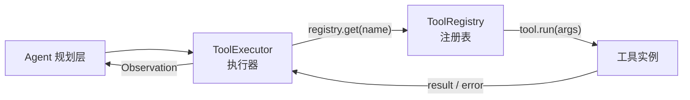
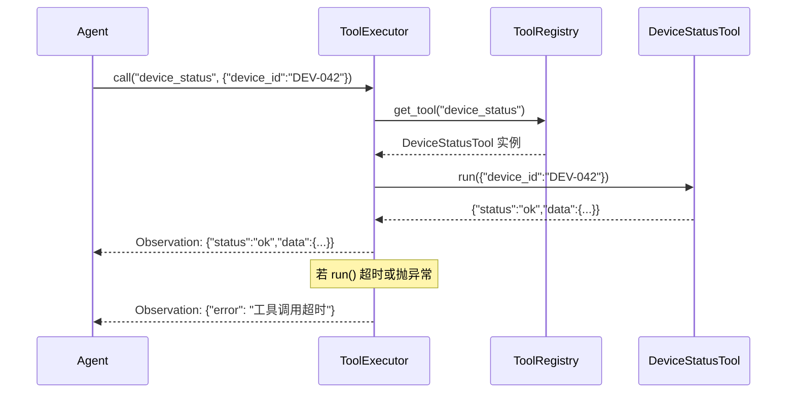

# 工具执行机制

> 工具注册表负责管理工具生命周期，执行器负责安全路由调用，二者共同构成工具执行层的基础设施。

---

## 1. 理论基础

工具执行层的核心职责是**工具调用的标准化路由**：接收 Agent 发出的 `(工具名, 参数)` 请求，找到对应的工具实现，执行并返回结果。AIOS（2024）的工具管理子系统在此基础上增加了权限控制和并发调度能力。

---

## 2. 核心机制

| 机制 | 说明 | 工程类比 |
|------|------|---------|
| 工具注册 | 将工具名映射到工具实例（name → BaseTool） | Spring Bean 注册 |
| 调用路由 | 根据工具名查找并调用对应工具的 run() 方法 | Servlet Dispatcher |
| 错误隔离 | 单个工具调用失败不影响其他工具和 Agent 循环 | 熔断器（Circuit Breaker）|
| 超时控制 | 设置工具调用超时，防止 Agent 因工具阻塞而卡死 | Future.get(timeout) |
| 并发控制 | 多个 Agent 并发调用同一工具时的资源隔离 | 线程池 ThreadPoolExecutor |

---

## 3. 在 Agent OS 中的位置



---

## 4. 工作原理



---

## 5. 实现要点

```python
# Source: hello-agents/code/chapter7/（ToolExecutor 核心实现）
# 本地演示：code/tools/iot_tools.py

class ToolRegistry:
    """工具注册表：管理工具的注册和查找"""

    def __init__(self):
        self._tools: dict[str, BaseTool] = {}

    def register(self, tool: BaseTool) -> None:
        self._tools[tool.name] = tool

    def call(self, name: str, input_data: dict) -> dict:
        """路由工具调用，错误时返回结构化错误而不抛异常"""
        if name not in self._tools:
            return {"error": f"工具 '{name}' 未注册。可用: {list(self._tools.keys())}"}
        try:
            return self._tools[name].run(input_data)
        except Exception as exc:
            # 错误隔离：工具异常不传播到 Agent 循环
            return {"error": f"工具 '{name}' 执行失败: {exc}"}

    def get_descriptions(self) -> str:
        """返回所有工具的描述（注入到 LLM 系统提示）"""
        return "\n".join(
            f"- {t.name}: {t.description}"
            for t in self._tools.values()
        )
```

---

## 6. 企业落地场景：IoT 设备诊断（某企业）

**工具注册流程**（Agent 启动时执行一次）：

```
1. 注册 DeviceStatusTool  → 绑定 AWS IoT Core GetThingShadow
2. 注册 AlarmHistoryTool  → 绑定 DynamoDB query (GSI: device_id)
3. 注册 ManualSearchTool  → 绑定 Amazon Knowledge Bases Retrieve
4. 注册 ReportGenTool     → 绑定 Bedrock InvokeModel (Claude 3)
```

**并发场景**：10 台设备同时触发诊断，10 个 ReAct Agent 并发调用 `device_status` 工具。每个调用独立执行，AWS IoT Core 支持高并发查询，无需额外同步。

---

## 7. AWS AgentCore 对应

| 本地实现 | AWS 组件 | 关键配置项 | 注意事项 |
|---------|---------|-----------|---------|
| ToolRegistry.call() | Amazon Bedrock Agents 内置执行器 | `actionGroupExecutor.lambda.lambdaArn` | Agents 自动处理工具路由和错误隔离 |
| 超时控制 | Lambda `timeout` | `timeout: 30` (秒) | Agents 等待 Lambda 响应的超时由 Lambda 自身控制 |
| 并发控制 | Lambda 并发限制 | `reservedConcurrentExecutions` | 为 IoT 诊断工具预留并发配额，避免冷启动 |

:::info 相关模块

- **[工具设计原则](./tool-design.md)**：工具如何设计；本文档讲工具如何执行和路由。
- **[规划与推理](../03-planning/index.md)**：ReAct Agent 通过 ToolExecutor 调用工具，每个 Act 步骤对应一次 call()。

:::

---

## 延伸阅读

- [Amazon Bedrock Agents — Action Groups](https://docs.aws.amazon.com/bedrock/latest/userguide/agents-action-groups.html)
- [AWS Lambda — 并发和扩展](https://docs.aws.amazon.com/lambda/latest/dg/lambda-concurrency.html)
- 配套代码：`code/tools/iot_tools.py`
