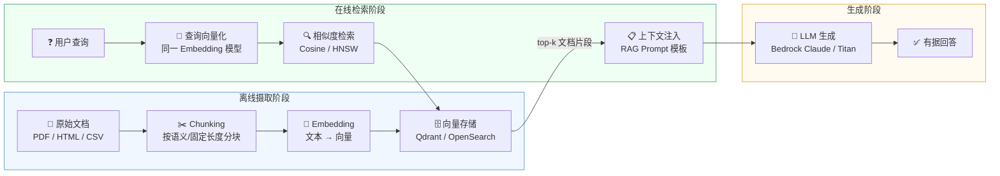

# 检索增强生成（RAG）

> 让 Agent 在回答前先"查书"——将外部知识库动态注入上下文，解决纯 LLM 知识截止与幻觉问题。

---

## 理论基础

**RAG**（Retrieval-Augmented Generation，Lewis et al., 2020）将"检索"与"生成"解耦：先从外部向量库中定位最相关的文本片段，再将其注入 LLM 提示词，使生成结果有据可查。

**CoALA**（Sumers et al., 2023）将 RAG 归入语义记忆的"外部存储"读操作路径；**AIOS**（Mei et al., 2024）则将检索器抽象为内核层的"存储管理子系统"组件，与内存调度并列。

在 Agent OS 架构中，RAG 是连接语义记忆（向量索引）和上下文工程（GSSC 流水线）的核心桥梁。

---

## 完整 RAG 流水线

---

## RAG vs 纯 LLM

| 维度 | 纯 LLM | RAG |
|-----|--------|-----|
| 知识时效性 | 受训练截止日期限制 | 实时更新知识库即可 |
| 幻觉风险 | 高（无外部依据） | 低（回答基于检索到的原文） |
| 领域专业性 | 通用，缺乏私有文档知识 | 可注入企业手册、专有数据 |
| 上下文窗口消耗 | 全靠 few-shot 或参数 | 按需检索，仅注入相关片段 |
| 维护成本 | 需重新微调或再训练 | 更新文档后重建向量索引即可 |

---

## 子文档导航

| 文档 | 内容摘要 |
|-----|---------|
| [pipeline.md](./pipeline.md) | 检索流水线详解：分块策略、Embedding 模型选型、相似度算法、重排序（Reranker） |
| [knowledge-base.md](./knowledge-base.md) | 知识库构建：某企业 设备手册 PDF 摄取、MarkItDown 格式转换、增量更新策略 |

---

## IoT 场景：某企业 设备手册知识库

某储能企业设备的操作手册、故障码规程、DMS 参数规格均以 PDF 形式存在，纯 LLM 无法直接访问。RAG 将这些文档向量化后入库，诊断 Agent 在收到告警时可实时检索"DEV-042 过温处置规程"等专有知识。

典型查询路径：设备上报告警 → Agent 以告警描述为查询词 → 向量检索返回手册第 4.2 节相关片段 → 注入提示词 → LLM 输出基于手册的处置建议。知识库可按设备型号分命名空间管理，支持按季度增量更新手册版本。

---

## AWS 映射

| 本地 / 开源实现 | AWS 组件 | 关键配置项 | 注意事项 |
|--------------|---------|-----------|---------|
| Qdrant（向量库） | [Amazon Knowledge Bases for Bedrock](https://docs.aws.amazon.com/bedrock/latest/userguide/knowledge-base.html) | `embeddingModelArn`, `storageConfiguration.type: OPENSEARCH_SERVERLESS` | 自动处理 Chunking 和 Embedding，省去自管向量库 |
| 自定义 Chunker | Knowledge Bases 内置分块器 | `chunkingConfiguration.chunkingStrategy: FIXED_SIZE` / `HIERARCHICAL` | 层次分块更适合有标题结构的手册 PDF |
| `text-embedding-ada-002` | Amazon Titan Embeddings V2 | `dimension: 1024`（默认） | 同一知识库内 Embedding 模型不可更换，建库前确认 |
| 自定义检索脚本 | `RetrieveAndGenerate` API | `numberOfResults: 5`, `rerankingConfiguration` | 支持 Reranker 模型提升召回精度 |

---

:::info 相关模块

- **[记忆系统](../01-memory/index.md)**：RAG 检索结果写入语义记忆（向量索引）；情景记忆中的历史诊断案例也可作为 RAG 知识源。
- **[上下文工程](../06-context-engineering/index.md)**：RAG 返回的 top-k 片段经 GSSC 流水线的 Select 和 Compress 阶段处理后注入最终提示词。

:::

---

## 延伸阅读

- Lewis, P., et al. (2020). *Retrieval-Augmented Generation for Knowledge-Intensive NLP Tasks*. arXiv:2005.11401. [https://arxiv.org/abs/2005.11401](https://arxiv.org/abs/2005.11401)
- Sumers, T. R., et al. (2023). *Cognitive Architectures for Language Agents (CoALA)*. arXiv:2309.02427. [https://arxiv.org/abs/2309.02427](https://arxiv.org/abs/2309.02427)
- Mei, K., et al. (2024). *AIOS: LLM Agent Operating System*. arXiv:2403.16971. [https://arxiv.org/abs/2403.16971](https://arxiv.org/abs/2403.16971)
- [Amazon Knowledge Bases for Bedrock — 开发者指南](https://docs.aws.amazon.com/bedrock/latest/userguide/knowledge-base.html)
- hello-agents Chapter 8 配套代码：`hello-agents/code/chapter8/04_RAGTool_MarkItDown_Pipeline.py`
