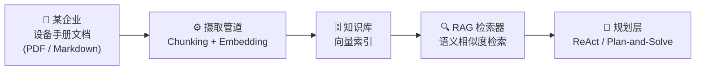
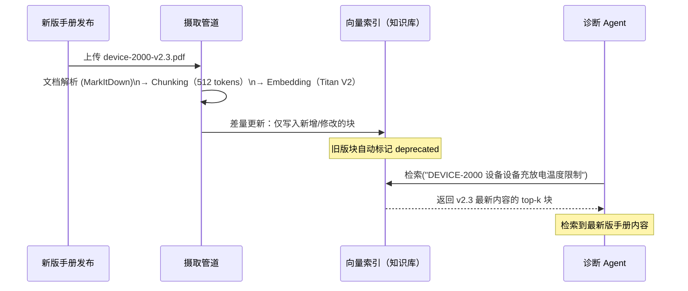

# 知识库构建

> 知识库是 RAG 的静态语义记忆层——将非结构化文档转化为可检索的向量索引，让 Agent 随时"翻阅"企业私有知识。

---

## 1. 理论基础

### 知识库作为外化语义记忆

认知心理学家 Tulving（1972）将人类长期记忆分为两类：**情景记忆**（Episodic Memory，记录"发生了什么"的个人经历）和**语义记忆**（Semantic Memory，存储与具体经历无关的通用概念与事实知识）。RAG 知识库对应后者——它不记录"上周诊断过什么故障"，而是存储"设备错误代码 E047 的含义是什么"这类静态事实。

CoALA（Sumers et al., 2023）将语义记忆定义为：

> "Semantic memory stores general world knowledge, facts, concepts, and their relationships, independent of specific experiences."

**RAG 知识库正是语义记忆的工程化实现**：将 PDF、Markdown、HTML 等格式的企业文档分块、向量化后存入向量数据库，为 Agent 提供一个可以用自然语言查询的"静态语义记忆层"。

### AIOS 存储管理子系统

AIOS（Mei et al., 2024/2025，arXiv:2403.16971）的内核层将知识库归入 **存储管理（Storage Management）** 子系统，负责持久化非结构化知识的摄取、索引和检索。知识库作为长期不变的背景知识源，与动态变化的工作记忆和情景记忆并列，共同构成 Agent 的完整记忆体系。

---

## 2. 核心机制

| 机制名称 | 说明 | 工程类比 |
|---------|------|---------|
| 命名空间隔离 | 不同设备型号的文档分隔存储，检索时只在对应命名空间内执行 | 数据库 Schema 隔离 |
| 增量更新 | 仅处理新增或修改的文档片段，不重建全量索引 | 增量索引（Elasticsearch） |
| 元数据过滤 | 检索时按 `device_model`、`chapter` 等字段过滤，缩小候选集 | SQL WHERE 条件 |
| 版本控制 | 知识库版本号与手册版本号一一对应，支持回滚到历史版本 | Git Tag |

---

## 3. 在 Agent OS 中的位置



知识库是摄取管道的输出端，也是 RAG 检索器的数据来源。规划层在每次 Think 步骤中通过检索器查询知识库，获取与当前告警最相关的手册片段后再调用 LLM 推理。

---

## 4. 工作原理



差量更新的关键在于对每个文档块计算内容哈希值：摄取管道比对新旧哈希，只有发生变更的块才会触发重新 Embedding 和写入，降低 API 调用成本。

---

## 5. 实现要点

以下摘自 `hello-agents/code/chapter8/05_RAGTool_Advanced_Search.py`，展示知识库初始化和技术文档摄取的核心逻辑：

```python
# Source: hello-agents/code/chapter8/05_RAGTool_Advanced_Search.py

def _setup_knowledge_base(self):
    """初始化知识库并添加技术文档"""

    # 添加 Python 最佳实践文档（作为技术知识源）
    python_doc = """
    Python Best Practices Guide:
    1. Use virtual environments for dependency isolation
    2. Follow PEP 8 style guidelines for code formatting
    3. Write docstrings for all functions and classes
    4. Use type hints for better code documentation
    5. Implement proper error handling with try/except blocks
    """
    self.rag_tool.run({
        "action": "add_document",
        "content": python_doc,           # 文档内容（自动分块 + 向量化）
        "doc_id": "python_best_practices",
        "metadata": {
            "category": "programming",   # 元数据字段，支持检索时过滤
            "language": "python",
        },
    })

    # 添加 AI 系统设计最佳实践
    ai_doc = """
    AI System Design Best Practices:
    1. Start with clear problem definition and success metrics
    2. Use appropriate model size for your use case
    3. Implement proper evaluation pipelines
    4. Monitor model performance in production
    """
    self.rag_tool.run({
        "action": "add_document",
        "content": ai_doc,
        "doc_id": "ai_design_practices",
        "metadata": {
            "category": "ai_engineering",
            "domain": "system_design",
        },
    })
```

`add_document` 接口统一处理分块、Embedding 和写入，调用方无需关心底层向量数据库的细节。`metadata` 字段在检索时作为过滤条件，确保只在对应命名空间内搜索。

---

## 6. 企业落地场景（IoT 企业）

### 场景概述

某企业 的设备手册知识库服务于IoT 系统的智能运维诊断 Agent。

**文档来源**：
- DEVICE-2000 安装与操作手册（约 450 页 PDF）
- 设备错误代码处置规程（约 380 页 PDF，含 E001–E099 全量故障条目）
- 温度管理参数规格文档（约 370 页 PDF，含各电池型号温度阈值表）
- 合计约 **1200 页 PDF**，每季度发布更新版本

**命名空间设计**（按设备型号分隔）：

| 命名空间前缀 | 内容 |
|------------|------|
| `device-2000/` | DEVICE-2000 型IoT 系统全套手册 |
| `bms-error-codes/` | 设备错误代码规程（全型号通用） |
| `thermal-specs/` | 温度管理参数规格（按电池型号分子目录） |

**查询示例**：

> 查询："DMS E047 错误代码含义"
>
> 命中：`bms-error-codes/section-3.md` 第 47 条故障说明
>
> 返回片段："E047 — 单体电池欠压保护（Cell Under-Voltage Protection）：单体电池电压低于 欠压阈值 阈值，系统触发一级保护，停止放电并发出告警。处置步骤：1) 检查 设备采样线是否松动……"

---

## 7. AWS AgentCore 对应

| 本地/开源实现 | AWS 组件 | 关键配置项 | 注意事项 |
|--------------|---------|-----------|---------|
| 本地文件系统 | [Amazon S3 Data Source](https://docs.aws.amazon.com/bedrock/latest/userguide/knowledge-base-ds.html) | `s3BucketArn`, `inclusionPrefixes` | 配合 IAM 权限控制访问；`inclusionPrefixes` 实现命名空间隔离 |
| Qdrant 向量库 | [Amazon OpenSearch Serverless](https://docs.aws.amazon.com/opensearch-service/latest/developerguide/serverless.html) | `vectorField`, `dimension` | 与 Amazon Bedrock Knowledge Bases 原生集成，无需自管向量数据库 |
| 自定义摄取脚本 | Amazon Bedrock Knowledge Bases 托管摄取 | `startIngestionJob` API | 支持按 S3 前缀增量同步；摄取任务异步执行，轮询 `getIngestionJob` 获取状态 |

---

## 8. 相关模块

:::info 相关模块

- **[RAG 检索流水线](./pipeline.md)**：知识库由检索流水线消费，pipeline.md 描述检索侧的具体机制——向量相似度算法、Reranker、top-k 策略等。
- **[语义记忆](../01-memory/semantic.md)**：向量知识库是语义记忆的工程化实现，两者在概念上一致；semantic.md 从认知架构角度描述语义记忆的完整理论框架。

:::

---

## 9. 延伸阅读

- Lewis, P., et al. (2020). *Retrieval-Augmented Generation for Knowledge-Intensive NLP Tasks*. arXiv:2005.11401. [https://arxiv.org/abs/2005.11401](https://arxiv.org/abs/2005.11401)
- Sumers, T. R., et al. (2023). *Cognitive Architectures for Language Agents (CoALA)*. arXiv:2309.02427. [https://arxiv.org/abs/2309.02427](https://arxiv.org/abs/2309.02427)
- Mei, K., et al. (2024). *AIOS: LLM Agent Operating System*. arXiv:2403.16971. [https://arxiv.org/abs/2403.16971](https://arxiv.org/abs/2403.16971)
- [Amazon Bedrock Knowledge Bases — 开发者指南](https://docs.aws.amazon.com/bedrock/latest/userguide/knowledge-base.html) — 摄取流水线、`startIngestionJob` API、向量存储配置
- [Amazon S3 — 开发者指南](https://docs.aws.amazon.com/AmazonS3/latest/userguide/Welcome.html) — S3 Data Source 配置、存储桶策略与 IAM 权限控制
- hello-agents 配套代码：`hello-agents/code/chapter8/05_RAGTool_Advanced_Search.py`
