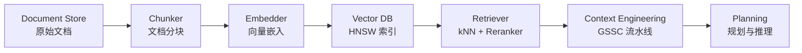
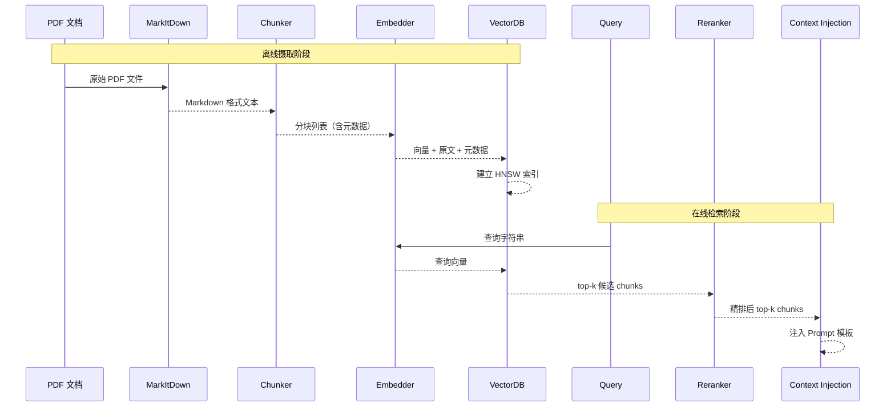

# RAG 检索流水线

> 文档经过分块、向量化、索引三道工序后入库，查询时走一次对称的召回路径——这就是 RAG 流水线的全部秘密。

---

## 1. 理论基础

Lewis et al.（2020，arXiv:2005.11401）在原始 RAG 论文中将检索增强生成定义为：**将参数化记忆（LLM 权重）与非参数化记忆（可检索的文档语料库）结合的端到端生成框架**。模型在每次生成前先从语料库中检索与输入最相关的文档片段，将其拼接进提示词，从而在生成步骤中利用外部知识而无需修改模型权重。这一设计使知识更新成本从"重新训练"降低到"重建向量索引"。

CoALA（Sumers et al., 2023，arXiv:2309.02427）在认知架构视角下将 RAG 检索归入 **Semantic Memory（语义记忆）的 Read 路径**。语义记忆存储结构化的世界知识，检索操作通过相似度查询定位相关知识片段，再将结果注入当前工作上下文供规划模块使用。RAG 流水线正是这条 Read 路径的工程化实现。

AIOS（Mei et al., 2024，arXiv:2403.16971）将检索器（Retriever）抽象为内核层 **Storage Management 子系统**的核心组件，与文件系统、数据库共同构成 Agent 的持久化存储层。Storage Management 的职责是响应 Agent 的存储读写请求并屏蔽底层存储引擎差异——向量数据库在这一框架下与关系数据库处于同等的抽象层次。

---

## 2. 核心机制

| 机制名称 | 说明 | 工程类比 |
|----------|------|----------|
| 文档分块 | 按语义边界切割文档为片段 | 消息队列分区 |
| 向量嵌入 | 文本 → 稠密向量（1024 / 1536 维） | 搜索引擎索引 |
| HNSW 索引 | 近似最近邻图索引，支持高效 kNN 查询 | 数据库 B-Tree 索引 |
| Cosine 相似度 | 余弦相似度衡量向量夹角，与向量模长无关 | Elasticsearch 评分 |
| Reranker | 二阶段精排，用交叉编码器提升 top-k 精度 | 搜索结果精排 |

---

## 3. 在 Agent OS 中的位置



RAG 流水线横跨 Storage Management（Document Store → Vector DB）和 Context Engineering 两个 AIOS 子系统。Chunker 和 Embedder 负责离线摄取，Retriever 负责在线召回，召回结果经上下文工程的 Select / Compress 阶段处理后注入 Planning 模块的 Prompt。

---

## 4. 工作原理（时序图）



摄取阶段的关键决策是分块策略：`chunk_size` 过大会引入噪声，过小则缺乏上下文。标准配置为 512 token / chunk，`chunk_overlap` 50 token 保证边界语义连续。检索阶段先用向量 kNN 召回候选集（通常 top-20），再由 Reranker 交叉编码器精排后返回 top-5，兼顾召回率和精准度。

---

## 5. 实现要点

以下摘自 `hello-agents/code/chapter8/04_RAGTool_MarkItDown_Pipeline.py`，展示 MarkItDown 转换后的分块与检索核心逻辑：

```python
# Source: hello-agents/code/chapter8/04_RAGTool_MarkItDown_Pipeline.py

class MarkdownChunkingDemo:
    """演示 MarkItDown 转换 + 语义分块 + 向量检索完整流水线"""

    def __init__(self):
        self.memory_tool = MemoryTool(
            user_id="markdown_chunking_demo",
            memory_types=["semantic"]           # 语义记忆：向量索引存储
        )

    def demonstrate_markdown_chunking(self, markdown_text: str):
        """将 Markdown 文本分块后写入向量索引"""
        # chunk_size=512: 每块约 512 token，平衡上下文与噪声
        # chunk_overlap=50: 相邻块重叠 50 token，避免语义在边界断裂
        result = self.memory_tool.run({
            "action": "add",
            "content": markdown_text,
            "memory_type": "semantic",
            "chunk_size": 512,
            "chunk_overlap": 50,
            "metadata": {
                "source": "device_manual",      # 来源标签，支持按命名空间过滤
                "format": "markdown",
            }
        })
        return result

    def search_chunks(self, query: str, top_k: int = 5):
        """向量相似度检索：返回最相关的 top-k 分块"""
        result = self.memory_tool.run({
            "action": "search",
            "query": query,
            "memory_type": "semantic",
            "limit": top_k,                     # Reranker 精排后返回条数
            "score_threshold": 0.7,             # 过滤低相关度片段
        })
        return result.get("results", [])
```

分块写入时携带 `metadata` 字段（来源、版本、章节层级），检索时可按元数据过滤缩小候选集范围，适合多型号设备手册共存的场景。`score_threshold` 可防止低相关度片段污染上下文。

---

## 6. 企业落地场景：IoT 设备诊断（某企业）

**场景**：某企业 《DEVICE-2000 安装维护手册》（PDF，约 300 页）涵盖安全规程、安装步骤、设备告警码、维护周期等结构化章节，需向量化入库供诊断 Agent 实时检索。

**分块策略**：采用感知标题层次的分块方式（Hierarchical Chunking），以 H1/H2/H3 标题为主要边界，保留设备型号编号（如 `DEVICE-2000`）、规格参数（如 `充电截止电压 3.65 V`）等关键数字上下文于同一块内，避免跨块截断导致数字脱离语义。例如，第 4.2 节"设备温度保护规程"会作为一个完整分块入库，其中包含温度阈值、保护动作、复位步骤等关联信息。

**检索效果**：当诊断 Agent 收到 `DEV-042 过温告警` 事件后，以 `"DEV-042 过温告警 处置"` 为查询词执行向量检索，Reranker 精排后的 top-1 结果指向手册第 4.2 节"设备温度保护规程"片段，包含"当设备模块温度超过 60°C 时，系统触发一级保护，充电电流降低至 额定值 50%，并上报 DMS-04x 系列告警码"等原文内容，直接作为 LLM 生成诊断建议的依据。

---

## 7. AWS AgentCore 对应

| 本地 / 开源实现 | AWS 组件 | 关键配置项 | 注意事项 |
|--------------|---------|-----------|---------|
| MarkItDown 文档转换 | [Amazon Bedrock Knowledge Bases](https://docs.aws.amazon.com/bedrock/latest/userguide/knowledge-base.html) 内置摄取管道 | `chunkingStrategy` | 支持 PDF / HTML / Word 自动转换，无需自建 MarkItDown 管道 |
| Chunking | `FIXED_SIZE` / `HIERARCHICAL` chunkingStrategy | `chunkingConfiguration.maxTokens` | 层次分块（`HIERARCHICAL`）适合有标题结构的设备手册 |
| Qdrant / ChromaDB | [Amazon OpenSearch Serverless (AOSS)](https://docs.aws.amazon.com/opensearch-service/latest/developerguide/serverless.html) | `vectorField`, `dimension: 1024` | AOSS 按 OCU 计费，测试环境建议设置 `standbyReplicas: DISABLED` 以降低成本 |
| 自定义 Reranker | [Amazon Bedrock Rerank API](https://docs.aws.amazon.com/bedrock/latest/userguide/rerank.html) | `rerankingConfiguration.rerankingModelConfiguration` | 支持 Cohere Rerank 模型；Rerank 按调用次数单独计费 |

选型说明：Amazon Bedrock Knowledge Bases 将摄取管道（转换 → 分块 → 嵌入 → 索引）托管化，省去自建 Chunker 和 Embedder 的运维成本。AOSS 作为向量存储后端可弹性伸缩，适合 某企业 按季度批量更新手册的场景；若对成本敏感，可在测试阶段使用 `OPENSEARCH_MANAGED` 替代 Serverless。

---

## 8. 相关模块

:::info 相关模块

- **[知识库构建](./knowledge-base.md)**：本文档描述流水线的通用机制（分块、嵌入、检索、精排）；知识库构建文档介绍如何针对 某企业 设备手册组织和维护多型号、多版本知识库，包括增量更新与命名空间管理策略。
- **[记忆系统](../01-memory/index.md)**：RAG 检索结果最终进入语义记忆（向量索引即语义记忆的外部存储形态）；情景记忆中的历史诊断案例也可作为 RAG 数据源，构建"案例库"供检索复用。

:::

---

## 9. 延伸阅读

- Lewis, P., et al. (2020). *Retrieval-Augmented Generation for Knowledge-Intensive NLP Tasks*. arXiv:2005.11401. [https://arxiv.org/abs/2005.11401](https://arxiv.org/abs/2005.11401)
- Sumers, T. R., et al. (2023). *Cognitive Architectures for Language Agents (CoALA)*. arXiv:2309.02427. [https://arxiv.org/abs/2309.02427](https://arxiv.org/abs/2309.02427)
- Mei, K., et al. (2024). *AIOS: LLM Agent Operating System*. arXiv:2403.16971. [https://arxiv.org/abs/2403.16971](https://arxiv.org/abs/2403.16971)
- [Amazon Knowledge Bases for Bedrock — 开发者指南](https://docs.aws.amazon.com/bedrock/latest/userguide/knowledge-base.html)
- [Amazon Bedrock Rerank API — 开发者指南](https://docs.aws.amazon.com/bedrock/latest/userguide/rerank.html)
- [Amazon OpenSearch Serverless — 向量搜索指南](https://docs.aws.amazon.com/opensearch-service/latest/developerguide/serverless-vector-search.html)
- hello-agents 配套代码：`hello-agents/code/chapter8/04_RAGTool_MarkItDown_Pipeline.py`
