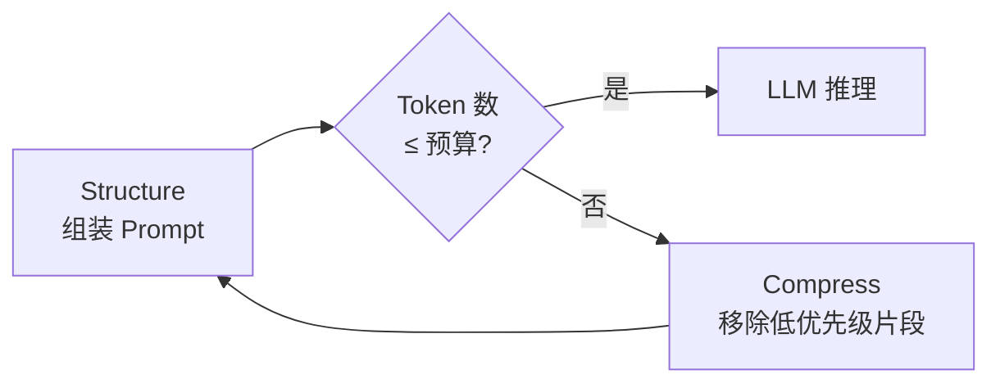
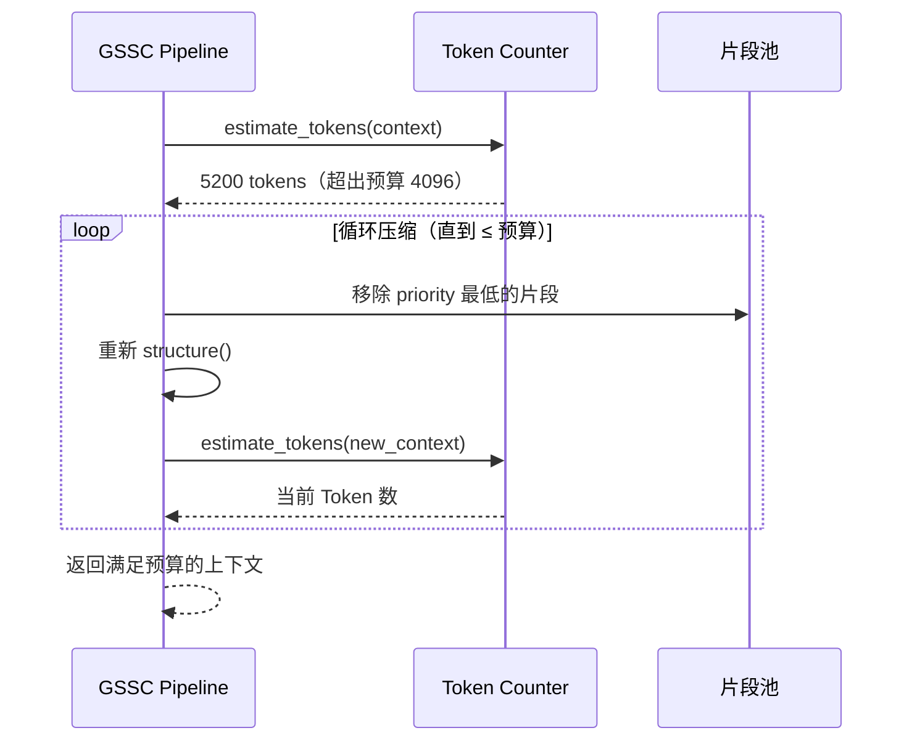

# 上下文压缩策略

> 当可用上下文片段超出 Token 预算时，选择"扔掉什么"比选择"保留什么"更关键。

---

## 1. 理论基础

LLM 的上下文窗口是有限且昂贵的资源。研究表明（"Lost in the Middle"，Liu et al., 2023），LLM 对上下文中间位置的信息关注度显著低于头部和尾部。因此，压缩策略不仅要控制 Token 总数，还要考虑保留信息的位置布局。

AIOS（2024）的上下文管理子系统定义了三种压缩模式：截断（Truncation）、摘要（Summarization）、稀疏化（Sparsification）。本实现采用基于优先级的截断策略，在工程复杂度和效果之间取得平衡。

---

## 2. 核心机制

| 策略 | 说明 | 工程类比 | 适用场景 |
|------|------|---------|---------|
| 优先级截断 | 从最低优先级片段开始移除 | JVM GC 优先回收弱引用对象 | 多来源片段、优先级明确 |
| 摘要压缩 | 用 LLM 生成历史对话摘要 | 日志轮转归档 | 长对话历史压缩 |
| 滑动窗口 | 仅保留最近 N 轮对话 | 环形缓冲区（Ring Buffer） | 多轮对话场景 |
| 关键词过滤 | 只保留含关键词的片段 | 倒排索引过滤 | 任务高度明确时 |

---

## 3. 在 Agent OS 中的位置



压缩是 GSSC 流水线的最后一道防线。通过循环迭代（移除片段 → 重新组装 → 再次检查），确保最终输出严格满足 Token 预算。

---

## 4. 工作原理



---

## 5. 实现要点

```python
# Source: code/context/gssc_pipeline.py

def compress(self, context: str, fragments: list[ContextFragment]) -> str:
    """
    基于优先级的截断压缩：
    从 priority 最低的片段开始逐步移除，直到 Token 数满足预算。
    类比 JVM GC 分代策略：低重要性对象（低优先级片段）优先回收。
    """
    if _estimate_tokens(context) <= self.token_budget:
        return context  # 未超预算，无需压缩

    # 按优先级升序排列（最低优先级在前）
    sorted_frags = sorted(fragments, key=lambda f: f.priority)
    remaining = list(fragments)

    for frag in sorted_frags:
        if _estimate_tokens(context) <= self.token_budget:
            break
        remaining.remove(frag)   # 移除当前最低优先级片段
        task = "..."              # 从原始 context 提取任务描述
        context = self.structure(remaining, task)  # 重新组装

    return context
```

关键设计决策：优先保留工作记忆（当前任务状态），其次保留 RAG 规程（领域知识），最后保留情景记忆（历史案例）。这个优先级顺序基于实际诊断场景中各类信息对 LLM 推理质量的影响权重。

---

## 6. 企业落地场景：IoT 设备诊断（某企业）

**场景**：10 台设备同时告警，每台 Agent 各需约 600 tokens 上下文，总计 6000 tokens，超出 4096 预算。

**压缩策略执行过程**：

1. 移除优先级最低的 3 台低风险设备的历史案例片段（释放约 800 tokens）
2. 将中风险设备的历史案例从 top-3 缩减到 top-1（释放约 600 tokens）
3. 最终上下文：5 台高风险设备完整上下文 + 5 台中低风险设备摘要上下文
4. 总 Token 数降至 3800，满足 4096 预算

**效果**：高风险设备（温度 ≥ 70°C）的诊断质量不受影响，低风险设备接受轻量处理。

---

## 7. AWS AgentCore 对应

| 本地实现 | AWS 组件 | 关键配置项 | 注意事项 |
|---------|---------|-----------|---------|
| 优先级截断 | Amazon Bedrock AgentCore Memory `memorySummaryStrategy` | `RECENT_MESSAGES` / `DENSE` | Memory 内置摘要策略可替代手动截断 |
| Token 计数 | Amazon Bedrock `usage.inputTokens` | 响应中的 usage 字段 | 实际计费以 Bedrock 返回的 token 数为准，与本地估算有差异 |
| 滑动窗口 | Amazon Bedrock Agents `sessionState.sessionAttributes` | `maxRecentMessages` | Agents 内置支持限制历史轮数 |

:::info 相关模块

- **[GSSC 流水线](./gssc-pipeline.md)**：压缩是 GSSC 流水线的第四阶段，需在 Structure 之后执行。
- **[成本治理](../07-cost-governance/index.md)**：Token 预算设置直接影响 LLM 调用成本，两个模块需配合调优。

:::

---

## 延伸阅读

- Liu et al. (2023). *Lost in the Middle: How Language Models Use Long Contexts*. arXiv:2307.03172.
- [Amazon Bedrock AgentCore Memory — 摘要策略](https://docs.aws.amazon.com/bedrock/latest/userguide/agents-memory.html)
- 配套代码：`code/context/gssc_pipeline.py`
