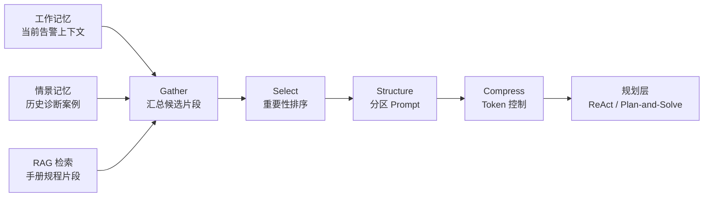
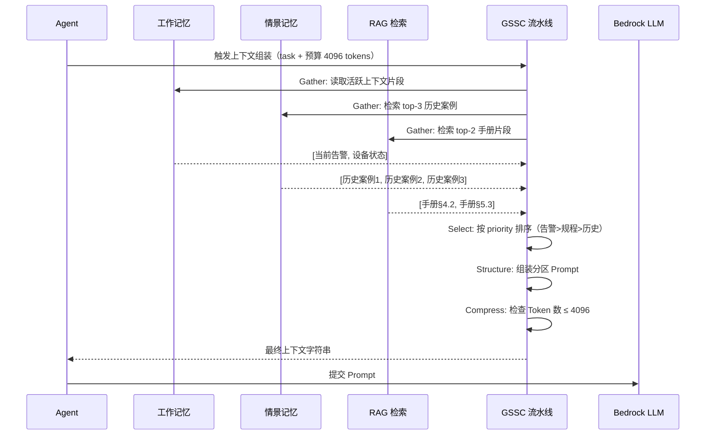

# GSSC 流水线

> Gather → Select → Structure → Compress：把分散在记忆和知识库中的片段，裁剪组装成恰好够用的 LLM 提示词。

---

## 1. 理论基础

上下文工程的核心挑战来自两个矛盾：LLM 上下文窗口有限（成本与 Token 数正相关），而可用的上下文来源（记忆、RAG、工具结果）通常远超窗口容量。GSSC 流水线通过四阶段顺序处理解决这个矛盾。

CoALA（2023）将"上下文选择（context selection）"列为 Agent 内部操作（internal actions）的核心子类。AIOS（2024）的上下文管理子系统（Context Management）负责跨步骤维护活跃上下文，GSSC 是其工程化实现模式。

---

## 2. 核心机制

| 阶段 | 说明 | 工程类比 |
|------|------|---------|
| Gather（收集）| 从工作记忆、情景记忆、RAG 结果汇总所有候选片段 | 数据库多表 JOIN |
| Select（筛选）| 按重要性（importance）和相关度（relevance）排序过滤 | SQL ORDER BY + WHERE |
| Structure（结构化）| 按分区（任务/历史/规程/工具结果）组装为 Prompt 模板 | 模板引擎（Jinja2/Mustache）|
| Compress（压缩）| Token 预算控制，超限时从低优先级片段开始截断 | JVM GC 分代回收策略 |

---

## 3. 在 Agent OS 中的位置



---

## 4. 工作原理（时序图）



---

## 5. 实现要点

```python
# Source: hello-agents/code/chapter9/（GSSC 流水线核心逻辑）
# 对应本地演示代码：code/context/gssc_pipeline.py

class GSSCPipeline:
    """GSSC 四阶段上下文组装流水线"""

    def gather(self, sources: dict) -> list[ContextFragment]:
        """从多来源收集原始片段，统一包装为 ContextFragment 对象"""
        fragments = []
        for source_name, items in sources.items():
            for item in items:
                frag = ContextFragment(
                    source=source_name,
                    content=item["content"],
                    priority=item.get("priority", 0.5),  # 优先级 0-1
                )
                fragments.append(frag)
        return fragments

    def select(self, fragments: list) -> list:
        """按 priority 降序排序，过滤空内容"""
        return sorted(
            [f for f in fragments if f.content.strip()],
            key=lambda f: f.priority, reverse=True
        )

    def structure(self, fragments: list, task: str) -> str:
        """组装为带分区标题的 Prompt 模板"""
        sections = {"working_memory": [], "episodic": [], "rag": []}
        for frag in fragments:
            key = frag.source if frag.source in sections else "working_memory"
            sections[key].append(frag.content)
        # 按重要性分区：任务 > 当前状态 > 历史 > 知识库
        parts = [f"## 任务\n{task}"]
        if sections["working_memory"]:
            parts.append("## 当前告警上下文\n" + "\n".join(sections["working_memory"]))
        if sections["episodic"]:
            parts.append("## 历史诊断案例\n" + "\n".join(sections["episodic"]))
        if sections["rag"]:
            parts.append("## 设备手册规程\n" + "\n".join(sections["rag"]))
        return "\n\n".join(parts)

    def compress(self, context: str, fragments: list) -> str:
        """Token 预算控制：超限时从低优先级片段开始截断"""
        if estimate_tokens(context) <= self.token_budget:
            return context  # 未超预算，直接返回
        # 逐步移除最低优先级片段直到满足预算
        remaining = list(fragments)
        for frag in sorted(fragments, key=lambda f: f.priority):
            if estimate_tokens(context) <= self.token_budget:
                break
            remaining.remove(frag)
            context = self.structure(remaining, "")
        return context
```

---

## 6. 企业落地场景：IoT 设备诊断（某企业）

某企业 多设备并发告警的上下文调度策略：

| 设备优先级 | 条件 | 上下文片段分配 |
|-----------|------|--------------|
| 高优先级 | 温度 ≥ 70°C 或风险评分 ≥ 0.8 | 完整工作记忆 + top-3 历史案例 + 完整规程 |
| 中优先级 | 60°C ≤ 温度 < 70°C | 完整工作记忆 + top-1 历史案例 + 规程摘要 |
| 低优先级 | 温度 < 60°C 且为预警 | 仅工作记忆（节省 Token 预算） |

当 10 台设备同时告警时，Compress 阶段按设备优先级分配 Token 预算，确保高风险设备的上下文完整性优先得到保障。

---

## 7. AWS AgentCore 对应

| 本地实现 | AWS 组件 | 关键配置项 | 注意事项 |
|---------|---------|-----------|---------|
| Gather 阶段 | Amazon Bedrock AgentCore Memory（会话上下文检索）| `sessionId` | Memory 内置 Gather 逻辑，自动从会话历史收集片段 |
| Select + Compress | Amazon Bedrock 模型 `maxTokens` 参数 | `maxTokens: 4096` | 通过设置 maxTokens 隐式约束输入长度 |
| Structure | [Amazon Bedrock Prompt Management](https://docs.aws.amazon.com/bedrock/latest/userguide/prompt-management.html) | `promptArn`, `templateType: TEXT` | 结构化 Prompt 模板版本化管理 |

:::info 相关模块

- **[记忆系统](../01-memory/index.md)**：Gather 阶段的数据来源是工作记忆和情景记忆。
- **[成本治理](../07-cost-governance/index.md)**：Compress 阶段的 Token 预算值直接影响每次 LLM 调用的成本，需与成本治理模块联动设置。

:::

---

## 延伸阅读

- Sumers et al. (2023). *CoALA*. arXiv:2309.02427.
- Mei et al. (2024). *AIOS*. arXiv:2403.16971.
- [Amazon Bedrock AgentCore Memory](https://docs.aws.amazon.com/bedrock/latest/userguide/agents-memory.html)
- 配套代码：`code/context/gssc_pipeline.py`
