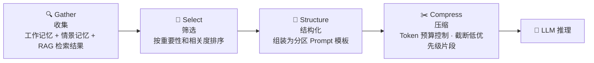

# 上下文工程（Context Engineering）

> 上下文工程决定 LLM 在每次推理时"看到什么"——通过 GSSC 四阶段流水线，从海量记忆和知识中精准裁剪出最有价值的上下文片段。

---

## 理论基础

**CoALA**（Sumers et al., 2023）将"选择什么信息放入上下文窗口"归类为 Agent 规划阶段的核心决策之一。上下文组装不当（噪声过多、关键信息缺失）是导致 LLM 推理质量下降的首要原因。

**AIOS**（Mei et al., 2024，arXiv:2403.16971）在内核层专设**上下文管理子系统（Context Management Subsystem）**，负责跨推理步骤的上下文维护、注入和压缩。该子系统与工作记忆协同工作：工作记忆存储原始片段，上下文管理子系统决定哪些片段最终进入 LLM 提示词。

---

## GSSC 流水线

GSSC 是四个阶段的首字母缩写。每个阶段职责单一，类比 Java Stream 的 filter → sorted → map → collect 流式处理链。

## 子文档导航

| 文档 | 内容 |
|-----|------|
| [gssc-pipeline.md](./gssc-pipeline.md) | 四阶段实现细节、分区 Prompt 模板、多设备并发调度策略 |
| [compression.md](./compression.md) | Token 预算控制算法、压缩策略对比、与成本治理的联动 |

---

## IoT 场景：多设备并发上下文调度

某企业 部署的 500+ IoT 设备每天产生约 10 万条告警。当 10 台设备同时触发过温告警时，每台设备的诊断 Agent 都需要从以下来源汇总上下文：工作记忆（当前告警详情）、情景记忆（历史相似案例）、RAG（设备手册规程）。

在 4096 Token 预算下，GSSC 流水线确保最高风险设备的上下文片段（高优先级）始终完整保留，低风险设备的历史案例在必要时被截断压缩。

---

## AWS AgentCore 对应

| 本地实现 | AWS 组件 | 关键配置项 | 注意事项 |
|---------|---------|-----------|---------|
| GSSC 流水线 | [Amazon Bedrock AgentCore Memory](https://docs.aws.amazon.com/bedrock/latest/userguide/agents-memory.html) | `sessionId`, `memorySummaryStrategy` | AgentCore Memory 内置上下文摘要和注入，可替代自定义 GSSC |
| Token 预算控制 | Amazon Bedrock 模型上下文窗口 | `maxTokens` in InvokeModel | Claude 3 Sonnet 支持 200K token 上下文，但成本随 token 线性增长 |
| 分区 Prompt | Amazon Bedrock Prompt Management | `promptArn` | 结构化 Prompt 模板版本化管理，支持 A/B 测试 |

:::info 相关模块

- **[记忆系统](../01-memory/index.md)**：GSSC Gather 阶段从工作记忆和情景记忆中收集上下文片段。
- **[成本治理](../07-cost-governance/index.md)**：Compress 阶段的 Token 预算直接影响每次 LLM 调用的成本。

:::

---

## 延伸阅读

- Sumers et al. (2023). *CoALA*. arXiv:2309.02427.
- Mei et al. (2024). *AIOS*. arXiv:2403.16971.
- [Amazon Bedrock AgentCore Memory](https://docs.aws.amazon.com/bedrock/latest/userguide/agents-memory.html)
- hello-agents Chapter 9 配套代码：`hello-agents/code/chapter9/`
