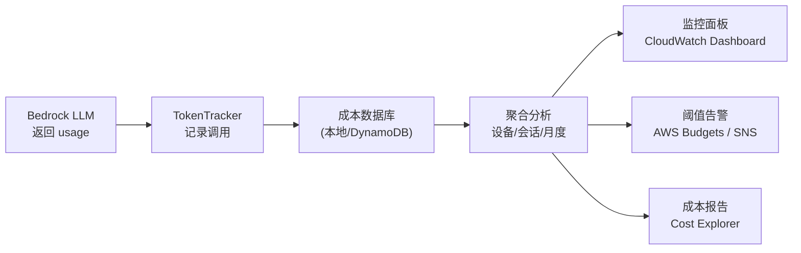
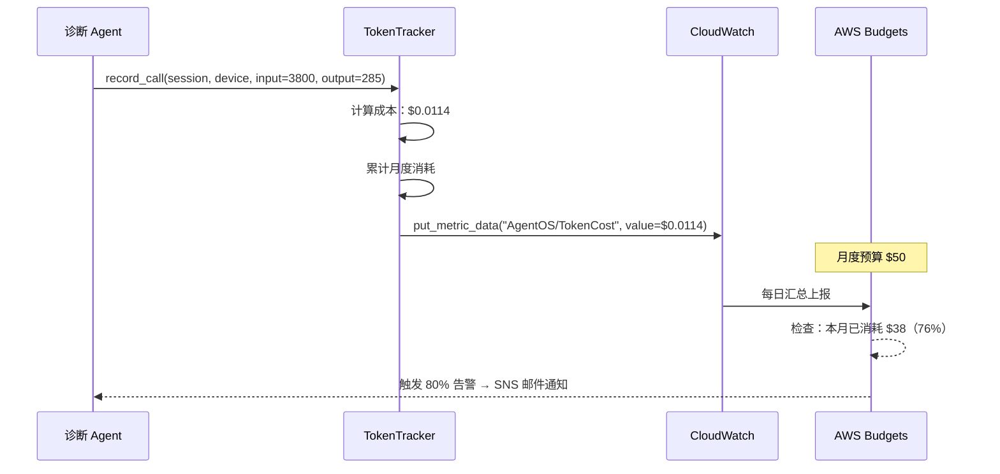

# 成本监控

> 让 LLM API 费用像应用程序指标一样可观测——实时追踪、阈值告警、按设备下钻分析。

---

## 1. 理论基础

成本监控解决的是可观测性问题：在 Agent 运行时实时采集 Token 消耗数据，聚合为可用于决策的成本指标，并在超阈值时及时告警。这与传统应用的 APM（Application Performance Monitoring）高度类似，区别在于核心指标从 CPU/内存换成了 Token/美元。

AIOS（2024）的访问控制子系统不仅负责限流，还负责**使用量审计（usage auditing）**，记录每次 LLM 调用的资源消耗，为成本分析提供数据基础。

---

## 2. 核心机制

| 机制 | 说明 | 工程类比 |
|------|------|---------|
| 调用级追踪 | 记录每次 LLM 调用的 input/output tokens | APM Span |
| 会话级汇总 | 按 session_id 聚合单次诊断的总成本 | 分布式 Trace |
| 设备级下钻 | 按 device_id 分析哪台设备消耗最多 Token | 维度分析 |
| 月度估算 | 基于历史平均值外推月度总费用 | 容量规划 |
| 阈值告警 | 单次超过预算或月度超过预算时触发告警 | SLA 违规告警 |

---

## 3. 在 Agent OS 中的位置



---

## 4. 工作原理



---

## 5. 实现要点

```python
# Source: code/cost/token_tracker.py

class TokenTracker:
    """Token 成本追踪器：记录每次 LLM 调用并累计统计"""

    def per_device_summary(self) -> dict:
        """按设备汇总 Token 消耗，用于识别高成本设备"""
        result = {}
        for call in self._calls:
            d = result.setdefault(call.device_id, {
                "calls": 0, "input_tokens": 0,
                "output_tokens": 0, "cost_usd": 0.0
            })
            d["calls"] += 1
            d["input_tokens"] += call.input_tokens
            d["output_tokens"] += call.output_tokens
            d["cost_usd"] += call.cost_usd
        return result

    def monthly_estimate(self, daily_alarm_rate: int = 50) -> dict:
        """基于历史平均值外推月度成本，用于容量规划"""
        avg_cost = sum(c.cost_usd for c in self._calls) / len(self._calls)
        monthly_calls = daily_alarm_rate * 30
        return {
            "avg_cost_per_call_usd": round(avg_cost, 6),
            "monthly_calls_estimate": monthly_calls,
            "monthly_cost_usd": round(avg_cost * monthly_calls, 2),
        }
```

---

## 6. 企业落地场景：IoT 设备诊断（某企业）

**监控指标体系**：

| 指标 | 粒度 | 告警阈值 | 告警动作 |
|------|------|---------|---------|
| 单次调用成本 | 每次 LLM 调用 | > $0.05（单次异常高） | 记录日志 + 邮件 |
| 设备月度成本 | 每台设备/月 | > $5（单设备异常高） | 检查该设备告警频率 |
| 全局月度成本 | 所有设备/月 | > $40（月度预算 80%）| 触发降级策略（切换 Haiku 模型）|
| Token 利用率 | 每次调用 | 输入 Token > 3800（≥ 93% 预算）| 触发 GSSC 压缩增强 |

**降级策略**：当月度成本超过预算 80% 时，自动将模型从 Claude 3 Sonnet 切换到 Claude 3 Haiku（成本降低约 90%），牺牲少量诊断质量换取成本控制。

---

## 7. AWS AgentCore 对应

| 本地实现 | AWS 组件 | 关键配置项 | 注意事项 |
|---------|---------|-----------|---------|
| TokenTracker 本地记录 | [Amazon CloudWatch](https://docs.aws.amazon.com/cloudwatch/) 自定义指标 | `put_metric_data`, Namespace: `AgentOS/TokenCost` | 自定义指标按 $0.30/指标/月计费 |
| 月度预算告警 | [AWS Budgets](https://docs.aws.amazon.com/cost-management/latest/userguide/budgets-managing-costs.html) | `budgetLimit`, `notificationsWithSubscribers` | 需配置 SNS Topic 接收告警邮件 |
| 按设备下钻 | AWS Cost Explorer + 资源标签（device_id）| `ResourceTag/device_id` | 需要在 Bedrock 调用时传递标签 |

:::info 相关模块

- **[Token 预算控制](./token-budget.md)**：成本监控是 Token 预算控制的可观测性配套，两者协同工作。
- **[评估体系](../09-evaluation/index.md)**：成本效率（tokens/次成功诊断）是评估指标之一，需要成本监控数据支撑。

:::

---

## 延伸阅读

- [AWS Cost Explorer 文档](https://docs.aws.amazon.com/cost-management/latest/userguide/what-is-costexplorer.html)
- [Amazon CloudWatch 自定义指标](https://docs.aws.amazon.com/AmazonCloudWatch/latest/monitoring/publishingMetrics.html)
- [AWS Budgets 文档](https://docs.aws.amazon.com/cost-management/latest/userguide/budgets-managing-costs.html)
- [Amazon Bedrock 监控指标](https://docs.aws.amazon.com/bedrock/latest/userguide/monitoring-cloudwatch.html)
