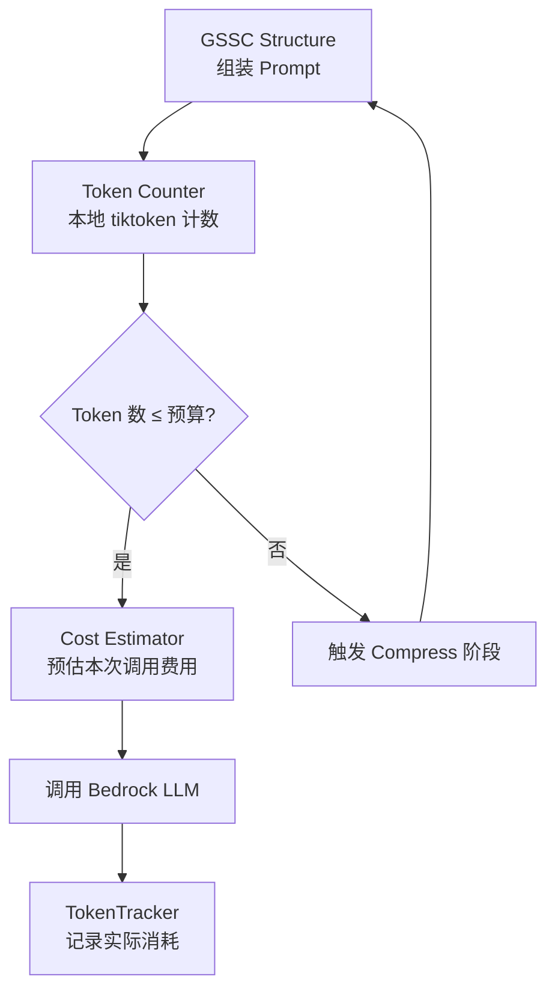
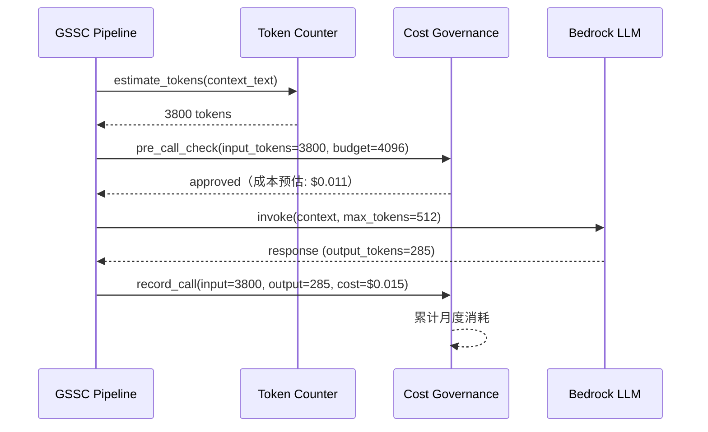

# Token 预算控制

> 在调用 LLM 之前精确计算上下文的 Token 消耗，在超出预算前主动触发压缩——比事后限流更经济。

---

## 1. 理论基础

Token 预算控制是成本治理的前置防线：通过在组装上下文时实时计算 Token 数，并在超出预算阈值前触发 GSSC 流水线的 Compress 阶段，确保每次 LLM 调用的输入 Token 数不超过设定的预算上限。

与事后限流（API 网关速率控制）不同，Token 预算控制在进程内实时执行，零网络开销，且可以精确控制每次调用的成本，不会因为已经发出请求后才触发限流而浪费费用。

---

## 2. 核心机制

| 机制 | 说明 | 工程类比 |
|------|------|---------|
| 本地 Token 计数 | 使用 tiktoken 在本地精确计算 Token 数（无需 API 调用）| 内存占用预估（heapSize）|
| 预算分配 | 将总 Token 预算按来源分配（系统提示/历史/RAG/输出预留）| 内存分区（JVM Heap/Metaspace）|
| 预算软/硬限制 | 软限制触发压缩，硬限制直接截断 | Kafka 消费者 max.poll.records |
| 成本预估 | 在调用前根据 Token 数估算成本，供监控和告警使用 | 事务前预估锁竞争 |

---

## 3. 在 Agent OS 中的位置



---

## 4. 工作原理



---

## 5. 实现要点

```python
# Source: code/cost/token_tracker.py

# tiktoken 本地 Token 计数（精确，无需 API 调用）
def count_tokens(text: str) -> int:
    try:
        import tiktoken
        enc = tiktoken.get_encoding("cl100k_base")
        return len(enc.encode(text))
    except ImportError:
        return max(1, len(text) // 4)   # 降级：4 字符 ≈ 1 token

# Token 预算分配建议（4096 token 上下文）
TOKEN_BUDGET_ALLOCATION = {
    "system_prompt":    512,   # 系统角色和指令
    "working_memory":   800,   # 当前会话状态
    "episodic_memory":  600,   # 历史诊断案例
    "rag_results":      800,   # 手册规程片段
    "output_reserve":   400,   # 模型输出预留
    "buffer":           984,   # 缓冲区（应对估算误差）
}
# 总计: 4096 tokens
```

---

## 6. 企业落地场景：IoT 设备诊断（某企业）

**Token 预算分配策略**（每次诊断会话，总预算 4096 tokens）：

| 分区 | Token 分配 | 内容 |
|------|-----------|------|
| 系统提示 | 512 | Agent 角色定义、输出格式要求 |
| 工作记忆 | 800 | 当前告警详情、设备状态快照 |
| 情景记忆 | 600 | 最近 2 条相似历史案例摘要 |
| RAG 结果 | 800 | 手册相关章节（top-2 片段） |
| 输出预留 | 400 | 诊断建议输出空间 |
| 缓冲区 | 984 | 估算误差容忍 |

**成本控制效果**：固定 Token 预算将单次诊断成本上限锁定在约 $0.015（4096 tokens × $0.003 输入 + 400 tokens × $0.015 输出），月度 500 设备总成本可控在 $300 以内。

---

## 7. AWS AgentCore 对应

| 本地实现 | AWS 组件 | 关键配置项 | 注意事项 |
|---------|---------|-----------|---------|
| tiktoken 计数 | Bedrock 响应中的 `usage.inputTokens` | 响应 `usage` 字段 | 实际计费以 Bedrock 返回值为准，本地估算作为预控 |
| Token 预算分配 | Bedrock `maxTokens` + 自定义 Lambda 中间件 | `maxTokens` 控制输出上限 | 输入 Token 无法直接限制，需在组装时控制 |

:::info 相关模块

- **[GSSC 流水线](../06-context-engineering/gssc-pipeline.md)**：Token 预算控制与 GSSC 的 Compress 阶段紧密协作。
- **[成本监控](./monitoring.md)**：Token 计数的结果写入成本监控模块，累计追踪月度消耗。

:::

---

## 延伸阅读

- [tiktoken 官方文档](https://github.com/openai/tiktoken)
- [Amazon Bedrock 模型推理参数](https://docs.aws.amazon.com/bedrock/latest/userguide/model-parameters.html)
- 配套代码：`code/cost/token_tracker.py`
