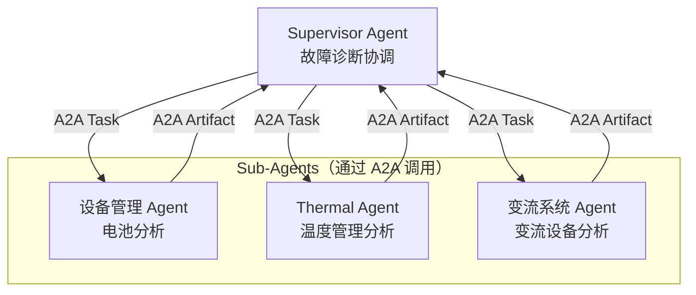
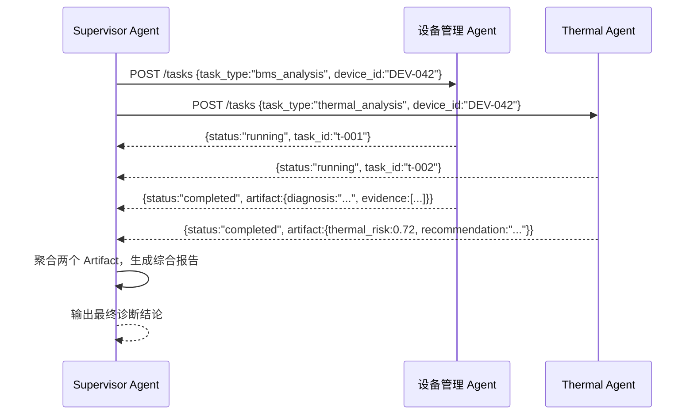

# Agent-to-Agent Protocol（A2A）

> A2A 让 Agent 像微服务一样组合——主 Agent 通过标准协议委托子 Agent 完成专项任务，无需了解对方的内部实现。

---

## 1. 理论基础

A2A（Agent-to-Agent Protocol）由 Google 于 2025 年提出，解决的问题是：**多个独立 Agent 如何安全、标准化地互相发现、委托任务、传递结果**。A2A 将 Agent 抽象为 HTTP 服务，定义了 Agent Card（能力描述）、Task 对象（任务委托）和 Artifact（任务产出）三个核心概念。

A2A 与 MCP 的分工：MCP 解决 Agent ↔ 工具通信，A2A 解决 Agent ↔ Agent 通信。两者可以叠加使用：主 Agent 通过 A2A 委托子 Agent，子 Agent 通过 MCP 调用工具。

---

## 2. 核心机制

| 机制 | 说明 | 工程类比 |
|------|------|---------|
| Agent Card | Agent 的能力描述文档（JSON），声明支持的任务类型和输入输出格式 | OpenAPI Spec / Service Discovery |
| Task 委托 | 主 Agent 向子 Agent 发送 Task 对象，包含任务描述和输入数据 | gRPC 异步调用 |
| Artifact 返回 | 子 Agent 完成任务后返回 Artifact（结构化产出物）| 微服务响应体 |
| 状态追踪 | Task 对象携带状态（pending/running/completed/failed）| 分布式事务状态机 |

---

## 3. 在 Agent OS 中的位置



---

## 4. 工作原理（时序图）



---

## 5. 实现要点

```python
# Source: hello-agents/code/chapter10/（A2A 通信模式）
# A2A 的本地演示通过 orchestrator_demo.py 中的 AgentMessage 模拟

@dataclass
class AgentMessage:
    """A2A 任务委托消息"""
    sender: str        # 发送方 Agent ID
    receiver: str      # 接收方 Agent ID
    task: str          # 任务类型（如 "bms_analysis"）
    payload: dict      # 任务输入数据

@dataclass
class AgentResult:
    """A2A 任务执行结果（对应 Artifact）"""
    worker_id: str     # 执行 Agent ID
    task: str          # 对应的任务类型
    result: str        # 任务产出（自然语言 + 结构化数据）
    success: bool      # 执行是否成功
    tokens_used: int   # Token 消耗（成本追踪）
```

---

## 6. 企业落地场景：某企业 多 Agent 协作

**场景**：DEV-042 发生复合故障（同时触发设备过温和 变流系统 电流异常），需要三个专业 Agent 协同诊断：

1. Supervisor Agent 收到告警，识别为复合故障，通过 A2A 并发委托三个子 Agent
2. 设备管理 Agent：专注电池层面诊断（温度趋势、SOH、历史案例）
3. Thermal Agent：专注温度管理诊断（散热系统状态、风扇效率）
4. 变流系统 Agent：专注变流设备诊断（电流异常原因分析）
5. 三个 Artifact 返回后，Supervisor Agent 聚合生成综合诊断报告

**优势**：各子 Agent 专业化（Prompt 针对特定领域优化），并发执行缩短整体响应时间，各自独立计费和监控。

---

## 7. AWS AgentCore 对应

| 本地实现 | AWS 组件 | 关键配置项 | 注意事项 |
|---------|---------|-----------|---------|
| Supervisor Agent | [Amazon Bedrock AgentCore Supervisor](https://docs.aws.amazon.com/bedrock/latest/userguide/agents-multi-agent-collaboration.html) | `collaborationInstruction` | Supervisor 负责任务分解和结果汇总 |
| Sub-Agent | Amazon Bedrock AgentCore Sub-Agent | `agentId`, `agentAliasId` | Sub-Agent 可以是不同的 Bedrock Agent |
| 并发委托 | Supervisor 内置并发调用机制 | `relayConversationHistory` | 可配置是否将对话历史传递给 Sub-Agent |

:::info 相关模块

- **[多智能体协作](../10-multi-agent/index.md)**：A2A 是多 Agent 协作架构的通信基础，Orchestrator 模式使用 A2A 进行任务委托。
- **[MCP 协议](./mcp.md)**：A2A（Agent ↔ Agent）与 MCP（Agent ↔ 工具）互补，在多 Agent 系统中通常同时使用。

:::

---

## 延伸阅读

- [A2A Protocol Specification](https://google.github.io/A2A/)
- [Amazon Bedrock Multi-Agent Collaboration](https://docs.aws.amazon.com/bedrock/latest/userguide/agents-multi-agent-collaboration.html)
- 配套代码：`code/multi-agent/orchestrator_demo.py`
