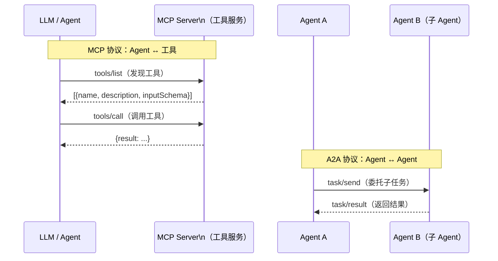

# 通信协议（Protocols）

> Agent 之间、Agent 与工具之间如何"说话"——MCP 定义 Agent 调用工具的语言，A2A 定义 Agent 间协作的语言。

---

## 理论基础

在多 Agent 系统中，通信协议决定了消息的格式、传输方式和语义约定。标准化协议使 Agent 可以跨语言、跨框架、跨厂商互操作。

- **MCP（Model Context Protocol）**：Anthropic 提出的 LLM ↔ 工具通信标准，基于 JSON-RPC 2.0，解决"LLM 如何发现和调用外部工具"的问题。
- **A2A（Agent-to-Agent Protocol）**：Google 提出的 Agent 间通信标准，解决"多个 Agent 如何安全协作、委托任务"的问题。

---

## MCP vs A2A 对比

| 维度 | MCP | A2A |
|------|-----|-----|
| 通信对象 | LLM Agent ↔ 工具服务 | Agent ↔ Agent |
| 消息格式 | JSON-RPC 2.0 | Task / Artifact 对象 |
| 传输协议 | HTTP SSE / stdio | HTTPS |
| 主要解决 | 工具发现与调用标准化 | 多 Agent 任务委托与协作 |
| AWS 映射 | Bedrock AgentCore MCP 集成 | Bedrock Supervisor Agent |

---

## IoT 场景：某企业 多 Agent 通信

**MCP 应用**：DMS 诊断 Agent 通过 MCP 协议调用统一工具服务器（IoT 状态查询、手册检索），工具服务器可被多个 Agent 共享复用。

**A2A 应用**：故障诊断协调 Agent（Supervisor）通过 A2A 委托三个专业 Agent（DMS 分析 Agent、温度管理分析 Agent、变流系统 分析 Agent）各自执行专项诊断，最终汇总报告。

---

## AWS AgentCore 对应

| 协议 | AWS 组件 | 关键配置项 | 文档链接 |
|------|---------|-----------|---------|
| MCP | Amazon Bedrock AgentCore MCP Server 集成 | `mcpServerConfig.endpoint` | [Bedrock MCP 文档](https://docs.aws.amazon.com/bedrock/latest/userguide/agents-mcp.html) |
| A2A | Amazon Bedrock AgentCore Supervisor Agent + Sub-Agents | `agentCollaborationConfiguration` | [Bedrock Multi-Agent Collaboration](https://docs.aws.amazon.com/bedrock/latest/userguide/agents-multi-agent-collaboration.html) |

:::info 相关模块

- **[多智能体协作](../10-multi-agent/index.md)**：A2A 协议是多 Agent 协作的通信基础。
- **[工具执行层](../04-action-tools/index.md)**：MCP 是工具执行层的标准化通信协议。

:::

---

## 延伸阅读

- [MCP 规范](https://modelcontextprotocol.io/introduction)
- [A2A Protocol Spec](https://google.github.io/A2A/)
- [Amazon Bedrock AgentCore MCP 文档](https://docs.aws.amazon.com/bedrock/latest/userguide/agents-mcp.html)
- 配套代码：`code/protocols/mcp_demo.py`
