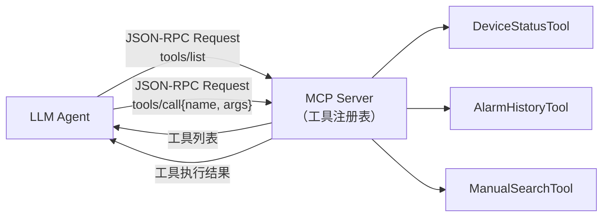
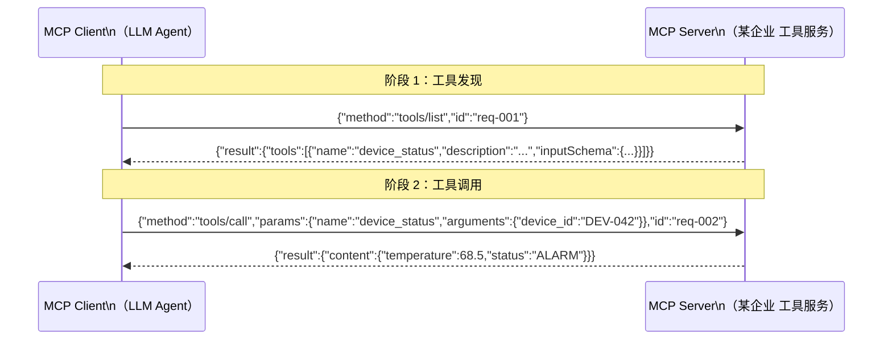

# Model Context Protocol（MCP）

> MCP 是 LLM Agent 调用外部工具的通用语言——工具发现（tools/list）+ 工具调用（tools/call），基于 JSON-RPC 2.0 构建。

---

## 1. 理论基础

MCP（Model Context Protocol）由 Anthropic 于 2024 年提出，解决的核心问题是：**如何让 LLM Agent 以标准化方式发现和调用任意外部工具，而不依赖特定框架或厂商**。MCP 规范基于 JSON-RPC 2.0，定义了工具发现（`tools/list`）、工具调用（`tools/call`）、资源访问（`resources/read`）等标准接口，使工具服务器（MCP Server）可以被多个 LLM 客户端共享复用。

---

## 2. 核心机制

| 机制 | 说明 | 工程类比 |
|------|------|---------|
| 工具发现 | `tools/list` 返回工具列表（name + description + inputSchema）| REST API Swagger 文档 |
| 工具调用 | `tools/call` 执行工具（name + arguments → result）| RPC 函数调用 |
| JSON-RPC 2.0 | 标准化消息格式（method + params + id + result/error）| HTTP REST |
| SSE 传输 | Server-Sent Events 支持流式响应 | WebSocket 单向流 |
| InputSchema | JSON Schema 描述参数约束，LLM 依此生成合法参数 | OpenAPI requestBody |

---

## 3. 在 Agent OS 中的位置



---

## 4. 工作原理（时序图）



---

## 5. 实现要点

```python
# Source: hello-agents/code/chapter10/（MCP 核心实现）
# 本地演示：code/protocols/mcp_demo.py

@dataclass
class MCPRequest:
    """MCP 请求（JSON-RPC 2.0 格式）"""
    method: str                    # "tools/list" 或 "tools/call"
    params: dict                   # 工具名和参数
    id: str                        # 请求 ID（用于匹配响应）
    jsonrpc: str = "2.0"

class MCPServer:
    """MCP Server：注册工具并路由调用请求"""

    def handle(self, request: MCPRequest) -> MCPResponse:
        if request.method == "tools/list":
            # 返回所有注册工具的 Schema
            return MCPResponse(id=request.id,
                             result={"tools": self.list_tools()})

        if request.method == "tools/call":
            tool_name = request.params["name"]
            arguments = request.params.get("arguments", {})
            if tool_name not in self._tools:
                return MCPResponse(id=request.id,
                    error={"code": -32601, "message": f"工具不存在: {tool_name}"})
            result = self._tools[tool_name](**arguments)
            return MCPResponse(id=request.id, result={"content": result})
```

---

## 6. 企业落地场景：IoT 企业 诊断工具服务

某企业 将 IoT 诊断工具统一封装为一个 MCP Server，多个诊断 Agent 通过 MCP 协议共享工具：

- **工具隔离**：每个工具在独立 Lambda 函数中运行，故障不相互影响
- **工具共享**：设备管理 Agent 和温度管理 Agent 可调用同一个 `device_status` 工具
- **版本管理**：MCP Server 升级工具实现时，Agent 无感知（接口不变）

---

## 7. AWS AgentCore 对应

| 本地实现 | AWS 组件 | 关键配置项 | 注意事项 |
|---------|---------|-----------|---------|
| MCPServer | [Amazon Bedrock AgentCore MCP Server](https://docs.aws.amazon.com/bedrock/latest/userguide/agents-mcp.html) | `mcpServerConfig.endpoint`, `mcpServerConfig.authConfig` | 需通过 API Gateway 暴露 MCP 端点 |
| MCPClient | Amazon Bedrock Agents 内置 MCP 客户端 | Agent 配置中指定 MCP Server ARN | Agents 自动处理 tools/list 和 tools/call |

:::info 相关模块

- **[A2A 协议](./a2a.md)**：MCP 处理 Agent ↔ 工具通信，A2A 处理 Agent ↔ Agent 通信，两者互补。
- **[工具执行层](../04-action-tools/index.md)**：MCP Server 是工具执行层的标准化封装形式。

:::

---

## 延伸阅读

- [MCP 规范官方文档](https://modelcontextprotocol.io/introduction)
- [Amazon Bedrock AgentCore MCP 集成](https://docs.aws.amazon.com/bedrock/latest/userguide/agents-mcp.html)
- 配套代码：`code/protocols/mcp_demo.py`
