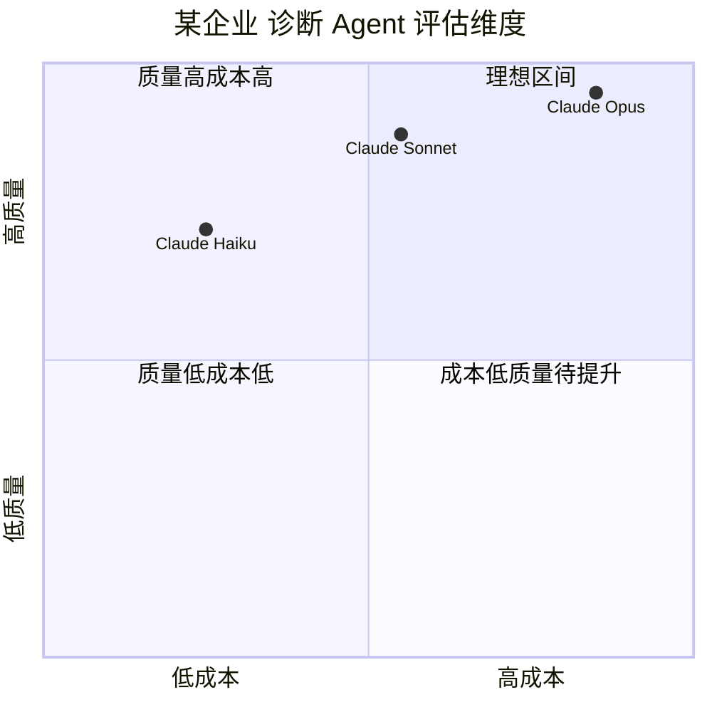

# 评估体系（Evaluation）

> Agent 评估不是一次性任务，而是持续反馈循环——定期计算质量指标，与基线对比，驱动模块优化。

---

## 理论基础

Agent OS 的评估体系借鉴了机器学习评估框架，但针对 Agent 的特点扩展了四个维度：任务完成率（有效性）、工具调用准确率（正确性）、响应延迟（及时性）、成本效率（经济性）。这四个维度覆盖了 Agent 在 某企业 生产场景中的核心质量需求。

AIOS（2024）将质量评估定义为 Agent OS 的横向基础设施，与调度、存储、工具管理并列，负责持续监控 Agent 系统的整体健康状态。

---

## 四维评估体系

| 指标 | 计算方式 | 某企业 基线目标 |
|------|---------|-------------------|
| 任务完成率 | 成功给出诊断建议的会话数 / 总会话数 | ≥ 85% |
| 工具调用准确率 | 工具名和参数均正确的调用数 / 总工具调用数 | ≥ 90% |
| 平均响应延迟 | 从告警接收到输出建议的端到端时间 | ≤ 30s |
| 成本效率 | 总 Token 消耗 / 成功诊断次数 | ≤ 2000 tokens/次 |

---

## 子文档导航

| 文档 | 内容 |
|-----|------|
| [metrics.md](./metrics.md) | 指标定义、计算方法、评估脚本实现 |

---

## IoT 场景：某企业 诊断 Agent 质量基线

**评估流程**：每周从诊断日志中抽取 100 条会话记录，计算四项指标，与基线对比并生成质量报告。若任一指标持续两周未达标，触发模块优化流程。

**典型优化路径**：
- 任务完成率 < 85% → 优化 ReAct 提示词或增加 max_steps
- 工具调用准确率 < 90% → 改进工具 description 或添加示例
- 响应延迟 > 30s → 优化 GSSC 流水线或切换更快的模型
- 成本效率 > 2000 tokens → 收紧 Token 预算或切换 Haiku 模型

---

## AWS AgentCore 对应

| 本地实现 | AWS 组件 | 关键配置项 | 注意事项 |
|---------|---------|-----------|---------|
| 评估脚本 | [Amazon Bedrock Model Evaluation](https://docs.aws.amazon.com/bedrock/latest/userguide/model-evaluation.html) | `evaluationConfig.customMetrics` | 支持自定义指标和人工评估 |
| 指标存储 | Amazon CloudWatch 自定义指标 | `put_metric_data` | 与成本监控使用同一 CloudWatch Namespace |
| 基线比较 | AWS DevOps Guru / 自定义告警 | CloudWatch Alarms | 指标低于基线时触发 SNS 告警 |

:::info 相关模块

- **[成本治理](../07-cost-governance/index.md)**：成本效率指标需要成本监控模块的 Token 数据支撑。
- **[规划与推理](../03-planning/index.md)**：任务完成率和工具调用准确率反映规划模块的质量，是优化规划策略的主要参考。

:::

---

## 延伸阅读

- [Amazon Bedrock Model Evaluation](https://docs.aws.amazon.com/bedrock/latest/userguide/model-evaluation.html)
- 配套代码：`code/evaluation/eval_metrics.py`
