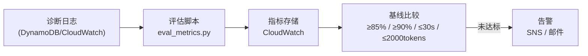
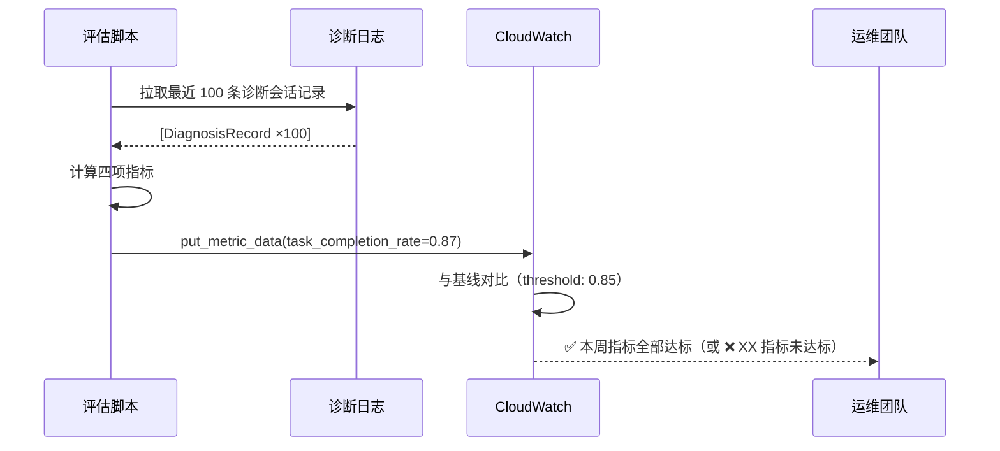

# 评估指标

> 四项可量化的评估指标，与 某企业 生产基线对比，驱动持续质量改进。

---

## 1. 理论基础

Agent 评估指标的设计原则来自 AIOS（2024）的评估与质量保障框架：指标必须**可量化**（数值可比较）、**可操作**（指标下降时有明确的优化方向）、**业务相关**（与实际生产需求直接对应）。

对于 某储能企业设备诊断场景，核心业务需求是：快速、准确、经济地处理设备告警。四项指标直接对应这三个需求维度。

---

## 2. 核心机制

| 指标 | 公式 | 工程类比 |
|------|------|---------|
| 任务完成率 | 成功会话数 / 总会话数 | HTTP 2xx 成功率 |
| 工具调用准确率 | 正确调用数 / 总调用数 | API 参数正确率 |
| 平均响应延迟 | Σ(响应时间) / 会话数 | P50 延迟（Percentile）|
| 成本效率 | 总 Token 数 / 成功诊断次数 | 单位计算成本 |

---

## 3. 在 Agent OS 中的位置



---

## 4. 工作原理



---

## 5. 实现要点

```python
# Source: code/evaluation/eval_metrics.py

def compute_metrics(records: list[DiagnosisRecord]) -> dict:
    """计算四项核心评估指标并与 某企业 基线对比"""
    n = len(records)
    n_completed = sum(1 for r in records if r.completed)
    total_tools = sum(r.tool_calls for r in records)
    correct_tools = sum(r.correct_tool_calls for r in records)

    # 四项指标计算
    task_completion_rate = n_completed / n
    tool_accuracy = correct_tools / total_tools if total_tools > 0 else 0.0
    avg_response_time = sum(r.response_time_s for r in records) / n
    cost_per_success = sum(r.input_tokens + r.output_tokens for r in records) / n_completed

    # 与基线对比（某企业 生产部署标准）
    BASELINE = {
        "task_completion_rate": 0.85,   # ≥ 85%
        "tool_accuracy": 0.90,          # ≥ 90%
        "avg_response_time_s": 30.0,    # ≤ 30s
        "cost_per_success_tokens": 2000, # ≤ 2000 tokens/次
    }
    return {
        "task_completion_rate": task_completion_rate,
        "tool_accuracy": tool_accuracy,
        "avg_response_time_s": avg_response_time,
        "cost_per_success_tokens": cost_per_success,
        "baseline_pass": (
            task_completion_rate >= BASELINE["task_completion_rate"] and
            tool_accuracy >= BASELINE["tool_accuracy"] and
            avg_response_time <= BASELINE["avg_response_time_s"] and
            cost_per_success <= BASELINE["cost_per_success_tokens"]
        ),
    }
```

---

## 6. 企业落地场景：某企业 评估基线设定

**基线设定依据**：

| 指标 | 基线 | 设定依据 |
|------|------|---------|
| 任务完成率 ≥ 85% | 历史人工处理成功率约 75%，Agent 需超越人工 10 个百分点 |
| 工具调用准确率 ≥ 90% | 工具调用错误率 >10% 会导致诊断建议质量严重下降 |
| 平均响应延迟 ≤ 30s | Level-2 告警的运维响应时限要求（SLA） |
| 成本效率 ≤ 2000 tokens | 月度成本目标 $50 内，按 50 次/天估算反推 |

**基线调整策略**：随着 Agent 质量提升和业务规模扩大，基线应定期（每季度）审查调整。初期可设置宽松基线（85%），待 Agent 稳定后收紧（90%+）。

---

## 7. AWS AgentCore 对应

| 本地实现 | AWS 组件 | 关键配置项 | 注意事项 |
|---------|---------|-----------|---------|
| `compute_metrics` 函数 | [Amazon Bedrock Model Evaluation](https://docs.aws.amazon.com/bedrock/latest/userguide/model-evaluation.html) | `evaluationConfig.taskType: QUESTION_AND_ANSWER` | 内置 RAGAS 等评估框架 |
| 指标 CloudWatch 上报 | Amazon CloudWatch 自定义指标 | `Namespace: AgentOS/Evaluation` | 与成本指标共用 Dashboard |
| 基线告警 | CloudWatch Alarms + SNS | `threshold`, `comparisonOperator` | 配置 SNS 主题发送邮件/Slack 通知 |

:::info 相关模块

- **[评估体系总览](./index.md)**：四维评估框架的整体设计见总览文档。
- **[成本治理](../07-cost-governance/index.md)**：成本效率指标的原始数据来自 TokenTracker，需与成本治理联动。

:::

---

## 延伸阅读

- [Amazon Bedrock Model Evaluation 文档](https://docs.aws.amazon.com/bedrock/latest/userguide/model-evaluation.html)
- [RAGAS — RAG 评估框架](https://docs.ragas.io/)
- 配套代码：`code/evaluation/eval_metrics.py`
