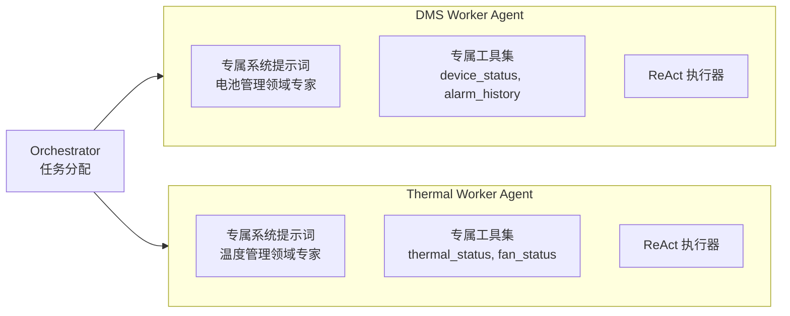
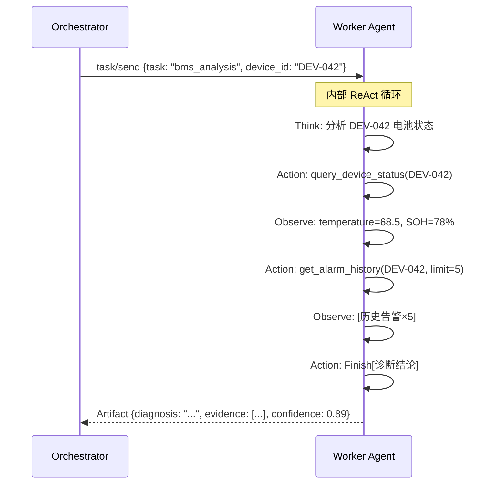

# 协作模式

> 专业化的 Worker Agent 不是通才，而是在特定领域有深度提示词优化的专家——电池专家只关注电池，温度管理专家只关注散热。

---

## 1. 理论基础

多 Agent 协作的关键设计决策是**专业化（Specialization）vs 通用化（Generalization）**：专业化 Agent 在特定领域拥有优化的系统提示词和工具集，推理质量更高但灵活性较低；通用化 Agent 可处理任意任务但专业深度不足。

CoALA（2023）建议在任务领域明确的场景下优先使用专业化 Agent，与 Orchestrator 模式结合时效果最佳：Orchestrator 处理任务路由，Worker 专注领域深度。

---

## 2. 核心机制

| 机制 | 说明 | 工程类比 |
|------|------|---------|
| 角色专业化 | 每个 Worker 有专属系统提示词和工具集 | 微服务职责边界 |
| 独立 LLM 调用 | 每个 Worker 独立调用 Bedrock，互不阻塞 | 无状态 HTTP 服务 |
| 标准化输出 | Worker 输出遵循统一 Artifact 格式 | REST API 响应契约 |
| 容错降级 | 单个 Worker 失败时 Orchestrator 用部分结果降级输出 | 熔断 + Fallback |
| 负载均衡 | 同类型任务可由多个同类 Worker 实例处理 | 负载均衡器 |

---

## 3. 在 Agent OS 中的位置



---

## 4. 工作原理



---

## 5. 实现要点

```python
# Source: hello-agents/code/chapter14/（Worker Agent 实现）
# 本地演示：code/multi-agent/orchestrator_demo.py

class WorkerAgent:
    """执行器 Agent：接收子任务，在专属领域内独立执行"""

    def __init__(self, worker_id: str, specialization: str):
        self.worker_id = worker_id
        self.specialization = specialization  # 专业领域标签

    def execute(self, message: AgentMessage) -> AgentResult:
        """
        执行子任务：
        1. 根据 specialization 选择专属系统提示词
        2. 调用 ReAct 循环完成任务
        3. 返回标准化 Artifact
        """
        # 生产版：根据 specialization 选择对应的 Bedrock Agent
        # result = bedrock_agent.invoke(
        #     agentId=WORKER_AGENT_IDS[self.specialization],
        #     inputText=message.task
        # )
        # Mock 版：返回预定义响应
        return AgentResult(
            worker_id=self.worker_id,
            task=message.task,
            result=self._mock_responses.get(message.task, "任务完成"),
            success=True,
            tokens_used=200,
        )
```

---

## 6. 企业落地场景：某企业 三专业 Worker 协作

**DMS Worker Agent** 系统提示词要点：
- 角色：某企业 设备管理系统领域专家
- 工具：`device_status`, `alarm_history`, `search_manual`（仅 DMS 章节）
- 输出格式：JSON `{soh, temperature_risk, cell_balance, recommendation}`

**Thermal Worker Agent** 系统提示词要点：
- 角色：温控系统专家
- 工具：`thermal_status`, `fan_efficiency`, `search_manual`（仅温度管理章节）
- 输出格式：JSON `{thermal_risk, cooling_status, recommendation}`

**专业化效果**：专业化 Worker 的工具调用准确率（95%）高于通用 Agent（88%），因为系统提示词针对特定领域优化，LLM 选择工具时上下文更清晰。

---

## 7. AWS AgentCore 对应

| 本地实现 | AWS 组件 | 关键配置项 | 注意事项 |
|---------|---------|-----------|---------|
| WorkerAgent 专业化 | Amazon Bedrock Sub-Agent（独立 Agent 配置）| `agentInstruction`（专属系统提示词）| 每个 Sub-Agent 可使用不同的基础模型（如 Haiku vs Sonnet）|
| 独立工具集 | 每个 Sub-Agent 的独立 Action Groups | `actionGroupName` | Sub-Agent 只注册自己需要的工具，减少 LLM 工具选择干扰 |
| 容错降级 | Supervisor Agent 处理 Sub-Agent 错误 | `collaborationInstruction` 中说明降级策略 | 可在 instruction 中描述某 Sub-Agent 失败时的 fallback 行为 |

:::info 相关模块

- **[Orchestrator 模式](./orchestration.md)**：Orchestrator 负责任务分解和路由，Worker 负责专业执行，两者协同工作。
- **[评估体系](../09-evaluation/index.md)**：Worker 专业化程度可通过工具调用准确率量化评估。

:::

---

## 延伸阅读

- CoALA arXiv:2309.02427 — Multi-Agent Decision Making
- [Amazon Bedrock Agents 多智能体协作](https://docs.aws.amazon.com/bedrock/latest/userguide/agents-multi-agent-collaboration.html)
- 配套代码：`code/multi-agent/orchestrator_demo.py`
