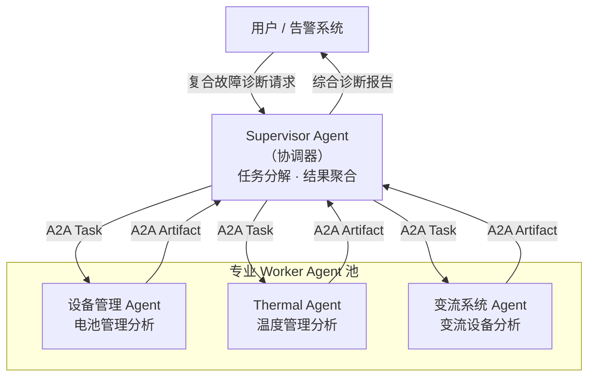

# 多智能体协作（Multi-Agent）

> 当单个 Agent 力所不及时，让专业 Agent 团队协作——Orchestrator 负责任务分解，Worker 专注各自领域，集体智慧解决复杂问题。

---

## 理论基础

多 Agent 系统（Multi-Agent Systems，MAS）的核心思想来自分布式人工智能：将复杂任务分解为可并行处理的子任务，由专业化的子 Agent 分别执行，协调者汇总结果。

CoALA（2023）的多 Agent 决策框架定义了 Orchestrator（协调者）和 Worker（执行者）两种角色。AIOS（2024）的调度子系统支持跨 Agent 的任务依赖管理和资源分配，确保多 Agent 并发执行时不产生竞争条件。

---

## Orchestrator-Worker 架构

---

## IoT 场景：某企业 多系统协作诊断

某储能企业系统包含三个相互关联的子系统：

| 子系统 | 专责 Worker Agent | 专项诊断能力 |
|--------|------------------|------------|
| 设备管理 | 设备管理 Agent | SOH 分析、单体电压均衡、过温/欠压诊断 |
| 温度管理 | Thermal Agent | 散热效率分析、风扇状态检测、温度异常预测 |
| 功率变换系统 | 变流系统 Agent | 电流异常分析、AC/DC 变换效率、保护动作溯源 |

当发生**复合故障**（如同时触发 DMS 过温 + 变流系统 电流异常）时，Supervisor Agent 并发委托三个专业 Worker Agent，30 秒内完成全系统诊断。

---

## 子文档导航

| 文档 | 内容 |
|-----|------|
| [orchestration.md](./orchestration.md) | Orchestrator 模式详解、任务分解、结果聚合 |
| [collaboration.md](./collaboration.md) | 协作模式、Worker 专业化设计、并发与容错 |

---

## AWS AgentCore 对应

| 本地实现 | AWS 组件 | 关键配置项 | 注意事项 |
|---------|---------|-----------|---------|
| Supervisor Agent | [Amazon Bedrock AgentCore Supervisor](https://docs.aws.amazon.com/bedrock/latest/userguide/agents-multi-agent-collaboration.html) | `agentCollaborationConfiguration.agentDescriptor` | 需配置每个 Sub-Agent 的 ARN 和别名 |
| Worker Agent | Amazon Bedrock AgentCore Sub-Agent | `agentId`, `agentAliasId` | Sub-Agent 可使用不同的基础模型 |
| A2A 通信 | 内置于 Bedrock Agents Multi-Agent Collaboration | `relayConversationHistory` | 可选择是否向 Sub-Agent 传递完整对话历史 |

:::info 相关模块

- **[通信协议](../08-protocols/index.md)**：A2A 协议是多 Agent 协作的通信基础。
- **[规划与推理](../03-planning/index.md)**：Supervisor Agent 内部使用 Plan-and-Solve 范式分解任务，Worker Agent 使用 ReAct 执行子任务。

:::

---

## 延伸阅读

- Sumers et al. (2023). *CoALA*. arXiv:2309.02427.
- [Amazon Bedrock Multi-Agent Collaboration](https://docs.aws.amazon.com/bedrock/latest/userguide/agents-multi-agent-collaboration.html)
- 配套代码：`code/multi-agent/orchestrator_demo.py`
