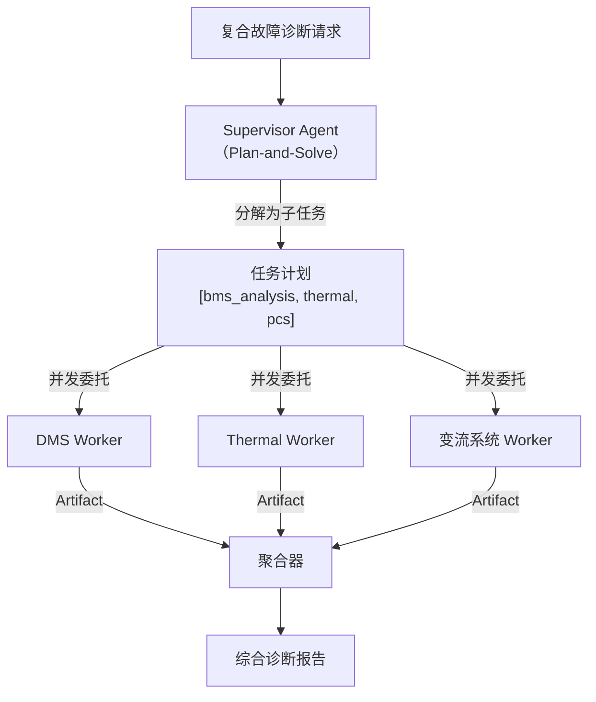
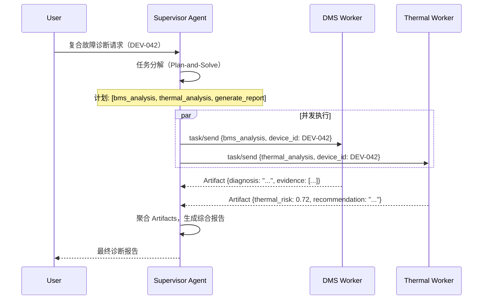

# Orchestrator 模式

> Supervisor Agent 扮演项目经理——负责任务分解、进度跟踪、结果汇总，自己不直接动手，只指挥 Worker。

---

## 1. 理论基础

Orchestrator 模式是多 Agent 系统中的主流协作范式：由一个高层 Supervisor Agent 接收复杂任务，将其分解为可独立执行的子任务，委托给专业化的 Worker Agent，最后聚合所有 Worker 的输出生成最终结果。

CoALA（2023）将这种模式称为 **Hierarchical Planning**（层级规划）：Supervisor 在高层进行 Plan-and-Solve 式规划，Worker 在具体执行层使用 ReAct 完成子任务，两者在不同抽象层次上协同工作。

---

## 2. 核心机制

| 机制 | 说明 | 工程类比 |
|------|------|---------|
| 任务分解 | Supervisor 将复杂请求分解为独立子任务列表 | 微服务拆解（Decomposition）|
| 并发委托 | 独立子任务并发分发给 Worker，减少总延迟 | 线程池并发执行 |
| 结果汇总 | 收集所有 Worker 的 Artifact，聚合为最终报告 | MapReduce Reduce 阶段 |
| 容错处理 | 单个 Worker 失败时降级（使用部分结果或重试）| 熔断 + 重试机制 |
| 状态追踪 | 维护每个子任务的执行状态 | 分布式状态机 |

---

## 3. 在 Agent OS 中的位置



---

## 4. 工作原理（时序图）



---

## 5. 实现要点

```python
# Source: hello-agents/code/chapter13-15/
# 本地演示：code/multi-agent/orchestrator_demo.py

class OrchestratorAgent:
    """协调器 Agent：分解任务、并发委托、聚合结果"""

    def run(self, diagnosis_request: str) -> dict:
        # 1. 任务分解（Plan-and-Solve 范式）
        subtasks = self._decompose_task(diagnosis_request)

        # 2. 顺序/并发分发给 Worker
        results = []
        for subtask in subtasks:
            worker = self._workers[subtask["worker"]]
            msg = AgentMessage(sender="orchestrator",
                             receiver=subtask["worker"],
                             task=subtask["task"],
                             payload=subtask["payload"])
            result = worker.execute(msg)     # 生产版可改为并发
            results.append(result)

        # 3. 聚合最终报告
        return {
            "subtasks_completed": sum(1 for r in results if r.success),
            "final_report": next(
                (r.result for r in results if "report" in r.task),
                "报告生成失败"
            ),
        }
```

---

## 6. 企业落地场景：某企业 复合故障诊断

**场景**：DEV-042 同时触发过温告警（DMS 层）和电流异常（变流系统 层），需要三个专业 Worker 协同诊断。

**任务分解示例**：

```python
subtasks = [
    {"task": "analyze_temperature",   "worker": "temperature-analyst"},
    {"task": "retrieve_procedure",    "worker": "knowledge-retriever"},
    {"task": "generate_report",       "worker": "report-generator"},
]
```

**并发优化**：前两个子任务（温度分析和规程检索）可并发执行，报告生成依赖前两步结果，需顺序执行。总延迟 = max(分析延迟, 检索延迟) + 报告生成延迟，比串行执行节省约 40%。

---

## 7. AWS AgentCore 对应

| 本地实现 | AWS 组件 | 关键配置项 | 注意事项 |
|---------|---------|-----------|---------|
| `OrchestratorAgent` | [Amazon Bedrock Supervisor Agent](https://docs.aws.amazon.com/bedrock/latest/userguide/agents-multi-agent-collaboration.html) | `collaborationInstruction` | Supervisor 的 instruction 需描述任务分解策略 |
| 并发委托 | Bedrock 内置并发调用 | 自动处理 | Bedrock 自动并发调用独立子任务 |
| 结果聚合 | Supervisor 内置聚合机制 | `relayConversationHistory: false` | 不传递历史可减少 Sub-Agent 的 Token 消耗 |

:::info 相关模块

- **[协作模式](./collaboration.md)**：Worker Agent 的专业化设计和并发容错机制见此文档。
- **[规划与推理](../03-planning/index.md)**：Supervisor 使用 Plan-and-Solve 分解任务，Worker 使用 ReAct 执行。

:::

---

## 延伸阅读

- CoALA arXiv:2309.02427 — Hierarchical Planning 章节
- [Amazon Bedrock Multi-Agent Collaboration](https://docs.aws.amazon.com/bedrock/latest/userguide/agents-multi-agent-collaboration.html)
- 配套代码：`code/multi-agent/orchestrator_demo.py`
