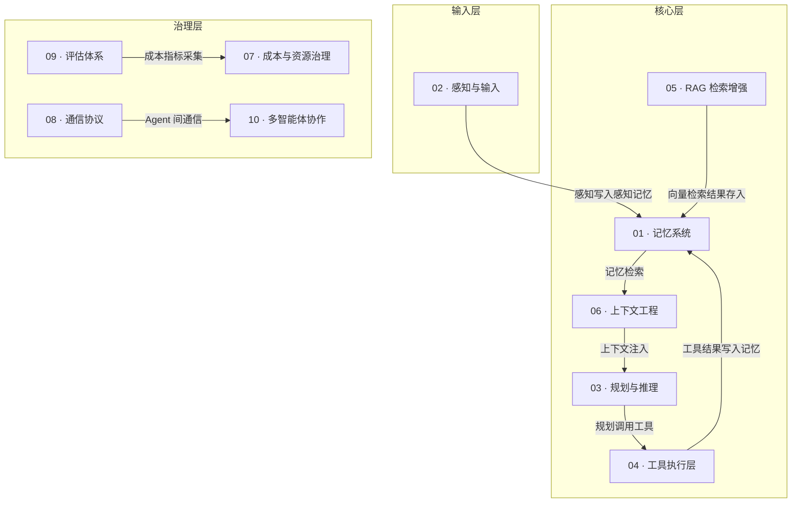

# Agent OS 全景总览

> 面向 某企业 公司 Agent OS 建设团队的知识库中枢 — 原理、AWS 映射、IoT 场景三合一。

---

## 理论框架声明

:::info 框架来源

本文档站的 Agent OS 框架基于以下两篇论文，不绑定任何特定厂商定义：

- **CoALA**（Cognitive Architectures for Language Agents，Sumers et al., 2023）— 定义四种记忆类型（Working / Episodic / Semantic / Procedural）、行动空间和决策过程。[arXiv:2309.02427](https://arxiv.org/abs/2309.02427)
- **AIOS**（LLM Agent Operating System，Mei et al., 2024）— 将 Agent OS 类比为传统操作系统内核，定义调度、上下文管理、内存管理、存储管理、工具管理、访问控制六大子系统。[arXiv:2403.16971](https://arxiv.org/abs/2403.16971)

:::

---

## Agent OS 整体架构

以下架构图展示 Agent OS 十大子系统及其相互依赖关系：

> 数据流向：感知输入 → 记忆存储 → 上下文组装 → 规划推理 → 工具执行 → 结果写回记忆。多 Agent 场景通过通信协议协调，评估体系和成本治理作为横向基础设施运行。

---

## 模块索引

| # | 模块名称 | hello-agents 对应章节 | AWS AgentCore 主要组件 | 状态 |
|---|---------|---------------------|----------------------|------|
| 01 | [记忆系统](./01-memory/index.md) | Chapter 8 — Memory Systems | Amazon Bedrock AgentCore Memory | ✅ completed |
| 02 | [感知与输入处理](./02-perception/index.md) | Chapter 2 — Perception | Amazon Rekognition / Amazon Transcribe | 📝 draft |
| 03 | [规划与推理](./03-planning/index.md) | Chapter 4 — Planning (ReAct / Plan-and-Solve / Reflection) | Amazon Bedrock AgentCore (Reasoning) | ✅ completed |
| 04 | [工具执行层](./04-action-tools/index.md) | Chapter 7 — Tools | Amazon Bedrock AgentCore Action Groups + AWS Lambda | ✅ completed |
| 05 | [RAG 检索增强](./05-rag/index.md) | Chapter 8 — RAG | Amazon Knowledge Bases for Bedrock | ✅ completed |
| 06 | [上下文工程](./06-context-engineering/index.md) | Chapter 9 — Context Engineering | Amazon Bedrock (Context Window) | ✅ completed |
| 07 | [成本与资源治理](./07-cost-governance/index.md) | Chapter 9 — Cost Control | Amazon Bedrock Pricing + AWS Budgets | ✅ completed |
| 08 | [通信协议（MCP/A2A）](./08-protocols/index.md) | Chapter 10 — Protocols | Amazon Bedrock AgentCore (MCP / Multi-Agent) | ✅ completed |
| 09 | [评估体系](./09-evaluation/index.md) | Chapter 12 — Evaluation | Amazon Bedrock Model Evaluation | ✅ completed |
| 10 | [多智能体协作](./10-multi-agent/index.md) | Chapter 13-15 — Multi-Agent | Amazon Bedrock AgentCore Supervisor Agent | ✅ completed |

---

## 企业落地场景：某储能企业设备智能诊断

某企业在全国部署了 500+ 套工商业IoT 系统，每套系统包含设备管理、温度管理、功率变换系统等子模块，每天产生约 10 万条传感器告警。

**核心挑战：**
- 告警量大、人工处理延迟高（平均响应 >2 小时）
- 历史诊断案例分散，无法高效复用
- 多系统并发告警时 LLM 调用成本难以控制

**Agent OS 解决方案：**
各模块在诊断 Agent 中扮演如下角色：

| 模块 | 在诊断 Agent 中的作用 |
|------|---------------------|
| 记忆系统 | 工作记忆缓存当前告警上下文；情景记忆存储历史诊断案例 |
| RAG | 向量化设备手册，实现故障代码→解决方案的精准检索 |
| 规划与推理 | ReAct 驱动多步诊断推理链，支持工具调用和自我反思 |
| 工具执行层 | 封装设备状态查询、告警检索、报告生成等工具 |
| 上下文工程 | 多设备并发时按优先级分配上下文预算（GSSC 流水线） |
| 成本治理 | Token 预算控制 + 成本追踪，控制月度 Bedrock 费用 |
| 通信协议 | MCP 标准化工具集成；A2A 支持 DMS/温度管理多 Agent 协作 |
| 评估体系 | 定期评估诊断准确率、响应延迟、成本效率三大指标 |
| 多智能体 | Supervisor Agent 协调 设备管理 Agent、温度管理 Agent、变流系统 Agent |

---

## AWS 服务名称术语规范

为确保文档一致性，本文档站遵循以下 AWS 服务名称规范：

| 规范写法 | 禁止简写 |
|---------|---------|
| Amazon Bedrock AgentCore | AgentCore（单独使用） |
| Amazon Bedrock | Bedrock（单独使用时须加 Amazon） |
| AWS Lambda | Lambda（单独使用时须加 AWS） |
| Amazon Knowledge Bases for Bedrock | Knowledge Bases（单独使用） |
| Amazon Elastic Container Service | ECS（文档正文中须全称） |

---

## 下一步

:::tip 推荐起点

建议从**记忆系统**开始阅读。它是 Agent OS 的核心数据层，RAG、规划、工具执行都依赖记忆系统存取中间结果。

- [记忆系统总览 →](./01-memory/index.md)
- [工作记忆（Working Memory）→](./01-memory/working.md)

:::
